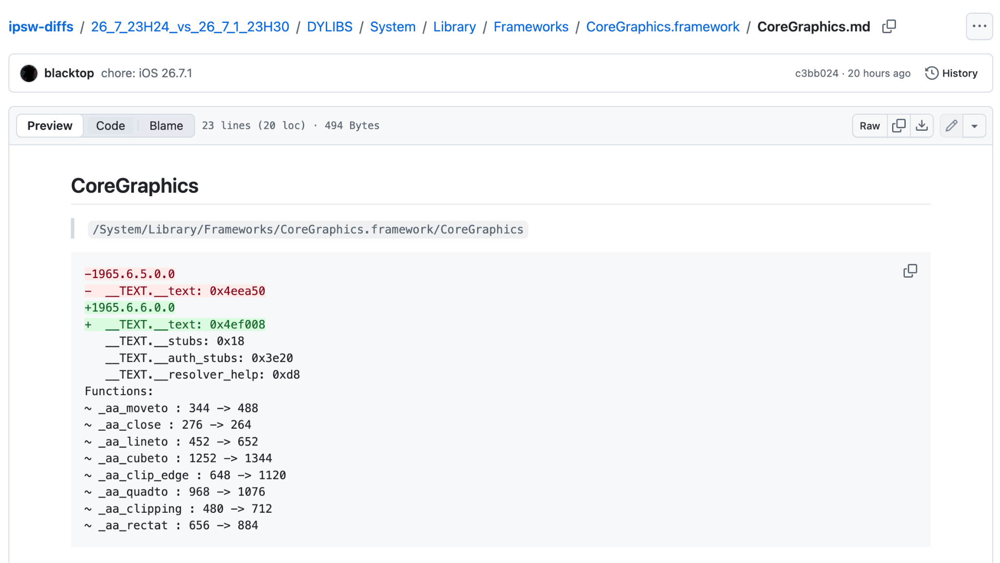
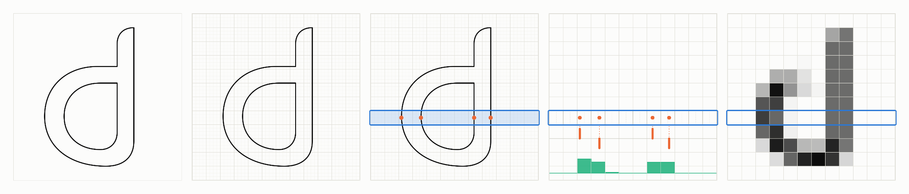
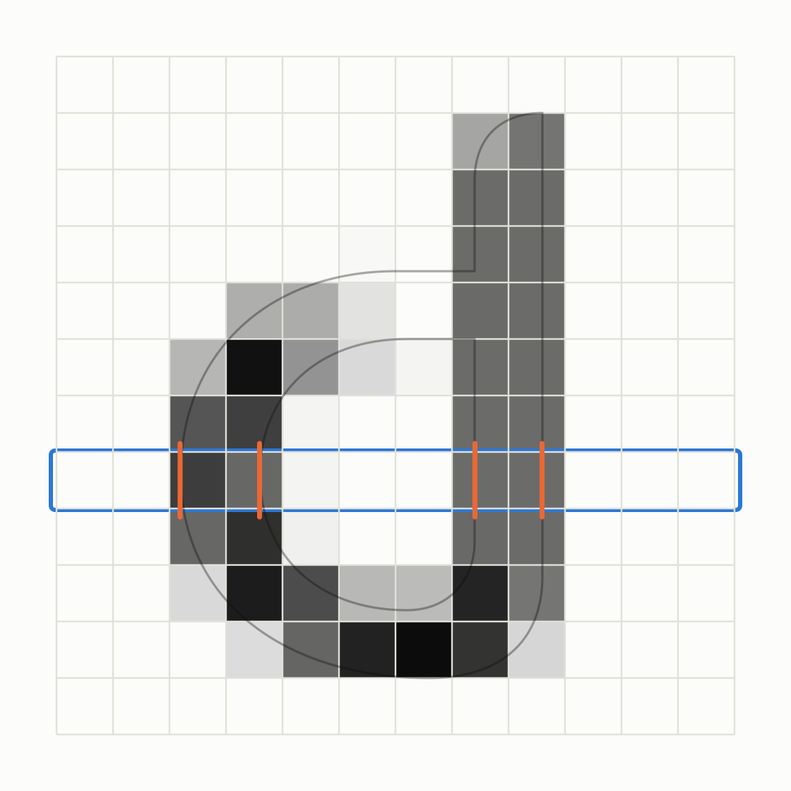

# CVE-2026-86950: The Great Glyph Grift

Apple recently released iOS 26.7.1 to fix a bug in CoreGraphics ([CVE-2026-86950](https://support.apple.com/en-us/149226)). The security advisory stated that the vulnerability was reported by Meta Product Security and "may have been exploited in an extremely sophisticated attack against specific targeted individuals." For those who are unfamiliar with Apple’s English dialect, it means that the bug was *actually* exploited in the wild. As usual, Apple provides no meaningful technical information for our curious minds. Well, the research team at Calif has an unusual affinity for zero-click attacks (check out [WeWorm](https://calif.io/research/weworm)) so we decided to investigate the bug and share the details with everyone. 

Through patch analysis, we identified a unit conversion error introduced by a compiler optimization. A malicious PDF containing a specially crafted font can trigger the bug during rendering. When CoreGraphics estimates how much memory it needs to draw a letter, the bug could break the arithmetic leading to an undersized allocation. It then draws using positions outside that memory, causing an out-of-bounds write. Our analysis suggests that WhatsApp could deliver such a PDF and trigger the vulnerability when the victim opens a chat containing it from a trusted contact, with automatic media downloads enabled. We provide a simple [PoC](https://github.com/califio/publications/tree/main/MADBugs/CVE-2026-86950) that triggers the bug on both macOS and iOS.

## What Changed in 26.7.1?

We started from the mechanically generated [ipsw-diffs](https://github.com/blacktop/ipsw-diffs/blob/main/iOS/26_7_23H24_vs_26_7_1_23H30/DYLIBS/System/Library/Frameworks/CoreGraphics.framework/CoreGraphics.md) report:



Based on this output, every changed function in CoreGraphics was prefixed with `aa_....` These functions are known, to our friendly neighborhood agent at least, to be part of the CoreGraphics anti-aliased path rasterizer. An instruction-level binary diff between the CoreGraphics frameworks on 26.7 and 26.7.1 shows that the same code pattern has been patched over 20 times throughout these 8 functions. Looking closely at the changes, this release fixes a small inline function used throughout the CoreGraphics path scan-conversion code. Specifically, the patched function is responsible for converting a floating point coordinate value into a fixed point coordinate value.

While this path rasterization code is used throughout CoreGraphics, the Apple advisory suggests the vulnerability has been triggered by remote attackers and exercised when processing a “maliciously crafted file.” Given the credit for this advisory (Meta Product Security), we next looked at recent changes to WhatsApp to provide some clues about which file formats might have been abused.

## Looking for Clues in WhatsApp Patches

We grabbed two recent WhatsApp versions (26.37.73 and 26.38.74) and began reviewing the changes. WhatsApp includes some heuristic checks to determine how risky an attachment might be via the `WAAttachmentChecker` class. Meta’s [Kaleidoscope](https://engineering.fb.com/2026/01/27/security/rust-at-scale-security-whatsapp/) framework is used to parse and score different formats, with a focus on safety under the assumption they are not yet trusted, before the heavier platform-specific processing occurs. Kaleidoscope is developed in Rust with the goal of providing a safe cross-platform file format evaluation system. Changes to Kaleidoscope PDF processing code immediately jumped out to us.

The latest WhatsApp code added an optional strict PDF analysis and scoring feature. When analyzing an attachment, a new feature flag (checked using the  `ks_pdf_strict_validation_enabled` function) enables deeper PDF validation. To support the strict mode, Kaleidoscope now includes support to parse PDF object streams including embedded `FontFile` object streams. The parsing and validation logic either passes the PDF as benign or produces a set of new font-based defect tags:

* `MalformedFontProgram`  
* `UndecodableFontProgram`  
* `UnverifiedFontProgram`

If any of these tags are returned by the new parser, a high risk score is returned to the `WAAttachmentChecker`. The attachment checker will treat risky files with more caution, preventing automatic parsing.

Given these changes, we decided to dig deeper into how the Apple system uses the CoreGraphics path rasterization via PDF parsing (and, more specifically, during font glyph rendering).

## Reaching Path Rasterization via Font Rendering

Imagine drawing a big “`d`” on the screen. The shape of the letter is called a glyph, and its outline can be described by a set of vector paths made up of lines and curves. To render a glyph to the screen, the scalable vector paths must undergo rasterization: deciding which pixels on the screen to fill. This is also called scanline conversion, named after the horizontal CRT scan path. If you don’t want your text to look like an Atari game score screen, your rendering engine must support anti-aliasing, which smooths jagged edges by partially coloring pixels along the outline. Anti-aliased rasterization uses a sub-pixel representation to estimate the alpha (or transparency) value of a rendered pixel to effectively blend partial pixels along the border of a shape with the background colors. The larger the percentage of a pixel the path and fill covers, the less transparent the pixel. The CoreGraphics code uses the same underlying code and algorithms to render a font glyph as it would any other path in the rendering engine.  


The stages of an anti-aliasing rasterization pipeline when rendering the “d” glyph

When rendering a glyph to a bitmap, the rasterizer will walk across each scanline (horizontal line of pixels), collect the edges of each path that cross that scanline, and then accumulate the alpha value at each pixel based on how each edge crosses the pixel (including which side of the edge is the filled side). Notice that the rasterizer, to be able to support anti-aliasing, must keep track of the path at a resolution higher than the pixel resolution. It is during this process, computing the alpha mask, that those `aa_*` CoreGraphics functions are used.

While the path and coordinates are stored as floating point values, the CoreGraphics anti-aliased rasterization code uses a fixed point format that represents each pixel as a 4096 x 4096 sub-pixel box. Converting a floating point coordinate value to a fixed point integer is almost as simple as multiplying by 4096 (with a 0.5 addend to ensure it rounds to the nearest subpixel):

```c
static inline int32_t aa_double_to_fixed(double px) {
  double v = 0.5 + 4096.0 * px;
  return (int32_t)v;
}
```

The 26.7.1 patch modified this inline function to ensure the fixed point value does not overflow the integer when cast:

```c
static inline int32_t aa_double_to_fixed(double px) {
  double v = 0.5 + 4096.0 * px;
  if (isnan(v)) return 0;
  if (v < -1073737729.0) return -1073737729;   // -0x3FFFF001
  if (v >  1073737729.0) return  1073737729;   //  0x3FFFF001
  return (int32_t)v;
}
```

Looking closer at the usage of this conversion function among the patched outer functions, the device coordinates may be bound prior to conversion. For example, see the pseudo code for `aa_moveto` showing the flags-based device coordinate clamping prior to conversion:

```c
  void aa_moveto(aa_ctx *ctx, float x, float y) {
      double dx = x, dy = y;
      if (ctx->factor != 0.0) { dx *= ctx->factor; dy *= ctx->factor; }

      if (ctx->flags & 0x30000) {
          (dx, dy) = clamp(dx, dy, ±1e15);
          outcode  = cohen_sutherland_outcode(dx, dy, ctx->clip_rect);
          (dx, dy) = clamp(dx, dy, ctx->clip_rect);
      }
      // else: dx, dy are whatever the caller passed

      ctx->cur_x = aa_double_to_fixed(dx);
      ctx->cur_y = aa_double_to_fixed(dy);
  }

```

To reach the patched vulnerable code, we have to ensure the functions are reached with the context flags masked by 0x30000 clear. Chasing the initialization of the context flags, the rasterizer context is created with the `aa_create` function and this function is only called in two locations:

1. `ripr_Acquire`  
2. `CGGlyphBitmapCreateWithPathAndDilation`

The first, `ripr_Acquire`, creates the context with the flags set and initializes a device coordinate clipping rectangle via a call to `aa_clipping`. The second, `CGGlyphBitmapCreateWithPathAndDilation`, creates a context with flags clear and never sets up a device coordinate clipping rectangle. In other words, to reach the vulnerable code, we must trigger the rendering of our glyph via `CGGlyphBitmapCreateWithPathAndDilation`.



After some work with our friendly agent, we found a path between the CoreGraphics font rendering entrypoint and the patched rasterization functions (under macOS for ease of testing). For the harness, we can use `CGContextShowGlyphsAtPositions` to render a glyph from a loaded font file:

```c
#include <CoreGraphics/CoreGraphics.h>

int main(int argc, char **argv) {
    CGDataProviderRef dp = CGDataProviderCreateWithFilename(argv[1]);
    CGFontRef font = CGFontCreateWithDataProvider(dp);
    CGGlyph glyph = CGFontGetGlyphWithGlyphName(font, CFSTR("A"));
    CGContextRef ctx = CGBitmapContextCreate(NULL, 64, 64, 8, 64,
        CGColorSpaceCreateDeviceGray(), kCGImageAlphaNone);
    CGContextSetShouldSmoothFonts(ctx, false);
    CGContextSetFont(ctx, font);
    CGContextSetFontSize(ctx, 1024);
    CGContextShowGlyphsAtPositions(ctx, &glyph, &CGPointZero, 1);
    return 0;
}
```

Compiling and running this with a breakpoint on `aa_cache_render` and then grabbing a backtrace shows:

```
$ lldb ./render_font ./trigger.ttf...
(lldb) c
Process 85311 resuming
Process 85311 stopped
* thread #1, queue = 'com.apple.main-thread', stop reason = breakpoint 2.1
    frame #0: 0x00000001920b55f0 CoreGraphics`aa_cache_render
CoreGraphics`aa_cache_render:
-> 0x1920b55f0 <+0>:  pacibsp 
   0x1920b55f4 <+4>:  stp    d9, d8, [sp, #-0x70]!
   0x1920b55f8 <+8>:  stp    x28, x27, [sp, #0x10]
   0x1920b55fc <+12>: stp    x26, x25, [sp, #0x20]
Target 0: (render_font) stopped.
(lldb) bt
* thread #1, queue = 'com.apple.main-thread', stop reason = breakpoint 2.1
  * frame #0: 0x00000001920b55f0 CoreGraphics`aa_cache_render
    frame #1: 0x00000001920b13c0 CoreGraphics`CGGlyphBitmapCreateWithPathAndDilation + 1560
    frame #2: 0x00000001920aef24 CoreGraphics`CGGlyphBuilderLockBitmaps + 1352
    frame #3: 0x00000001920ae8f0 CoreGraphics`render_glyphs + 296
    frame #4: 0x00000001920ae098 CoreGraphics`draw_glyph_bitmaps + 880
    frame #5: 0x00000001920adc58 CoreGraphics`ripc_DrawGlyphs + 1536
    frame #6: 0x00000001920ad414 CoreGraphics`CGContextDelegateDrawGlyphs + 344
    frame #7: 0x00000001924abeb4 CoreGraphics`draw_glyphs.18922 + 540
    frame #8: 0x000000010000061c render_font`main(argc=<unavailable>, argv=<unavailable>) at render_font.c:15:5 [opt]
    frame #9: 0x000000018af13da4 dyld`start + 6992
```

So far, we’ve proven that we can reach the patched code using CoreGraphics font rendering. But how can we turn this fixed-point coordinate wrapping into memory corruption? It wasn’t so simple.

## Turning the Integer Overflow into Memory Unsafety

As discussed earlier, one step of the full glyph rendering process includes rendering the glyph path components into an alpha mask bitmap. This process is done via the `aa_cache_render` call. The glyph’s CGPath is constructed inside `CGGlyphBitmapCreateWithPathAndDilation` prior to the aa\_cache\_render call. The rendering call walks the list of edges for each scanline storing an alpha value for each column. After all edges for a single scanline are processed, the alpha mask of the row is used to render the bitmap row.  
![][image4]  
Computing the alpha mask for a single scanline of the “d” glyph

The temporary “coverage buffer” is used to track the current scanline’s alpha values across all row intersecting edges. This buffer is allocated early in `aa_cache_render` and reused for each row. The buffer is sized based on the CGPath’s bounding box:

```c
width_px  = (bbox_max_x − bbox_min_x) / 4096;
coverage  = (width_px > 1015) ? malloc(4*(width_px+16))
                              : alloca(4*(width_px+16));
```

Interestingly, the coverage buffer can be located on the stack or heap depending on the width of the bounding box in pixels. The bounding box size tracking can be corrupted due to the vulnerable fixed point conversions leading to an out of bounds. While the corruption occurs in `aa_cache_render`, the root cause is in the conversion from path operations to edges and the tracking of the path bounding box.

A scalable font glyph can be represented as a set of path operations such as MoveTo, LineTo, QuadTo, …, Close. CoreGraphics represents these portions of a path as `CGPathElements` of [`CGPathElementType`](https://developer.apple.com/documentation/coregraphics/cgpathelementtype). To render the glyph, the `CGGlyphBitmapCreateWithPathAndDilation` function creates a rasterization context, iterates over each path element, and calls the anti-aliased rasterizer helper function corresponding to the element type. When the path is closed, the intermediate edges are recorded and a bounding box for the path is calculated:

```
  CGGlyphBitmapCreateWithPathAndDilation(path, ...)
    info = { ..., .aa = aa_create() }
    CGPathApply(path, &info, process_path_element)
    │
    ├─ CG::Path::apply(path.impl, block)
    │    per element:
    │    └─ __CGPathApply_block_invoke(blk, type, pts)
    │         └─ process_path_element_15286(info, &el)
    │              pt = clamp( transform(ctm, el.points[i]), info.lo, info.hi )
    │              switch (el.type):
    │                MoveTo  → aa_moveto(info.aa, pt.x, pt.y)
    │                LineTo  → aa_lineto(info.aa, pt.x, pt.y)
    │                QuadTo  → aa_quadto(...)
    │                CurveTo → aa_cubeto(...)
    │                Close   → aa_close(info.aa)
    │                             │
    │                             └─ aa_add_edges(ctx, fixed_pts, n)
    │                                  builds edge_t records, updates ctx->bbox
    │
    └─ aa_cache_render(info.aa, ...)

```

While recording each element during the operation callbacks, the path’s floating point coordinates are converted prior to storage and hit the patched code. The path we found to induce memory corruption relies on a compiler difference between the coordinate value conversion in `aa_moveto` and `aa_lineto`. 

Converting between a `double` and an `int32_t`, when the `double` value exceeds the bounds of an `int32_t` (i.e., outside the range of `[-2147483648, 2147483647]`), is undefined behavior and clang may optimize this to use different floating point conversion instructions. Before the patch, `aa_moveto` used the ARM64 instruction `FCVTZS Wd, Dn` to convert to a 32-bit integer, saturating to `INT32_MAX` or `INT32_MIN` on overflow. The other function, `aa_lineto`, converted the double to 64-bit integers with the ARM64 instruction `FCVTZS Vd.2D,Vn.2D`, then used `XTN` to keep the low 32 bits (truncation). The patch ensures the scaled value can never exceed the size of a 32-bit signed integer using manual clamping (as shown above) to avoid the undefined behaviour entirely. Because of this differential, the `aa_add_edges` accumulation step incorrectly computes the bounding box:

```c
void aa_add_edges(aa_ctx *ctx,
                  int32_t *pts,
                  int      n)
{
    // from aa_moveto 
    int32_t cur_x = ctx->cur_x;
    int32_t cur_y = ctx->cur_y;
    int     axis_flags = 0;

    for (int i = 0; i < n; ++i, pts += 2) {
        // from aa_lineto
        int32_t new_x = pts[0];
        int32_t new_y = pts[1];

        // ...

        int32_t dx = new_x - cur_x; // int32 subtraction — can wrap 
        // dx is used to save one comparison per axis 
        // but! when dx sign-wraps, the wrong endpoint 
        // is compared and neither expands the bbox
        if (dx < 1) { // <-
            if (ctx->bbox_min_x > new_x) ctx->bbox_min_x = new_x;
            if (ctx->bbox_max_x < cur_x) ctx->bbox_max_x = cur_x;
        } else {      // ->
            if (ctx->bbox_min_x > cur_x) ctx->bbox_min_x = cur_x;
            if (ctx->bbox_max_x < new_x) ctx->bbox_max_x = new_x;
        }
        // ...
    }
    // ...
}
```

When the bounding box calculation is broken by the wrapping delta, the rendering working buffer (the “coverage buffer”) is allocated too small (as shown above), leading to an OOB write when updating the alpha pixel for a given edge. Reaching this path requires having device pixel coordinates (those provided by the CGPath to the `aa_*` rasterizer functions) that will exceed the `int32_t` range when converted to fixed point values.

Weaving a coordinate value through all of the control-flow dependent scaling in CoreGraphics is a nightmare. Luckily, our nightmare is the friendly AI agent’s dream. Given the task of creating a TrueType font that satisfies our requirements and works when embedded in a PDF, the agent is happy to oblige. Using a combination of the PDF Text matrix and a nested set of composite-glyph scaling transforms, we can trigger the vulnerability:

```
$ lldb ./render trigger.pdf
...
creating thumbnail...
Process 89382 stopped
* thread #1, queue = 'com.apple.main-thread', stop reason = EXC_BAD_ACCESS (code=2, address=0x1005495e6)
    frame #0: 0x00000001920b5e38 CoreGraphics`aa_cache_render + 2120
CoreGraphics`aa_cache_render:
->  0x1920b5e38 <+2120>: ldrh   w8, [x30]
    0x1920b5e3c <+2124>: mov    x25, x30
    0x1920b5e40 <+2128>: ldrh   w15, [x25, #0x2]!
    0x1920b5e44 <+2132>: add    w8, w8, w13, asr #13
Target 0: (render) stopped.
(lldb) bt
* thread #1, queue = 'com.apple.main-thread', stop reason = EXC_BAD_ACCESS (code=2, address=0x1005495e6)
  * frame #0: 0x00000001920b5e38 CoreGraphics`aa_cache_render + 2120
    frame #1: 0x00000001920b13c0 CoreGraphics`CGGlyphBitmapCreateWithPathAndDilation + 1560
    frame #2: 0x00000001920aef24 CoreGraphics`CGGlyphBuilderLockBitmaps + 1352
    frame #3: 0x00000001920ae8f0 CoreGraphics`render_glyphs + 296
    frame #4: 0x00000001920ae098 CoreGraphics`draw_glyph_bitmaps + 880
    frame #5: 0x00000001920adc58 CoreGraphics`ripc_DrawGlyphs + 1536
    frame #6: 0x00000001920ad414 CoreGraphics`CGContextDelegateDrawGlyphs + 344
    frame #7: 0x00000001924abeb4 CoreGraphics`draw_glyphs.18922 + 540
    frame #8: 0x000000019213a450 CoreGraphics`simple_draw + 300
    frame #9: 0x000000019213a2e8 CoreGraphics`CGPDFTextLayoutDrawGlyphs + 112
    frame #10: 0x00000001922b31bc CoreGraphics`op_Tj.6849 + 80
    frame #11: 0x00000001920bd62c CoreGraphics`pdf_scanner_handle_xname + 120
    frame #12: 0x00000001920bc88c CoreGraphics`CGPDFScannerScan + 524
    frame #13: 0x00000001921cfe4c CoreGraphics`CGContextDrawPDFPageWithOptions + 2728
    frame #14: 0x0000000198497774 ImageIO`PDFReadPlugin::decodeImageData(unsigned char*, unsigned long) + 512
    frame #15: 0x0000000198497ab4 ImageIO`PDFReadPlugin::decodeImageImp(IIODecodeParameter*, IIOImageType, __IOSurface**, __CVBuffer**, CGImageBlockSet**) + 616
    frame #16: 0x00000001984c68e4 ImageIO`IIOReadPlugin::callDecodeImage(IIODecodeParameter*, IIOImageType, __IOSurface**, __CVBuffer**, CGImageBlockSet**) + 1000
    frame #17: 0x0000000198412b04 ImageIO`IIO_Reader::CopyImageBlockSetProc(void*, CGImageProvider*, CGRect, CGSize, __CFDictionary const*) + 708
    frame #18: 0x000000019842e984 ImageIO`IIOImageProviderInfo::copyImageBlockSetWithOptions(CGImageProvider*, CGRect, CGSize, __CFDictionary const*) + 408
    frame #19: 0x0000000198412670 ImageIO`IIOImageProviderInfo::CopyImageBlockSetWithOptions(void*, CGImageProvider*, CGRect, CGSize, __CFDictionary const*) + 908
    frame #20: 0x00000001920a725c CoreGraphics`imageProvider_retain_data + 96
    frame #21: 0x00000001920a7194 CoreGraphics`CGDataProviderRetainData + 76
    frame #22: 0x00000001920a71dc CoreGraphics`provider_for_destination_retain_data + 28
    frame #23: 0x00000001920a7194 CoreGraphics`CGDataProviderRetainData + 76
    frame #24: 0x00000001920a7024 CoreGraphics`CGAccessSessionCreate + 124
    frame #25: 0x00000001920a55e8 CoreGraphics`img_data_lock + 2372
    frame #26: 0x00000001920a0410 CoreGraphics`CGSImageDataLock + 1168
    frame #27: 0x000000019209fb94 CoreGraphics`ripc_AcquireRIPImageData + 1388
    frame #28: 0x000000019209e214 CoreGraphics`ripc_DrawImage + 808
    frame #29: 0x000000019209dd7c CoreGraphics`CGContextDrawImageWithOptions + 1048
    frame #30: 0x000000019209d8a4 CoreGraphics`CGContextDrawImage + 556
    frame #31: 0x00000001984ac7c0 ImageIO`CGImageCreateCopyWithParametersNew(CGImage*, CGColor*, CGAffineTransform, unsigned long, unsigned long, unsigned long, unsigned long, unsigned long, CGColorSpace*, unsigned int, bool, CGColorRenderingIntent, CGInterpolationQuality, bool) + 1880
    frame #32: 0x000000019848c3fc ImageIO`IIOImageSource::createThumbnailAtIndex(unsigned long, IIODictionary*, int*, unsigned int*) + 5064
    frame #33: 0x000000019844bdf4 ImageIO`CGImageSourceCreateThumbnailAtIndex + 768
    frame #34: 0x00000001000006ac render`main + 276
    frame #35: 0x000000018af13da4 dyld`start + 6992
```

Putting it all together, rendering the PDF loads the embedded TrueType font and applies the PDF text matrix and composite-glyph scaling transforms. The resulting glyph outline reaches `CGGlyphBitmapCreateWithPathAndDilation`, where the path operations pass oversized coordinates through the vulnerable `aa_double_to_fixed` conversion. The converted values cause the bounding-box calculation to overflow, making the glyph appear narrower than its recorded edges require. `aa_cache_render` then allocates an undersized coverage buffer and writes beyond it while processing those edges, causing the crash.

We’ve provided our minimal PDF and TrueType font generation scripts, a sample harness, and a Makefile for generating this example crashing file in our [GitHub repository](https://github.com/califio/publications/tree/main/MADBugs/CVE-2026-86950). Going from this to code execution is another exercise entirely.

## What else?

Well, that was really complicated. We still wonder if there are more convenient ways to trigger this vulnerability. The primitive is interesting: it provides a controlled offset out-of-bounds 16-bit increment on two adjacent 16-bit values. Additionally, the attacker can control the size of the allocation and whether or not it lands on the heap or on the stack (via alloca). It would be really interesting to take apart the in-the-wild sample (hint, hint) and see how the developers chose to leverage this. It would also be interesting to know if this was combined with additional vulnerabilities in WhatsApp to reach parsing with less user interaction.
