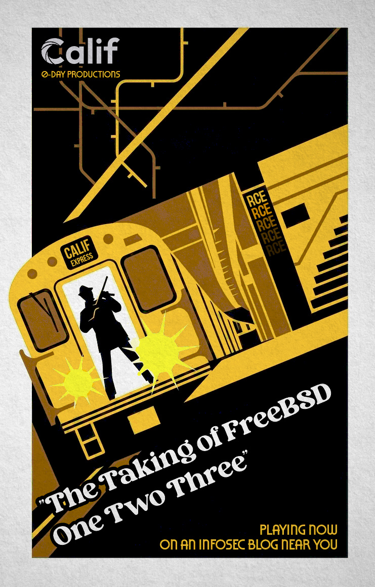

# The Taking of FreeBSD One Two Three

*Three pre-auth remote kernel bugs behind one TCP port that FreeBSD has decided to document rather than fix.*

In [An AI audit of FreeBSD](https://blog.calif.io/p/an-ai-audit-of-freebsd) we mentioned in passing that we had "reported 3 RCEs in a rarely used module." The module is CTL, FreeBSD's CAM Target Layer, the kernel subsystem that turns a FreeBSD box into a SCSI storage target for iSCSI and friends. Its High Availability (HA) mode lets two controllers mirror state to each other over TCP so one can take over if the other dies.

HA is live on TrueNAS Enterprise HA clusters, and on any FreeBSD system with `kern.cam.ctl.ha_peer` set. Once it's on, the kernel listens on a TCP port (999 by default) for its peer, with no authentication. Whatever connects is trusted as the second controller.

All three bugs live behind that port, and each one, on its own, gets you a root shell on the target from network access alone.

## FreeBSD One Two Three

**FreeBSD-One: arbitrary kernel read/write off the wire.** The HA DATA channel carries messages that contain raw kernel pointers. The handler dereferences them with no validation. A READ command makes the kernel read from any address and send the bytes back over TCP; a WRITE command makes it write attacker bytes to any address. That is arbitrary kernel read and write, straight off the wire. The GENERIC kernel ships without KASLR, so every symbol address is known ahead of time, and turning the primitive into code execution is mostly bookkeeping. This was the easy one, and the first we exploited.

**FreeBSD-Two: a write-only wire pointer in DATAMOVE.** The CTL channel's DATAMOVE handler trusts a different wire pointer, `original_sc`, and writes attacker-controlled bytes through it. This primitive is write-only and messy: every write also corrupts memory at two fixed offsets near the target, and there is no read to discover addresses or check your work. The exploit bootstraps out of that by using the one dirty write to repoint a handler function pointer at the DATA channel's clean-write code, and finishes from there.

**FreeBSD-Three: a heap overflow in the DATAMOVE copy loop.** The DATAMOVE path copies a scatter-gather list from the wire into a fixed 64-byte heap buffer, using an entry count taken straight from the message and never checked against the buffer size. Send more entries than fit and you overflow into the adjacent UMA slab object. There's no wire pointer to abuse here, so this is a full heap exploit: groom the slab so a useful object lands next door, overwrite its callback function pointer, pivot the stack, ROP, drop shellcode, clear the page NX bit, and jump. It's the hardest of the three and took the longest.

All three finish the same way, with shellcode that calls `kproc_create` and `kern_execve` to spawn `/bin/sh` and connect a root shell back to the attacker. The `ha_rx` kernel thread exits cleanly, and the box stays up.

## Why there's no code fix

We reported these in March and April. They turned out to be very hard to fix properly. The HA interconnect trusts its peer completely by design, and part of that design is exchanging raw kernel pointers as protocol fields. Closing that off means redesigning the protocol, not adding a bounds check.

In FreeBSD's threat model, the HA link is a private back-channel between two storage controllers and is never supposed to touch an untrusted network. Given that, the maintainers chose to make the expectation explicit rather than rework the code. In [commit `3c8f8432`](https://cgit.freebsd.org/src/commit/?id=3c8f8432b6f653128016c6aaf826e1efb7ee1cec), Mark Johnston added a warning to the `ctl.4` manpage, next to the `kern.cam.ctl.ha_peer` setting:

> **NOTE:**
> HA must be configured only on trusted networks: there is no authentication mechanism built in to the implementation, and the HA protocol effectively permits remote code execution on the peer node.

The commit message is blunter still about why:

> There is no authentication mechanism and the protocol itself embeds kernel pointers in the messages exchanged between HA hosts. This property (of `CTL_MSG_DATAMOVE` messages specifically), as well as insufficient validation of inbound messages, mean that anyone able to access a CTL HA port is able to remotely execute code on that host.

So the bug now lives in FreeBSD's own manual, and they cleared us to publish the exploits next to it. For a subsystem that only makes sense on a trusted back-channel, we think that's a reasonable call.

The practical takeaway is simple: if you run CTL with HA enabled, keep port 999 on a network you fully control, because anyone who can reach it can get root.

## Found in March, with a model that's now four generations old

The whole audit started in March, from a single prompt to Claude Code running on **Opus 4.6**:

> we want to audit the network facing code for any vulnerabilities which may be exploitable remotely exploitable meaning code execution potential, net,wifi,iscsi,nfs,sctp,netlink,netsmb as examples and all code downstream of those protocols, including any storage target or command processing layers they hand off to.

That kicked off a parallel audit of 35+ kernel source files across nine subsystems, run by 25+ Sonnet agents with Opus verification. It came back with 39 confirmed findings and flagged CTL HA as the most dangerous surface on the box: unauthenticated, remote, and full of trusted pointers. Three of those findings became the three working remote-root exploits above.

That was Opus 4.6, in March. It's now four generations behind Mythos 5, so treat everything here as a snapshot of what the tooling could manage six months ago.

## Warez

As with the rest of this series, the writeups and exploits below were written by AI and verified by us. We've kept the AI text as-is, as a record of what this looked like in early 2026. The exploits work. Each writeup also records the exact user prompts that drove the work, so you can see how much of it was steering and how much was the model.

- **FreeBSD-One**, arbitrary kernel R/W: [writeup](https://github.com/califio/publications/blob/main/MADBugs/freebsd-one-two-three/WRITEUP_FreeBSD-One.md), [`freebsd-one-exploit.py`](https://github.com/califio/publications/blob/main/MADBugs/freebsd-one-two-three/freebsd-one-exploit.py)
- **FreeBSD-Two**, DATAMOVE write-only pointer: [writeup](https://github.com/califio/publications/blob/main/MADBugs/freebsd-one-two-three/WRITEUP_FreeBSD-Two.md), [`freebsd-two-exploit.py`](https://github.com/califio/publications/blob/main/MADBugs/freebsd-one-two-three/freebsd-two-exploit.py)
- **FreeBSD-Three**, SGL heap overflow: [writeup](https://github.com/califio/publications/blob/main/MADBugs/freebsd-one-two-three/WRITEUP_FreeBSD-Three.md), [`freebsd-three-exploit.py`](https://github.com/califio/publications/blob/main/MADBugs/freebsd-one-two-three/freebsd-three-exploit.py)

## Thanks

To the FreeBSD team, for taking the reports seriously, for being straight with us about what they would and wouldn't fix, and for letting us publish. And to the maintainers everywhere keeping the Internet running with very few hands: thank you.
