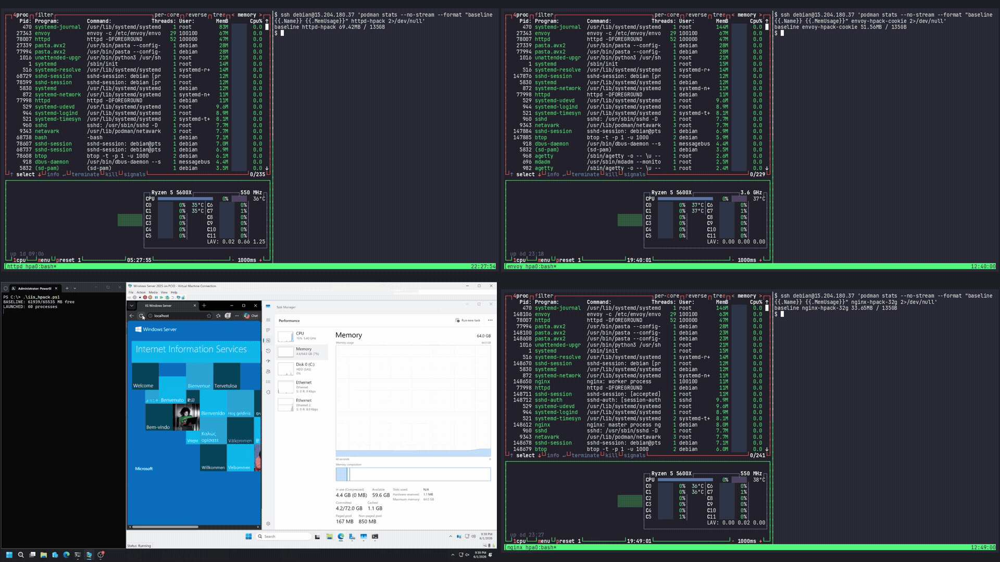

# Codex Discovered a Hidden HTTP/2 Bomb

*14 years ago, I helped break HTTP header compression, then was asked to review the fix, which became part of HTTP/2. Life has come full circle: today we're releasing an attack I missed.*

We're publishing HTTP/2 Bomb, a remote denial-of-service exploit against most major web servers, including:

* nginx
* Apache httpd
* Microsoft IIS
* Envoy
* Cloudflare Pingora

The vulnerable behavior exists in each server's default HTTP/2 configuration.

The attack was discovered by Codex, which chained two techniques known to humans for a decade: a compression bomb and a Slowloris-style hold. The bomb targets HPACK, HTTP/2's header compression scheme: one byte on the wire becomes one full header allocation on the server, repeated thousands of times per request. The hold is a zero-byte flow-control window that keeps the server from ever freeing any of it.

A curious search on Shodan revealed [880,000+ websites](https://www.shodan.io/search?query=ssl.alpn%3A%22h2%22+product%3Anginx%2CApache%2CIIS%2CEnvoy%2CPingora) supporting HTTP/2 and running one of these servers, though many sit behind a CDN, which is much harder to bring down.

A home computer on a 100Mbps connection can render a vulnerable server inaccessible within seconds. Against Apache httpd and Envoy, a single client can consume and hold 32GB of server memory in roughly 20 seconds.

*Clockwise from top-left: Apache httpd, Envoy, nginx, Microsoft IIS. (2× playback)*

| Server | Amplification | Demo result |
|---|---|---|
| Envoy 1.37.2 | ~5,700:1 | ~32 GB in ~10s |
| Apache httpd 2.4.67 | ~4,000:1 | ~32 GB in ~18s |
| nginx 1.29.7 | ~70:1 | ~32 GB in ~45s |
| Microsoft IIS (Windows Server 2022, 2025) | ~68:1 | 64 GB in ~45s |

## Credits

* Quang Luong for discovering the exploit. He'll be presenting his techniques at the upcoming Real World AI Security conference at Stanford in June.

* Jun Rong and Duc Phan for confirming the attack on other web servers.

## Technical details

HPACK ([RFC 7541](https://www.rfc-editor.org/rfc/rfc7541)) is a stateful compression scheme. Each side of an HTTP/2 connection maintains a dynamic table of recently seen headers. A sender can insert a header into the table once and then refer to it on later requests by index, usually a single byte. The receiver looks up the index and materializes a fresh copy of the full header into the request it's assembling.

HTTP/2 itself ([RFC 9113](https://www.rfc-editor.org/rfc/rfc9113)) adds per-stream flow control: the receiver advertises a window, and the sender can't transmit DATA beyond that window until it gets a `WINDOW_UPDATE`. Crucially, the client controls the window for the server's responses.

Each of those features has a known abuse pattern, and the exploit chains them:

* **HPACK Indexed Reference Bomb**: seed the dynamic table with one header, then emit thousands of 1-byte indexed references to it. Each reference costs the attacker one wire byte and the server anywhere from ~70 bytes (nginx, IIS, Pingora) to ~4,000 bytes (Apache httpd, Envoy) of allocation.

* **HTTP/2 Window Stall**: advertise a zero-byte flow-control window so the server can never finish sending its response, then drip 1-byte `WINDOW_UPDATE` frames to keep resetting the send timeout, pinning every allocation in memory for as long as the server's timeout allows.

None of this is completely new. Cory Benfield coined "HPACK Bomb" in 2016 with [CVE-2016-6581](https://nvd.nist.gov/vuln/detail/CVE-2016-6581), and in 2025 Gal Bar Nahum hit [~4000x against Apache httpd](https://galbarnahum.com/posts/apache-httpd-cve-2025-53020) as CVE-2025-53020 ([fix writeup](https://eissing.org/icing/posts/hpack-bombing-apache/)). HTTP/2 Slowloris-type exhaustion without the compression amplifier goes back just as far: [CVE-2016-8740](https://www.cve.org/CVERecord?id=CVE-2016-8740) for unbounded CONTINUATION frames and [CVE-2016-1546](https://www.cve.org/CVERecord?id=CVE-2016-1546) for worker-thread starvation, both in Apache httpd.

What's new here is where the amplification comes from. The classic bomb stuffs a large value into the table and references it repeatedly, so servers learned to cap the total decoded header size. Our variant goes the other way: the header is nearly empty, and the amplification comes from the per-entry bookkeeping the server allocates around it. The decoded-size limit never fires because there's almost nothing to decode.

For servers that cap the header-field count instead (Apache, Envoy), `Cookie` is the bypass: [RFC 9113 §8.2.3](https://www.rfc-editor.org/rfc/rfc9113#section-8.2.3) explicitly allows splitting the Cookie header into one field per crumb, and these servers weren't counting crumbs against the limit. From there the amplification depends on how the server reassembles the cookie. Envoy appends each crumb into a buffer, so a fat 4 KB cookie value referenced 32k times gives a logical ~3,600:1 (final cookie bytes over wire bytes); the measured RSS ratio runs higher: ~3,800:1 across streams, and up to ~5,700:1 on a single stream once allocator overhead piles on top. Apache httpd rebuilds the whole merged string on every crumb, leaving each older copy live until the stream is cleaned up, so even an empty cookie gives ~4,000:1.

In a real attack you probably don't want the process to OOM at all, since a killed worker just respawns clean. The more effective play is to hold memory pressure just under the kill threshold, push the box into swap, and let every other request on the machine crawl.

## PoCs

Per-server AI-generated writeups, Docker labs, and PoC scripts can be found [here](https://github.com/califio/publications/tree/main/MADBugs/http2-bomb).

Please don't point these at infrastructure you don't own.

## Disclosure

We disclosed the issue to nginx in April. They responded by [importing the `max_headers` directive](https://github.com/nginx/nginx/commit/365694160a85229a7cb006738de9260d49ff5fa2) from freenginx, shipping it in 1.29.8 the next day. At this point, we consider the attack public.

We disclosed to Apache on May 27, and Stefan Eissing [fixed it on the same day](https://github.com/apache/httpd/commit/47d3100b252dc6668a9e46ae885242be9eeca9cd) by making `cookie` headers count against `LimitRequestFields`. The issue was assigned CVE-2026-49975.

The fix commits above are public and disclose the vectors directly; any capable AI model can turn those diffs into a working exploit, which is exactly how we found that Microsoft IIS, Envoy, and Pingora are also vulnerable. We've notified their maintainers. Given how short the commit-to-exploit path now is, we're releasing this writeup to provide users with the mitigations below.

## Mitigations

**nginx**: Upgrade to 1.29.8+, which adds the `max_headers` directive with a default of 1000. If you can't upgrade, disable HTTP/2 with `http2 off;`.

**Apache httpd**: The fix is in mod_http2 v2.0.41, available from the [standalone mod_http2 releases](https://github.com/icing/mod_h2/releases) and in httpd trunk but not yet in a 2.4.x release. If you can't upgrade, set `Protocols http/1.1` to disable HTTP/2. Lowering `LimitRequestFieldSize` shrinks the per-stream blast radius (it caps the merged cookie, and so the crumb count), but it's only a partial mitigation, since an attacker can still multiply the effect across streams and connections. Lowering `LimitRequestFields` does nothing here: the duplicate cookie crumbs never count against it.

**Microsoft IIS, Envoy, Cloudflare Pingora**: No patch available at the time of writing. Disable HTTP/2 if you can, or front the server with something that enforces a hard cap on header count per request.

**Generally**: "Maximum decoded header size" and "maximum header count" are two different limits, and a server needs both. Any HTTP/2 termination point should cap the number of header fields per request, including `cookie` crumbs, independent of their total size, and should bound the lifetime of a stalled stream regardless of `WINDOW_UPDATE` activity. And if you can't do any of that today: cap per-worker memory (cgroups, `ulimit -v`, container limits) tight enough that a bombed worker gets OOM-killed and respawned before it drags the box into swap. A worker process rarely needs gigabytes; letting the kernel kill one early is a better failure mode than letting the attacker hold the whole machine at 95%.

## Takeaways

RFC 7541 has an entire section on this threat. [§7.3 Memory Consumption](https://datatracker.ietf.org/doc/html/rfc7541#section-7.3) opens with "an attacker can try to cause an endpoint to exhaust its memory," then explains that HPACK bounds the dynamic table via `SETTINGS_HEADER_TABLE_SIZE` and considers the matter handled. But when five independent implementations all read that section and still ship the same class of bug, the defect is in the spec.

The deeper miss is that the spec frames memory risk purely as an amplification ratio, and ratio is only half the equation. A 70:1 amplifier is harmless if the memory is freed when the request completes. It becomes an attack because HTTP/2 lets the client hold the connection open almost for free, pinning every allocated byte for as long as they like.

The other thing worth noting is how this exploit was found. Both halves have been public for a decade. What Codex did was read the codebases, recognize that the two compose, and build the combined attack. That combination is obvious once you see it, and yet as far as we can tell no human had put it together against these servers.

## Epilogue

When the team walked me through this research, I found myself back in 2012. That year, Juliano Rizzo and I discovered [CRIME](https://en.wikipedia.org/wiki/CRIME), a compression oracle that recovered cookies from compressed HTTP headers. I was at Google at the time, so I was asked to review the fix, which became HPACK. I just re-read my notes from that review: I never once considered this attack. I was too fixated on fighting CRIME and missed the bomb.