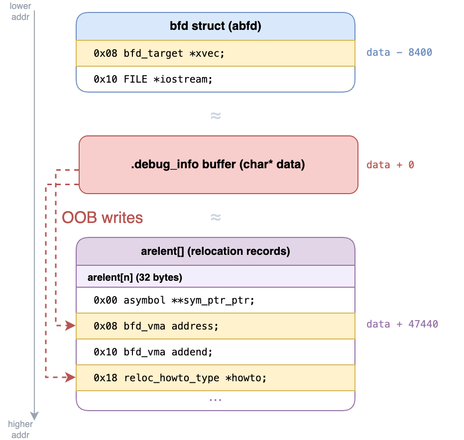
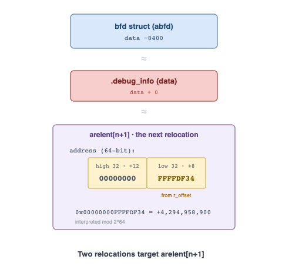
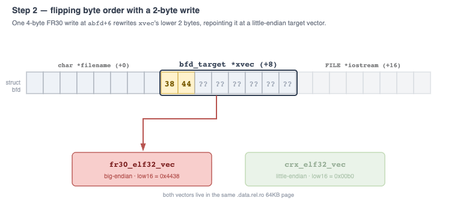
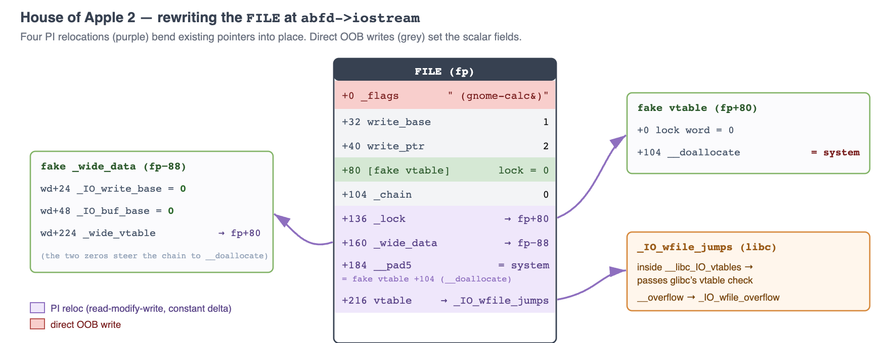
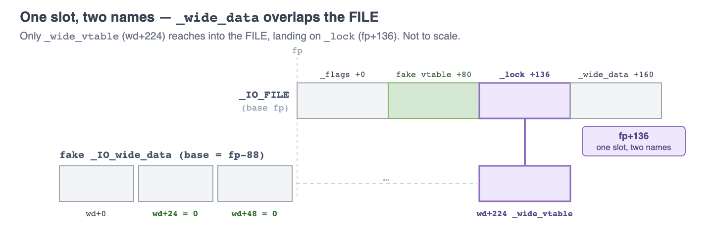

# OOBdump: Relocation Oriented Programming

We have a thing for [finding bugs in bug finding tools](https://blog.calif.io/p/mad-bugs-all-your-reverse-engineering). IDA Pro, Ghidra, Binja Sidekick, or radare2. You name it we hacked it. Our friends are saying we should try objdump next. So here we go.

Demo video: https://www.youtube.com/watch?v=plH31xVbGtE

`objdump -g` should be boring. It reads an object file, prints debug information, and exits. But with the right FR30 object file, it can be persuaded to execute arbitrary code.

The bug is a missing bounds check in the FR30 relocation handler. Pretty boring by today's standards. What's cool is how we turned this simple heap OOB into an exploit that defeats ASLR, PIE, and heap hardening mitigations with just a single crafted input.

The bug only affected a rare build configuration of objdump. The security policy of binutils, the parent project, explicitly excludes issues of this kind from being treated as security vulnerabilities, and instead requires them to be disclosed publicly. We followed that process, and the issue was fixed promptly.

The exploit itself is beautiful. It is rare to see a heap overflow that can be exploited in a true single shot while still defeating ASLR.

## The forgotten target

FR30 is a Fujitsu embedded RISC core from the late 1990s, part of the proprietary 32-bit [FR family](https://en.wikipedia.org/wiki/Fujitsu_FR). Binutils still ships support for it, but stock host-focused `objdump` builds usually do not enable that backend. The realistic exposure is custom or multi-target builds: `--enable-targets=all`, an explicit `fr30-*-elf` target, SDK toolchains, CI images, and binary-analysis environments that want one tool to recognize everything.

## Why relocate?

You might be wondering why `objdump` needs to perform relocations on the input object. Why can't it just read and print the bytes as-is?

The FR30 file in the exploit is a relocatable object file, not a finished executable. The C compiler emits one object file (`.o`) for each source file, and the linker later combines them into an executable. Since the compiler doesn't know where each section will land in the final program, it leaves placeholder values and records relocations that mark which spots to patch. Debug sections work the same way, and those are what `objdump -g` reads.

In this example, the `.debug_addr` section has a header followed by two zero placeholder entries for code addresses:

```
.debug_addr
  offset 0x00: header
  offset 0x08: address slot 0 = 0x0
  offset 0x10: address slot 1 = 0x0
```

That changes when the corresponding relocation section (`.rela.debug_addr`) is processed:
```
.rela.debug_addr:
  offset 0x08 -> .text
  offset 0x10 -> .text + 0x10
```

In the normal build process, a linker looks at the relocation section and applies the patches to the binary it produces.

But `objdump -g` runs on the original object file, with no linker around to do the patching. That job falls to binutils' Binary File Descriptor (BFD) library, which is where our bug lives.

The relocation above is simple, but real relocation formats are far more varied. Each architecture defines its own relocation types and how they're applied, which makes this a particularly bug-prone area for a multi-target library like BFD.

## The missing check

Anthropic discovered this bug and shared it with us.

FR30's `R_FR30_48` relocation handler is `fr30_elf_i32_reloc` in [`bfd/elf32-fr30.c`](https://sourceware.org/git/?p=binutils-gdb.git;a=blob;f=bfd/elf32-fr30.c;hb=7565cfd7ad2edc1f4ba6c88c6af86e78856c5b3f):

```c
typedef uint64_t bfd_vma;

static bfd_reloc_status_type
fr30_elf_i32_reloc (bfd *abfd, arelent *reloc_entry,
                    asymbol *symbol, 
                    void *data, asection *input_section, ...)
{
  /* first three terms = virtual (mapped) address of the symbol (eg .text) */
  bfd_vma relocation = symbol->value
    + symbol->section->output_section->vma
    + symbol->section->output_offset
    // addend, or offset from the base symbol
    + reloc_entry->addend;

  /* bfd_put_32 (bfd *abfd, bfd_vma value_to_write, void *destination_pointer) */
  bfd_put_32 (abfd, relocation, (char *) data + reloc_entry->address + 2);

  return bfd_reloc_ok;
}
```

The function first calculates `relocation`, the value to be written. The attacker controls the symbol and addend terms, and the section state is predictable here, so we control what gets written.

It then calls `bfd_put_32` to apply the patch. The write lands in `data`, the heap buffer that holds the target section's contents. In our exploit, that section is `.debug_info`.

Its offset comes straight from `reloc_entry->address`, plus two bytes to skip the 16-bit instruction prefix. Nothing checks that offset against the buffer size. Since we control both the value and the offset, an out-of-bounds write is trivial. 

The handler runs once for every relocation entry, and we can add as many entries as we like, so one file gives us as many writes as we want.

We use `.debug_info` because objdump's DWARF reader loads and relocates it before parsing the DWARF inside. The section can be all zeros and every write still fires.

## The heap layout

While the OOB write is powerful, two obstacles still stand in our way:
1. We can only modify memory at a higher address than the `data` buffer, because the write lands at `data + r_offset + 2` and `r_offset` is an unsigned offset that only ever reaches forward.
2. We have no information leak, so the PIE and libc bases stay hidden behind ASLR.

Fortunately, `data` is not alone on the heap. Two nearby objects give us what we need.

The first is the `bfd` struct, the handle BFD allocates when it opens the object file. It holds important fields that steer everything BFD does, including `xvec` (the pointer to the `bfd_target` struct, which is full of juicy function pointers) and `iostream` (the pointer to the open `FILE` struct). That makes it a valuable target, but it sits 8400 bytes before `data`, so our forward-only write cannot reach it yet.

The second is the `arelent` array, the in-memory form of the file's relocation records. It sits 47440 bytes after `data` in a separate allocation, within reach of the forward write. Each `objdump -g` run allocates the same chunks in the same order, so these distances are deterministic.



The exploit clears both obstacles in order.

## Step 1: wrap the offset

The on-disk FR30 relocation offset is 32 bits, but BFD expands it into a 64-bit `arelent.address`:

```c
typedef struct reloc_cache_entry {
  asymbol **sym_ptr_ptr;    // +0
  bfd_vma   address;        // +8   <- 64-bit
  bfd_vma   addend;         // +16
  reloc_howto_type *howto;  // +24
} arelent;                  // 32 bytes on aarch64
```

Because the `arelent` array sits at a positive, known offset `R` from `data`, one relocation can edit a later one. If relocation `n` writes `0xFFFFFFFF` into the high dword of relocation `n+1`'s `address`, then relocation `n+1` evaluates `data + 0xFFFFFFFF_xxxxxxxx + 2`, which wraps below `data` in 64-bit pointer arithmetic.

This allows us to perform a backwards write with two relocations:

```python
def write_backward(target, value):
    """Write `value` at a negative offset from data (a backward write)."""
    next_index = len(relocations) + 1
    # sizeof entry is 32 bytes, high bytes of address field is at offset 12
    address_hi = R + next_index * 32 + 12
    relocations.append((address_hi - 2, 0xFFFFFFFF)) 
    relocations.append(((target - 2) & 0xFFFFFFFF, value))
```



## Step 2: flip byte order

The exploit is non-interactive: `objdump -g` runs on one file and returns nothing. With no leak, we never learn a heap or libc address, so we can't write an absolute pointer. Instead, we will turn the OOB write into an OOB increment, editing pointers in place without knowing their value. 

This takes two changes:
1. Flip `bfd_put_32` from big-endian to little-endian. aarch64 is little-endian, so a big-endian write-back would corrupt the pointer instead of adjusting it. (this section)
2. Borrow an in-place relocation type from another backend, which gives the read-add-write increment. (Step 3)

Both rely on the same move. The objdump PIE image loads on a 64KB boundary, so the low 16 bits of any in-binary pointer are fixed under ASLR. Overwrite those two bytes and we redirect a pointer to another object in the same page, with zero guessing required. Since the OOB write modifies 32 bits at a time, we clobber two bytes of the previous field. In the places we use this, those bytes do not matter.

For the first change, we alter how `bfd_put_32` encodes bytes. `bfd_put_32` is a macro that dispatches through the function pointer `abfd->xvec->bfd_putx32`, which decides whether the write goes out little- or big-endian.

Luckily for us, the `bfd_target` structs that can be assigned to `abfd->xvec` all sit together in `.data.rel.ro`. This build has nine little-endian `bfd_target`s in the same 64KB page as FR30's vector. Any of them would do, but `crx_elf32_vec` sits first in the page at `0x00b0`, so we went with it.



## Step 3: borrow a better relocation

Step 2 changed how BFD writes bytes. In Step 3, we need to change the type of relocations available to us.

The same partial overwrite works here, just aimed at a different pointer. Each `reloc_cache_entry` has a `howto` pointer (a `reloc_howto_type *`) that describes how to apply that one relocation: its width, where it writes, and the handler that performs it.

Just like the `bfd_target` vectors, the backends' `reloc_howto_type` tables all live together in `.data.rel.ro`, so it just takes a single 2-byte write to switch `howto` from one to another.

The `R_386_PC32` relocation type from i386 gives us exactly what we want. It has `partial_inplace` set, which makes BFD add to the value already in the target instead of overwriting it:

```c
bfd_vma val = read_reloc (abfd, data, howto);
val = val + relocation;
write_reloc (abfd, val, data, howto);
```

Now, the only problem is that the relocation handlers for i386 actually perform the range check that the original vulnerable code was missing. Therefore, our OOB writes will be rejected once we switch to this handler.

There's a simple fix though: since the section size information is located on the heap, and we have a heap OOB write, we can just artificially increase the section size to bypass the checks.

## Step 4: rewrite the FILE (House of Apple 2)

OK, so we've upgraded our heap OOB write to an OOB increment. Now what?

Remember the `FILE* iostream` field of the `bfd` struct we briefly introduced earlier? It turns out that this `FILE` struct is actually allocated on the heap!

This means we can use our OOB increment primitive to modify selected fields within the `FILE` struct and thus achieve code execution using a file stream oriented programming (FSOP) technique known as [House of Apple 2](https://jia.je/ctf-writeups/2025-09-07-blackhat-mea-ctf-quals-2025/file101.html).

It turns out that only 4 OOB increments are required:

```python
pi_relocs = [
    (IO + 216, DW),              # _IO_file_jumps -> _IO_wfile_jumps
    (IO + 184, DS + 8),          # &_IO_list_all  -> system
    (IO + 136, (IO + 80) - LV),  # _lock          -> fp+80
    (IO + 160, (IO - 88) - WV),  # _wide_data     -> fp-88
]
```

The first two retarget libc pointers already in the FILE, while the other two modify heap pointers. Since the libc and heap layouts are constant, this operation is completely deterministic and reliable.



The `_lock` and `_wide_data` moves hide a trick. We point `_wide_data` at `fp-88`, so its `_wide_vtable` field (offset 224) lands on the FILE's own `_lock` at `fp+136`.



Those two fields now share the same heap pointer. Set it to `fp+80` and `_lock` gets a zero lock word, while `_wide_vtable` gets the fake vtable whose `__doallocate` is `system`.

Why bother with the overlap? Every value we produce is an existing pointer nudged by a constant, so we cannot conjure two unrelated heap addresses out of thin air, one for `_lock` and one for `_wide_vtable`. So we make the layout need only one. Choosing `fp-88` drops `_wide_vtable` exactly onto `_lock`, and that single nudged pointer does both jobs.

Other direct OOB writes fill in the required `FILE` state: `write_ptr > write_base`, fake wide-data fields, the command string in `_flags`.

One last write sets `abfd->iostream = NULL` so `bfd_close` skips `fclose` and leaves the FILE linked in `_IO_list_all`.

On `exit()`, glibc walks `_IO_list_all` and reaches the corrupted FILE. The narrow flush check (`_mode <= 0 && write_ptr > write_base`) selects it for flushing, but because the vtable now points at `_IO_wfile_jumps`, `_IO_OVERFLOW` dispatches into the *wide* handler `_IO_wfile_overflow`, which reaches `_IO_wdoallocbuf` and calls through the fake wide vtable. The `__doallocate` slot has been OOB-incremented to `system`, so the call becomes `system(fp)`, running the command we planted at the start of the `FILE` struct.

One final detail: we size `.debug_info` to 144 bytes. Smaller layouts put tcache metadata over fake `_wide_data` fields that must stay zero, disrupting the exploit.

## The fix

The upstream fix adds the bounds check the handler should have performed itself. Before writing, the FR30 handlers now validate the offset and reject anything past the section:

```diff
+  if (reloc_entry->address + 2 < 2
+      || !bfd_reloc_offset_in_range (reloc_entry->howto, abfd,
+				     input_section, reloc_entry->address + 2))
+    return bfd_reloc_outofrange;
```

The check is against `reloc_entry->address + 2`, the real write offset, with a guard against overflow. With it in place, the crash PoC makes `objdump` reject the relocation and exit cleanly instead of writing out of bounds.

## The lesson

We never really beat ASLR, PIE, or the heap hardening so much as avoided giving them anything to defend. Because nothing in the chain depended on an absolute address, there was never a leak to chase or a base to guess, and the `xvec` and `howto` swaps only had to touch the low bits that 64KB alignment already pins down.

The pointer arithmetic, in turn, only nudged existing pointers by constant deltas within their own region, so libc pointers stayed in libc and heap pointers stayed on the heap. Where a normal exploit would forge new structures out of leaked addresses, we just reused the ones already lying nearby.

Mitigations like these are built to be fought head-on and tend to win that fight. But we declined to fight and just routed around them instead. The irony is that the machinery doing the routing is BFD's own relocation engine, the same kind of machinery that enables ASLR and PIE to work in the first place.

AI-generated PoCs and writeups: https://github.com/califio/publications/tree/main/MADBugs/oobdump.
