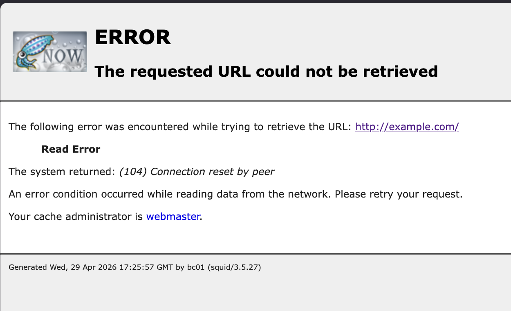
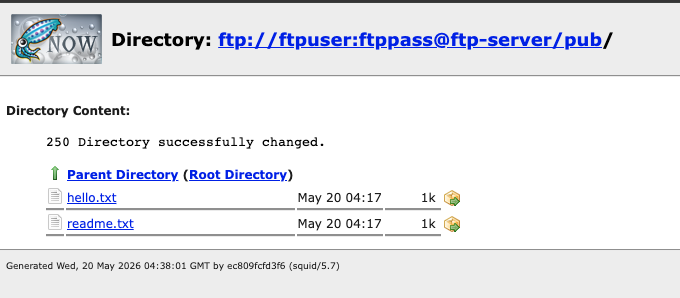
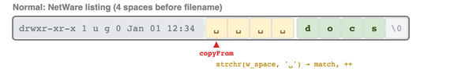
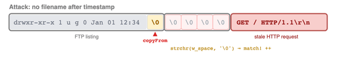
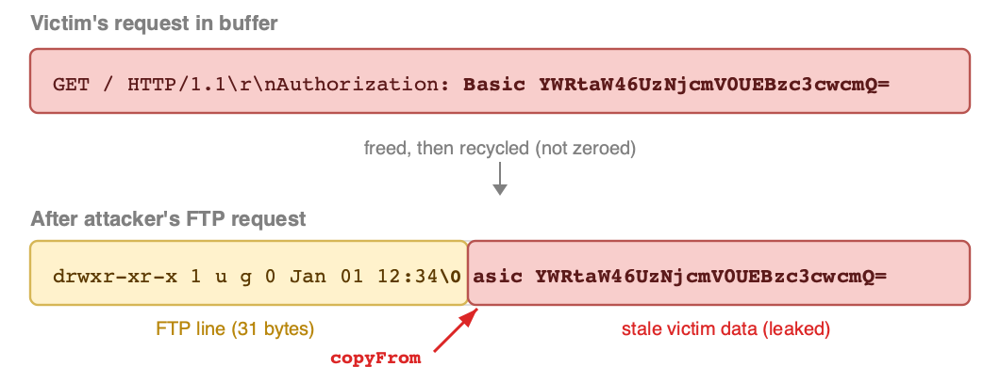

# Squidbleed (CVE-2026-47729)

>Heartbleed's ancient cousin, hiding in Squid since 1997.


Last week, we dropped an [HTTP/2 bomb](https://blog.calif.io/p/codex-discovered-a-hidden-http2-bomb) cooked up by Codex Cyber. This time, we sent Claude Mythos spelunking through Squid's guts, and it surfaced clutching a 29-year-old bug.

Meet **Squidbleed**: a Heartbleed-style vulnerability that leaks internal memory from every version of Squid Proxy, in its default configuration.

This bug is a whirlwind tour of old-school Internet lore. It involves FTP, NetWare, and DJB, names that only the most diehard Internet fans will recognize.

It comes down to a few of C's favorite footguns: null-terminated strings, pointer arithmetic, and a weird `strchr` edge case. Mix these ingredients into an open-source web proxy, and you get a heap buffer overread that quietly leaks random users' HTTP requests, despite three decades of releases, audits, and rewrites.

One caveat: the impact is situational. Most traffic is HTTPS, which the proxy relays as an opaque `CONNECT` tunnel, so only cleartext HTTP and TLS-terminating setups are exposed. The proxy must also be allowed to reach an attacker-controlled FTP server (TCP port 21).

A tip of the hat to Anthropic, our partner-in-crime on the quest to make open-source software a little more secure.

## The Target: Squid Proxy

Squid is a widely deployed multipurpose web proxy. While it was designed to speed up page loads by caching frequently accessed content, it can also be used for traffic interception, monitoring, and filtering.

Thus, Squid is often found in multi-user environments such as schools or corporate networks. In fact, I encountered Squid while attempting to access the Internet on a recent flight:



As you might expect, the version of Squid deployed on that plane was released nearly 10 years ago and is affected by the vulnerability I'm about to share with you.

## FTP: Finicky To Parse

While HTTP forms the majority of web traffic, Squid also supports FTP (File Transfer Protocol, a legacy protocol for moving files between machines) by default.

When connecting to an FTP server via Squid, a nice HTML file listing is helpfully generated:



Unfortunately for Squid, FTP doesn't have a standardized machine-readable file listing format. Instead, the FTP `LIST` command typically returns something that sort of looks like the output from `ls -l`:

```
-rw-r--r--    1 1000     1000           40 May 20 04:17 hello.txt
-rw-r--r--    1 1000     1000           21 May 20 04:17 readme.txt
```

This poorly-specified textual format is notoriously hard to parse, especially while staying compatible with every FTP server on the Internet. One of our Internet heroes, DJB, wrote about it too, calling the format [hard to parse with even moderate reliability](https://cr.yp.to/ftp/list.html). And when DJB says something is hard, you know it really is.

It is thus no surprise that when I asked Claude with Mythos to:

> Spawn more agents to investigate the full [FTP] state machine behavior better

one of the first bugs it found was in Squid's FTP directory listing parser.

## Searching for `NULL`

The bug predates all available commit history in [Squid's GitHub repo](https://github.com/squid-cache/squid/).

Commit [`bb97dd37a`](https://github.com/squid-cache/squid/commit/bb97dd37a), created on Jan 18, 1997, includes the following changelog entry:

> Fixed ftpget to recognize 'NetWare' servers and skip whitespace before filenames.

NetWare was a network operating system, wildly popular in the late 80s and 90s for running corporate file and print servers, and its bundled FTP service was a common way to move files on and off those machines.

This was necessary as [NetWare FTP servers output 4 spaces](https://cr.yp.to/ftpparse/ftpparse.c) between the modification timestamp and the filename:

```
d [R----F--] supervisor            512       Jan 16 18:53    login
- [R----F--] rhesus             214059       Oct 20 15:27    cx.exe
```

This was contrary to the behavior of most other FTP servers, which used just a single space.

With that historical context in mind, let's have a look at the [modern implementation](https://github.com/squid-cache/squid/blob/dc001f638/src/clients/FtpGateway.cc#L625-L640) of that fix, nearly 30 years on:

```c
// from compat/compat_shared.h
#define w_space     " \t\n\r"


copyFrom = buf + tokens[i + 2].pos + strlen(tokens[i + 2].token);
if (flags.skip_whitespace) {
    while (strchr(w_space, *copyFrom))
        ++copyFrom;
} else {
    /* Handle the following four formats:
        * "MMM DD  YYYY Name"
        * "MMM DD  YYYYName"
        * "MMM DD YYYY  Name"
        * "MMM DD YYYY Name"
        * Assuming a single space between date and filename
        * suggested by:  Nathan.Bailey@cc.monash.edu.au and
        * Mike Battersby <mike@starbug.bofh.asn.au> */
    if (strchr(w_space, *copyFrom))
        ++copyFrom;
}
p->name = xstrdup(copyFrom);
```

After parsing the timestamp, `copyFrom` points to the first byte after it. If the FTP server's banner contains "NetWare", `flags.skip_whitespace` is set, and the `while(strchr(w_space, *copyFrom))` loop skips past the extra whitespace.

Once `copyFrom` lands on the first non-whitespace byte, `xstrdup` copies it out as the filename. Looks correct, right?



It seemed like the perfect application of the C pointer arithmetic they teach in school.

But Claude thought otherwise.

> Confirmed. strchr(w_space, '\0') returns non-NULL per C11 §7.24.5.2 (terminating NUL is part of the string). This is a real bug.

The bug occurs when no filename is provided after the modification timestamp. Here's such an example:

```
d [R----F--] supervisor            512       Jan 16 18:53
```

In that case, `*copyFrom` is the null terminator at the end of the string.

However, instead of returning `NULL` and breaking out of the loop, `strchr` returns a pointer to the null terminator, as it is [considered part of the string](https://cppreference.com/c/string/byte/strchr).

This causes `++copyFrom` to be executed and the cycle repeats until a non-null, non-whitespace byte is reached.



This results in a heap overread that is caught by ASAN:
```
heap-buffer-overflow ... READ of size 4065 ... 0 bytes after 4096-byte region
  #1 xstrdup
  #2 Ftp::Gateway::htmlifyListEntry
```

The `copyFrom` pointer thus ends up pointing to a byte outside the FTP directory listing buffer.

The data starting from that byte, possibly belonging to another Squid Proxy user, is then returned to the attacker as the `name` of a file in the directory listing.

Since FTP support is enabled out of the box, and port 21 is included in the default `Safe_ports` ACL, no special flags or non-default settings are needed. The attacker only needs to control an FTP server reachable from the proxy.

## Bleeding HTTP Headers

Now that we have a heap overread, what can we actually leak?

The obvious target is HTTP requests, the most common form of web traffic and one that often contains passwords or API keys. 

Squid maintains per-size freelists on top of `malloc`. When a buffer is freed, it is pushed onto the pool's freelist rather than returned to the system allocator. The next allocation of the same type pops from that freelist, and because the pool [does not zero recycled buffers](https://github.com/squid-cache/squid/blob/dc001f638/src/mem/PoolMalloc.cc), the old contents survive intact.

The `line` buffer used to parse FTP listings is [allocated from `MEM_4K_BUF`](https://github.com/squid-cache/squid/blob/dc001f638/src/clients/FtpGateway.cc#L930). If that buffer previously held a victim's HTTP request, only the first few dozen bytes are overwritten by the short FTP line — the rest of the 4KB buffer still contains the victim's stale data. The `strchr` overread walks right past the null terminator and sends it all to the attacker.



For this to work, the victim's data must pass through `MEM_4K_BUF` at some point. On Squid 7.x, that is easy: [`CLIENT_REQ_BUF_SZ` is set to 4096](https://github.com/squid-cache/squid/blob/2e58fa81c730/src/defines.h#L86), and is [allocated with `memAllocBuf`](https://github.com/squid-cache/squid/blob/2e58fa81c730/src/sbuf/MemBlob.cc#L99-L114), which draws from `MEM_4K_BUF`. Therefore, most HTTP requests (except those larger than 4KB) will be stored in a `MEM_4K_BUF`.

However, prior to Squid 7.x, incoming HTTP requests were [allocated using `memAllocString`](https://github.com/squid-cache/squid/blob/a8c54a8f23f0/src/sbuf/MemBlob.cc#L94), which uses the separate "4KB Strings" pool. This is the case on our Debian test setup, as Debian distributes Squid 5.7.

Hope is not all lost though, as Squid [copies the outgoing request](https://github.com/squid-cache/squid/blob/5bb2694408e7/src/http.cc#L2452) into a `MemBuf` before forwarding it upstream. While `MEM_2K_BUF` is used by default, requests exceeding 2KB are promoted to `MEM_4K_BUF`. Once that buffer is freed, the attacker can reclaim it by spraying FTP directory listing requests.

To demonstrate the Squidbleed attack, I set up a simple login page for a web app and showed that the `Authorization` header can be leaked by an attacker using the same Squid proxy as the victim:

Demo video: https://www.youtube.com/watch?v=gYnBg8ig8_E

PoCs: https://github.com/califio/publications/tree/main/MADBugs/squidbleed

## Plugging the Leak

[The patch](https://github.com/squid-cache/squid/commit/865a131c7d557e68c965043d98c2eccae26deef8) is simple: check for the null terminator before calling `strchr`.

```patch
     if (flags.skip_whitespace) {
-        while (strchr(w_space, *copyFrom))
+        while (*copyFrom && strchr(w_space, *copyFrom))
             ++copyFrom;
     } else {
         ...
-        if (strchr(w_space, *copyFrom))
+        if (*copyFrom && strchr(w_space, *copyFrom))
             ++copyFrom;
     }
```

## Conclusion

The dangers of raw memory access in C are well understood, but the subtleties of standard library functions like `strchr` are easier to overlook. Few developers would guess that searching for `'\0'` succeeds, which may explain how a one-line bug survived close to 30 years of code review.

Claude Mythos, having trained on the entire C standard reference, treats this quirk as just another fact. When pointed at the right code, it spotted the bug almost immediately.

As a mitigation, you really ought to disable FTP at this point unless you have a specific, unusual need for it. Chrome, and by extension all Chromium-based browsers, dropped FTP support years ago, so most organizations running Squid are getting close to zero legitimate FTP traffic. Turning it off removes this entire attack surface for free.

More broadly, this might be a good habit for OSS maintainers in general: every now and then, ask an LLM which features you can safely drop. Dead code that nobody uses is still code that can be exploited.

Though FTP parsing might not be the only place where Squid forgot to stop reading. Stay tuned for the next round.

## Disclosure Timeline
- 2026-04-17: Initial report by Lam Jun Rong of Calif.io
- 2026-04-17: Fix posted
- 2026-04-19: Fix merged into master/v8
- 2026-05-07: Independent report by Youssef Awad
- 2026-05-17: Fix merged into v7
- 2026-06-08: Squid v7.6 released
- 2026-06-10: This blog post released
