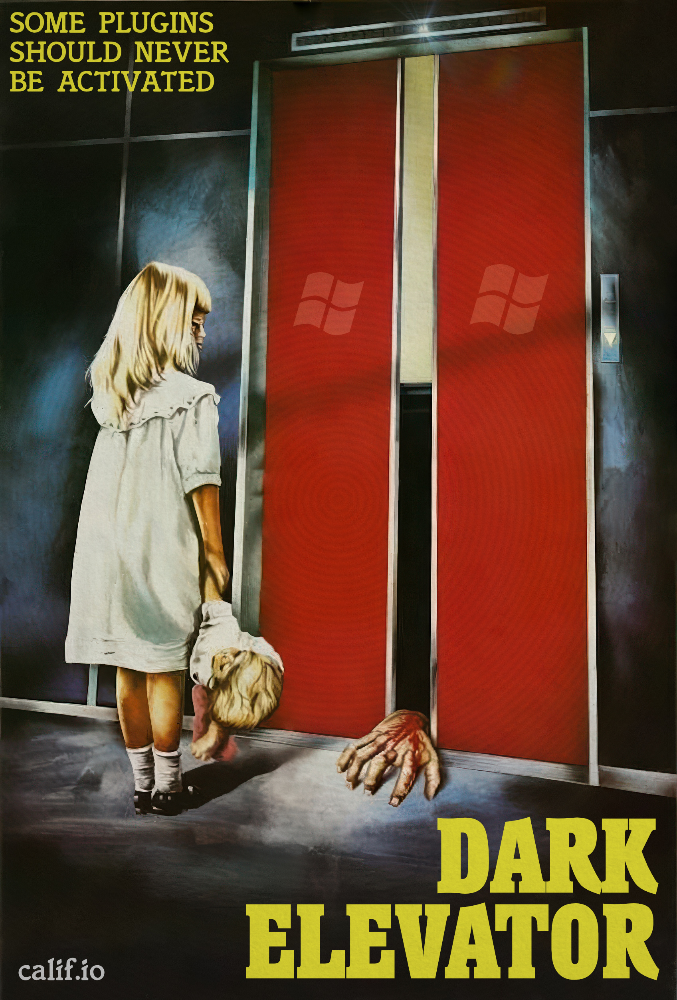
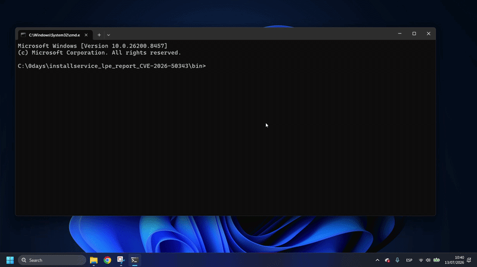
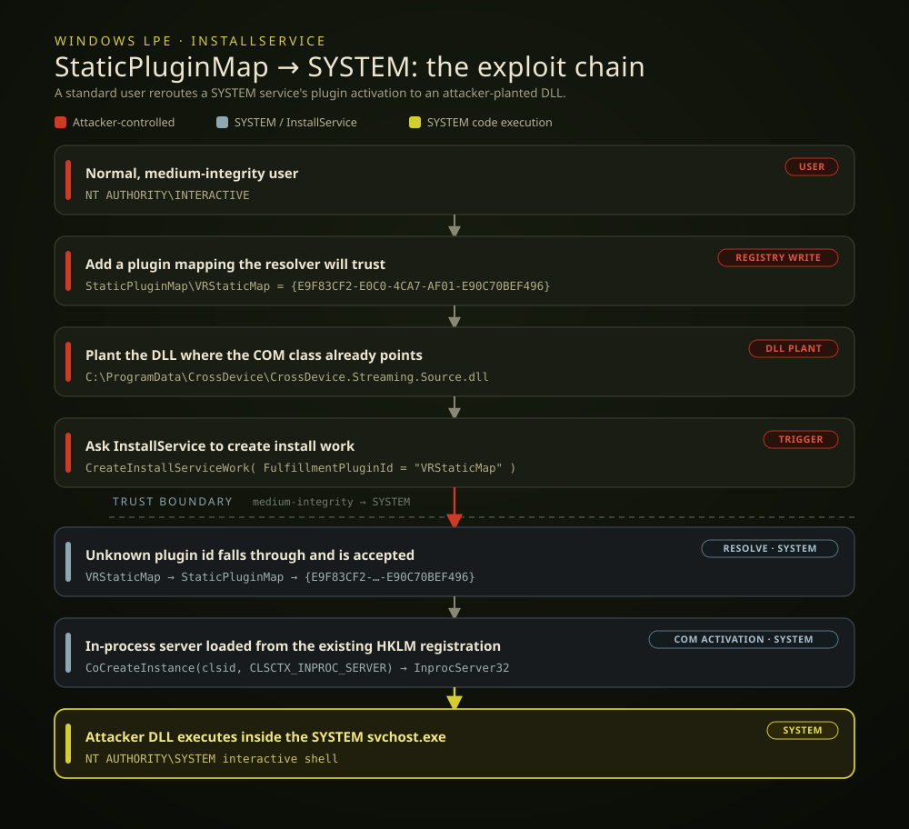
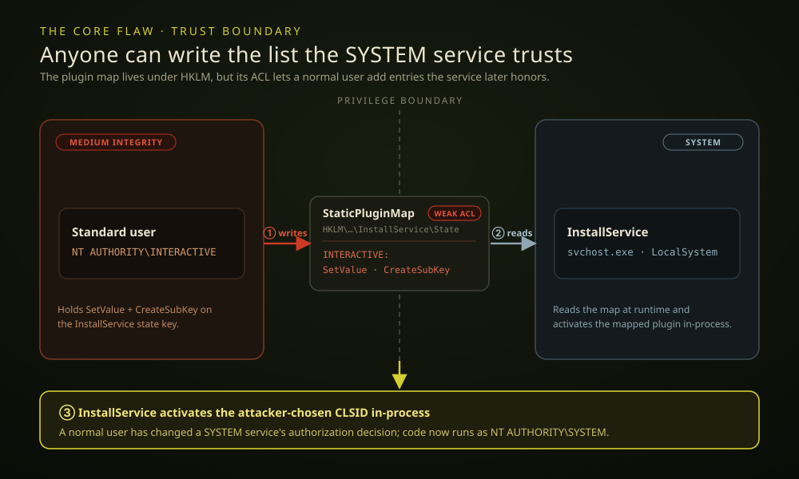

# Dark Elevator: Windows Install Service Local Privilege Escalation (CVE-2026-50343)

>No buffer was harmed in the making of this SYSTEM shell



Today we walk through Dark Elevator, a LPE in Windows 11. We reported it to Microsoft on May 20, 2026, and it is now fixed as CVE-2026-50343.

A normal user can cause `InstallService`, the SYSTEM service behind the Windows app install pipeline, to load an attacker-controlled DLL into the SYSTEM `svchost.exe` process and obtain an interactive `NT AUTHORITY\SYSTEM` shell.

The exploit chains two logic flaws: a writable plugin map in `InstallService`, and a Windows-shipped COM class whose backing DLL a normal user can plant. Because the exploit corrupts no kernel memory, it works deterministically every time. It also needs none of the usual preconditions: no administrator rights, no UAC consent, no reboot, and no service-control permissions over `InstallService`.

The impact is high because code execution lands inside a Microsoft-signed SYSTEM service process. From that position an attacker can install services, create privileged accounts, tamper with protected machine-wide state, access other users' data, disable or bypass local security controls, and establish persistence with SYSTEM privileges.

Tested target:

```text
Microsoft Windows 11
Build: 10.0.26200.8457
```

Here is a demo of the exploit on Windows 11 25H2:


The exploit takes three steps:

1. Add a map entry that points a plugin at an existing COM class whose DLL sits under `C:\ProgramData`.
2. Drop a malicious DLL at that path, a folder any normal user can write to.
3. Ask `InstallService` to activate the plugin.

`InstallService` then loads the attacker's DLL into its own SYSTEM process.



## The Bugs

The exploit chains two separate weaknesses:

1. **A writable plugin map.** `InstallService` runs as SYSTEM and decides which COM class to load by reading `StaticPluginMap`, a registry key that any normal user can write. This lets an unprivileged user point the SYSTEM service at any CLSID.
2. **A user-plantable COM server.** A COM class Windows ships, CrossDevice (`{E9F83CF2-E0C0-4CA7-AF01-E90C70BEF496}`), registers its in-process DLL at a path under `%PROGRAMDATA%` that any normal user can write, and the DLL need not already exist. This lets an unprivileged user supply the DLL that class loads.

The rest of this section walks through each bug in turn.

`InstallService` handles app package installation and runs as `LocalSystem`, so any code loaded into its process runs as SYSTEM. It does the actual install work through fulfillment plugins, and it picks which plugin to load by consulting a static plugin map at runtime.

That map, `StaticPluginMap`, is a set of registry values pairing a plugin id (like `VRStaticMap`) with a COM class id (a CLSID). Whoever can write the map decides which class the service loads. On the tested system, `StaticPluginMap` lives at `HKLM\SOFTWARE\Microsoft\Windows\CurrentVersion\InstallService\State`, which any normal user can write to. This is the first bug.



Reverse engineering and live debugging of `InstallService` showed that plugin activation works as follows:

```text
InstallServiceControl::CreateInstallServiceWork
  -> InstallQueue2::CreateWork
    -> CreateInstallServiceWorkByPlugin
      -> PluginHelpers::IsPluginAvailable
        -> PluginHelpers::GetPluginFromStaticMap
      -> PluginHelpers::ActivatePlugin
        -> PluginHelpers::GetPluginFromStaticMap
        -> CoCreateInstance(mapped CLSID, CLSCTX_INPROC_SERVER, IInstallServicePlugin)
```

Built-in plugin IDs such as `WU`, `XVC`, and `ChainedWork` are handled internally. Any other plugin ID can be made "available" by creating a matching value under `StaticPluginMap`.

Here is the relevant part of `PluginHelpers::ActivatePlugin`, decompiled:

```c
IInstallServicePlugin ActivatePlugin(hstring callerOrUserContext,
                                     hstring pluginId)
{
    if (pluginId == L"Microsoft.GamingServices_8wekyb3d8bbwe" ||
        pluginId == L"ChainedWork") {
        ...
    }
    ...
    mapped = PluginHelpers::GetPluginFromStaticMap(pluginId);
    if (mapped) {
        GUID clsid = {};

        if (IIDFromString(mapped.c_str(), &clsid) >= 0) {
            return CoCreateInstance(
                clsid,
                NULL,
                CLSCTX_INPROC_SERVER,
                IID_IInstallServicePlugin);
        }

        factory = get_activation_factory<IActivationFactory>(mapped);
        return factory.ActivateInstance<IInstallServicePlugin>();
    }
    ...
}
```

The exploit takes the static-map branch, where `ActivatePlugin` calls [`CoCreateInstance`](https://learn.microsoft.com/en-us/windows/win32/api/combaseapi/nf-combaseapi-cocreateinstance)`(clsid, NULL, CLSCTX_INPROC_SERVER, IID_IInstallServicePlugin)`. [`CLSCTX_INPROC_SERVER`](https://learn.microsoft.com/en-us/windows/win32/api/wtypesbase/ne-wtypesbase-clsctx) makes COM load the plugin's DLL into the `InstallService` process, and the final argument, `IID_IInstallServicePlugin` (`{42DFA3DD-F369-478E-B764-0079881E8D8D}`), is just the COM interface the service expects a plugin to implement.

That `clsid` is the one value the exploit gets to choose, and it needs a class whose in-process DLL sits at a path it can write. Registering a new class would need admin, so the exploit reuses one Windows already ships: `{E9F83CF2-E0C0-4CA7-AF01-E90C70BEF496}`, a CrossDevice streaming component. Its [`InprocServer32`](https://learn.microsoft.com/en-us/windows/win32/com/inprocserver32) DLL path already sits under `%PROGRAMDATA%`, which standard users can write:

```
HKLM\SOFTWARE\Classes\CLSID\{E9F83CF2-E0C0-4CA7-AF01-E90C70BEF496}\InprocServer32

(Default)      REG_EXPAND_SZ    %PROGRAMDATA%\CrossDevice\CrossDevice.Streaming.Source.dll
```

`%PROGRAMDATA%` is `C:\ProgramData`, a tree where standard users can create folders and files, and the DLL does not have to exist yet. Even though the attacker cannot touch the HKLM registration, they control what it points to: they just create `C:\ProgramData\CrossDevice\CrossDevice.Streaming.Source.dll` themselves. This is the second bug.

## PoC

Everything needed to build the PoC is in [this folder](https://github.com/califio/publications/tree/main/MADBugs/windows-CVE-2026-50343).

## Disclosure Timeline

- 2026-05-20: Reported to Microsoft.
- 2026-07-14: Fixed by Microsoft as CVE-2026-50343.

Kudos to all the other researchers who independently discovered and reported CVE-2026-50343.
