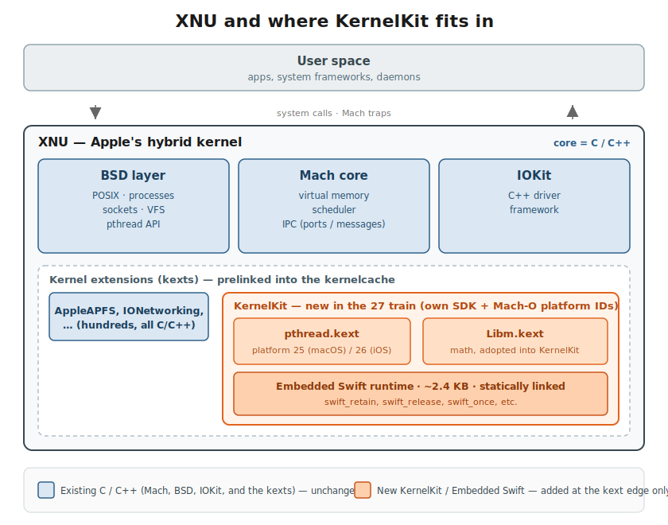

# Apple Internals: Swift in the Kernel

*A new series reverse-engineering Apple's internals.*

After WWDC, I saw [Devon Maloney posted a slide](https://x.com/plailect/status/2064138356259213475) saying Apple has "started writing parts of the core operating system kernel in Swift" for the 27 releases. First steps toward a memory-safe kernel. What does this even mean?!

Naturally I dropped what I was doing and went grepping through the iOS 27 kernelcache. Alas, nothing came of it. All is not lost though: I found the Embedded Swift runtime in macOS 27, sitting in `com.apple.kec.pthread` of all places. Then I went poking around the root filesystem and it turns out Apple gave the whole effort a name: KernelKit.

Let's dissect it.



*Where this is going: the C/C++ core (Mach, BSD, IOKit) is untouched. Swift shows up only as a small Embedded runtime inside specific KernelKit kexts at the extension layer.*

## A new directory in `/System`

On the macOS 27 root volume (`26A5353q`), right next to `/System/DriverKit`, are two kexts:

```
/System/KernelKit/
└── System/Library/Extensions/
    ├── Libm.kext/
    │   ├── Libm
    │   ├── Libm_kasan
    │   └── Info.plist
    └── pthread.kext/
        ├── pthread
        ├── pthread_development
        ├── pthread_kasan
        └── Info.plist
```

The `Info.plist` for the pthread one is where it gets fun:

```
"CFBundleSupportedPlatforms" => ["KernelKit.MacOSX"]
"DTPlatformName"             => "kernelkit.macosx"
"DTSDKName"                  => "kernelkit.macosx27.0.internal"
"DTXcode"                    => "2700"
```

And `version.plist`:

```
"ProjectName"  => "libpthread_kernelkit"
"BuildAliasOf" => "libpthread"
```

So there's an internal SDK called `kernelkit.macosx27.0.internal`, and `libpthread_kernelkit` is a separate Xcode target building from the same libpthread sources as the regular kext. `Libm` gets the same treatment: `ProjectName: Libm_kernelkit`.

If this is giving you [DriverKit](https://developer.apple.com/documentation/driverkit) déjà vu, you are on to something: its own directory under `/System`, its own SDK, its own Mach-O platform constant, the same playbook seven years later.

## New Mach-O platform IDs

The `LC_BUILD_VERSION` for these binaries says:

```
cmd LC_BUILD_VERSION
platform 25
minos 27.0
sdk 27.0
```

The Mach-O platform enum currently goes up to 24 (`visionOSExclaveKit`). Nothing in public headers, LLVM, or `loader.h` knows what 25 is yet; `ipsw` just printed `Platform(25)` until I went and added the constants.

Then I checked the iOS 27 kernelcache's pthread kext, expecting the boring old absence of `LC_BUILD_VERSION` that iOS 26 had:

```
LC_BUILD_VERSION  Platform: Platform(26), MinOS: 27, SDK: 27
```

That's notable for two reasons. `LC_BUILD_VERSION` is the stamp a Mach-O carries to record which OS it was built for, and Apple tracks each one by a number rather than a name. Last year's iOS 26 build of this kext had no such stamp at all, so its mere presence here is new. And the number is **26**, not the **25** macOS reported a moment ago. Apple could have filed every OS's kernel-Swift code under one shared platform, but instead each OS gets its own: macOS is 25, iOS is 26, with the rest in the table below.

To get the actual names I pulled the table out of the Xcode 27 beta linker. `ld` keeps a static array of 96-byte platform descriptors (from `Platform.cpp`); the `uint32` ID sits at offset `+0x20` in each. Calibrated against the known entries 23/24 (`visionOS-exclaveCore`/`Kit`), the six new ones are:

| ID | name (from `ld` @ `0x1001c67c8`+) |
|---|---|
| 25 | `macOS-kernelKit` |
| 26 | `iOS-kernelKit` |
| 27 | `tvOS-kernelKit` |
| 28 | `watchOS-kernelKit` |
| 29 | `visionOS-kernelKit` (alias `xrOS-kernelKit`) |
| 30 | `bridgeOS-kernelKit` |

The table ends at 30. All six are new in the 27 train; iOS 26.6's pthread kext (libpthread-539) has no `LC_BUILD_VERSION` at all. 25 and 26 are the only ones I've seen in shipping binaries so far.

## The Xcode beta toolchain already knows

`TargetConditionals.h` has no `TARGET_OS_KERNELKIT`, and there's no `KernelKit.platform` under `Contents/Developer/Platforms/`. But cstrings from the toolchain binaries provide some more clues:

* `ld`:

```
macOS-kernelKit
iOS-kernelKit
tvOS-kernelKit
watchOS-kernelKit
visionOS-kernelKit
bridgeOS-kernelKit
/System/KernelKit/usr/lib
/System/KernelKit/usr/lib/swift
/System/KernelKit/System/Library/Frameworks
kernelKit can only be used with -r, -kext and -static
```

* `tapi` and `swift-frontend`:

```
TARGET_OS_KERNELKIT
environment kernelkit
kernelkit_osx  kernelkit_ios  kernelkit_tvos
kernelkit_watchos  kernelkit_bridgeos  kernelkit_xros
```

Six per-OS variants. bridgeOS gets one, because apparently the Touch Bar needs in-kernel Swift before iOS does. There's a `TARGET_OS_KERNELKIT` preprocessor conditional. The linker hard-codes `/System/KernelKit/usr/lib/swift` as a search path, which tells you where the in-kernel Swift stdlib is going to live once it grows past what's statically baked into pthread today. And the ld error string `kernelKit can only be used with -r, -kext and -static` confirms there's no dylib or executable output, just kext bundles and object files.

The linker, the TBD stub tool, and the Swift compiler can all already target this thing. Apple just hasn't published the headers or the SDK yet.

## The Swift bit

The `/System/KernelKit/` pthread binary is the one that ends up in the kernelcache. I know because the UUIDs match:

| binary | UUID | platform | swift syms |
|---|---|---|---|
| `/S/KernelKit/.../pthread` (arm64e) | `F44A1FAB-1F9C-3E38-9C8B-1B238A61939C` | 25 | 37 |
| KC fileset `com.apple.kec.pthread` | `F44A1FAB-1F9C-3E38-9C8B-1B238A61939C` | 25 | 37 |
| `/S/L/E/pthread.kext` (arm64e) | `25FC1559-E358-33B4-8B84-5627969BC4B0` | 1 (macOS) | 0 |
| KDK `pthread.kext` (arm64e) | `25FC1559-E358-33B4-8B84-5627969BC4B0` | 1 (macOS) | 0 |

Same libpthread-553 source, two builds. The "normal" macOS-platform build, the one shipped in `/System/Library/Extensions` and the KDK, has no Swift. The KernelKit-platform build lives in `/System/KernelKit`, gets prelinked into the kernelcache, and carries the Embedded Swift runtime statically linked in.

Here's what's actually in there:

```
fffffe0008ab79e4 T _swift_allocEmptyBox
fffffe0008ab7a50 t __swift_embedded_set_heap_object_metadata_pointer
fffffe0008ab7ab0 T _swift_willThrow
fffffe0008ab7b2c T _swift_bridgeObjectRetain
fffffe0008ab7b90 T _swift_isUniquelyReferenced_native
fffffe0008ab7bfc T _swift_dynamicCastClass
fffffe0008ab7ccc T _swift_dynamicCast
fffffe0008ab8024 t __swift_embedded_existential_destroy
fffffe0008ab80ac t _swift_release
fffffe0008ab8234 T _swift_once
fffffe0008ab8350 T _swift_retain
fffffe000c7cc0e0 D _$es16_emptyBoxStorageSi_Sitvp
fffffe000c7cc0f0 D __swift_embedded_error_metadata_storage
... (37 total)
```

The `_swift_embedded_*` family matches [`stdlib/public/core/EmbeddedRuntime.swift`](https://github.com/swiftlang/swift/blob/main/stdlib/public/core/EmbeddedRuntime.swift) in the open Swift repo. The `$e` mangling prefix is the [documented](https://github.com/swiftlang/swift/blob/main/docs/ABI/Mangling.rst) Embedded Swift prefix (regular Swift uses `$s`; this was switched on in [#77923](https://github.com/swiftlang/swift/pull/77923)), and `_$es16_emptyBoxStorageSi_Sitvp` demangles to `Swift._emptyBoxStorage : (Swift.Int, Swift.Int)`.

There are no `__swift5_*` reflection sections, which is correct for Embedded Swift; generics are monomorphized and there's no runtime metadata. The whole runtime is about 2.4 KB of `__TEXT_EXEC.__text`.

I opened it in IDA to make sure these weren't 37 `ret` instructions wearing a trench coat. `swift_release` is a real atomic refcount decrement with a `brk #1` underflow trap and a call to `_swift_embedded_invoke_heap_object_destroy` at zero. `swift_once` is a CAS one-shot with a spinwait. `swift_dynamicCast` is 500 bytes of metadata-chain walking and existential handling. The data at `_emptyBoxStorage` is `(0, 0xFFFFFFFFFFFFFFFF)`, the immortal empty-box singleton, which confirms this is the genuine runtime rather than 37 stubs in a trench coat.

## But what about `Libm`???

`com.apple.kec.Libm` has been in macOS kernelcaches for a while (it was there in 26.6, source ver 3312). What's new is that it got rebuilt under the KernelKit SDK (`Libm_kernelkit`, platform 25, source ver 3326) and moved into `/System/KernelKit`. It's 65 symbols of math: `_cbrt`, `__sincos_stret`, `__ceilf16`, the float16 intrinsics, that sort of thing. No Swift symbols of its own; it's just been adopted into the KernelKit family, presumably so Swift's `Double`/`Float` operations have something to link against.

## Nobody calls any of it (yet)

I checked xrefs in IDA for the public Swift entry points: `swift_retain`, `swift_release`, `swift_once`, `swift_dynamicCast`, `swift_allocEmptyBox`. The only internal caller is `swift_dynamicCast` calling `swift_release` to clean up after itself. The decade-old pthread C code (`_psynch_mutexwait`, `_bsdthread_create`) never touches Swift.

Then I scanned all 370 macOS kernelcache fileset entries for `swift_*` references anywhere else, i.e. some other kext that links against this runtime:

```fish
ipsw kernel extract kernelcache.release.Mac17,6_7_8_9 --all -o mkc
ipsw macho search mkc -m '^_swift_'
# 0xfffffe0008ab8350: /com.apple.kec.pthread  (external)  _swift_retain
# ... and 36 more, all in com.apple.kec.pthread. nothing else.
```

Just one hit, the kext that defines them: 23 of the 37 symbols are global exports, and not a single other component in the kernelcache imports them. The runtime is linked, loaded at boot, and idle.

iOS 27 is one step further back: pthread and Libm are KernelKit-platform binaries (platform 26) but the Swift runtime isn't linked in at all, the same libpthread-553 source with just a different build config.

## TLDR

Currently, the Swift kernel runtime is on macOS only and unreferenced. That reads to me like the rollout order is: ship the SDK and the runtime first, watch it not break anything for a beta cycle or two, then start landing actual Swift kernel components that link against `_swift_retain` and friends. iOS gets the platform plumbing now and the runtime later.

XNU itself is still entirely C/C++. The KDK's `kernel.release.t6050.dSYM` (`t6050` is the M5 Pro SoC) has 2,106 DWARF compile units, and `DW_AT_language` breaks down as 1,855 `DW_LANG_C11`, 249 `DW_LANG_C_plus_plus_14`, 2 `DW_LANG_Mips_Assembler`, and zero `DW_LANG_Swift`. Same on t6041 (the M4 Max) and the KASAN build. The compiler emits one of those per source file, so this can't be hiding behind stripped symbols. Whatever Swift is coming, it's coming as KernelKit components, not as a rewrite of Mach.

Also if anyone at Apple wants to leak `KernelKit.macosx.sdk` I will treat it with the respect it deserves.

PS: For faithful readers, yes, we will be blogging about Swift and exclaves soon. Be patient.
